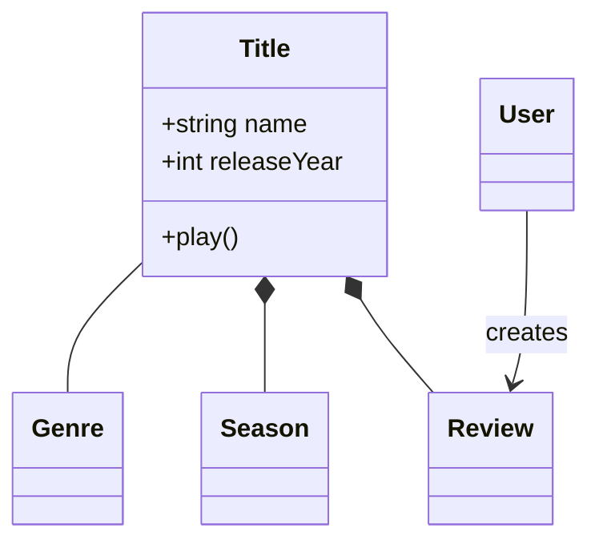
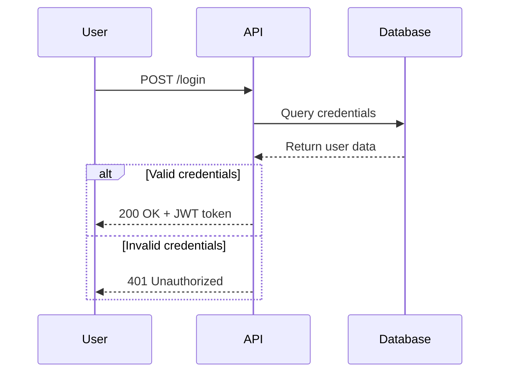
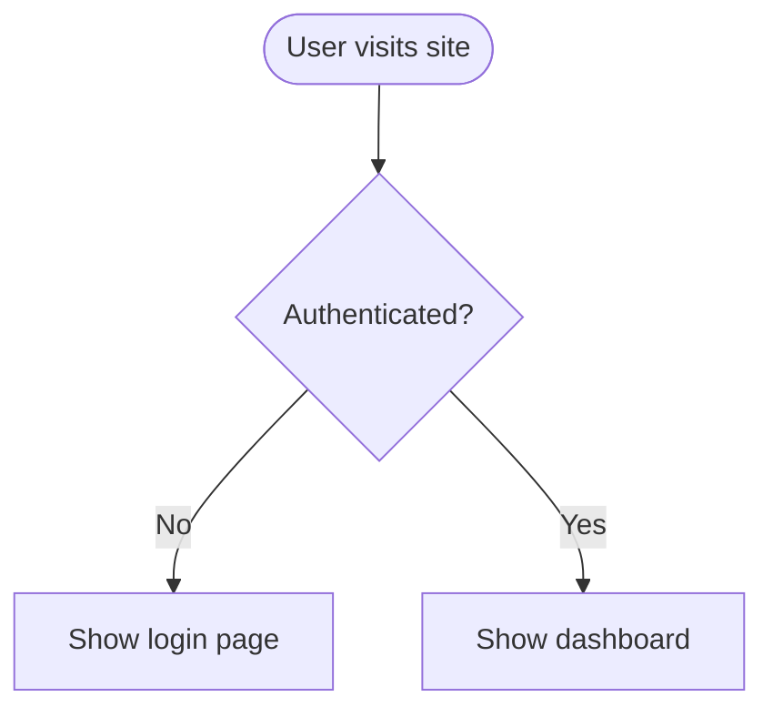
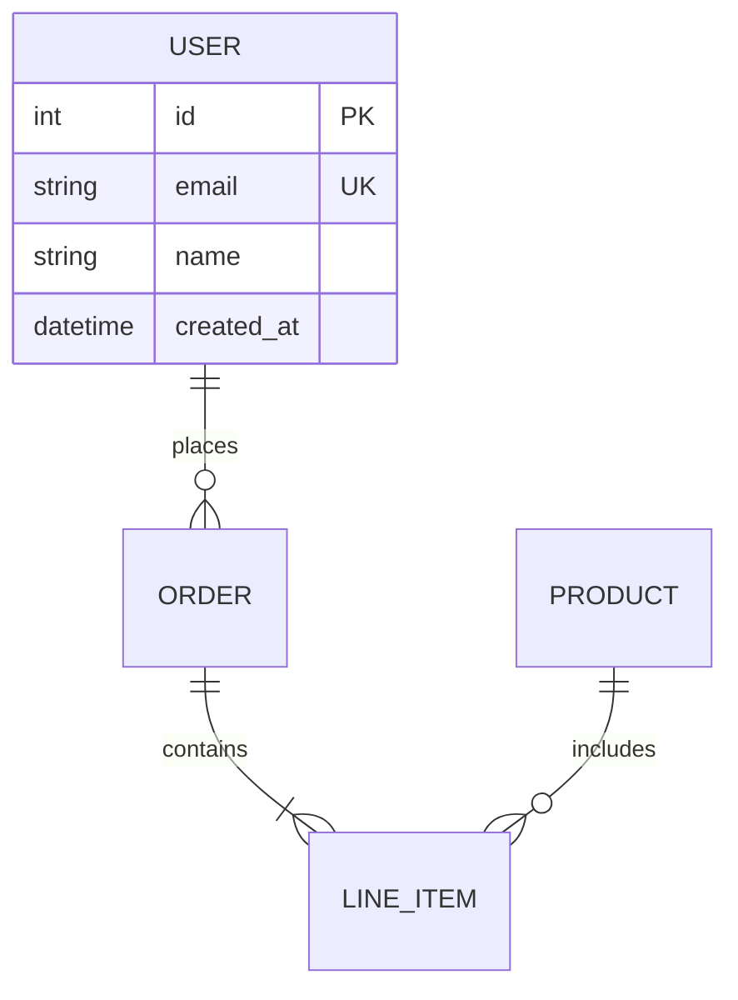

# Skills API Reference — All 72 Working Skills

> Generated by OpenClaw · 2026-05-05
> Covers all skills flagged Eligible + Visible in `openclaw skills check`
> Includes full parameters and descriptions for each skill

---

## Table of Contents

### Group 1 (Skills 1–18)
1. [Academic Research](#academic-research)
2. [Agent Team Orchestration](#agent-team-orchestration)
3. [API Dev](#api-dev)
4. [API Gateway](#api-gateway)
5. [Automation Workflows](#automation-workflows)
6. [Backend Patterns](#backend-patterns)
7. [Browser Automation](#browser-automation)
8. [CalDAV Calendar](#caldav-calendar)
9. [CFO / Chief Financial Officer](#cfo--chief-financial-officer)
10. [ClawHub](#clawhub)
11. [Code](#code)
12. [Code Analysis](#code-analysis)
13. [Data Analysis](#data-analysis)
14. [Desktop Control](#desktop-control)
15. [DevOps](#devops)
16. [Docker Essentials](#docker-essentials)
17. [Edge TTS](#edge-tts)
18. [Eventbrite](#eventbrite)

### Group 2 (Skills 19–36)
19. [Excalidraw](#excalidraw)
20. [Excel / XLSX](#excel--xlsx)
21. [FFmpeg Video Editor](#ffmpeg-video-editor)
22. [Flight Search](#flight-search)
23. [Frontend Design](#frontend-design)
24. [gh-issues](#gh-issues)
25. [GitHub](#github)
26. [gog](#gog)
27. [GoPlaces](#goplaces)
28. [Health](#health)
29. [Healthcheck](#healthcheck)
30. [Humanizer](#humanizer)
31. [Language Learning](#language-learning)
32. [Markdown Converter](#markdown-converter)
33. [Marketing Mode](#marketing-mode)
34. [mcporter](#mcporter)
35. [Mechanic](#mechanic)
36. [Mermaid Diagrams](#mermaid-diagrams)

### Group 3 (Skills 37–54)
37. [Moltspaces](#moltspaces)
38. [Nano PDF](#nano-pdf)
39. [News Summary](#news-summary)
40. [Next.js Expert](#nextjs-expert)
41. [Node Connect](#node-connect)
42. [Notion](#notion)
43. [Obsidian](#obsidian)
44. [Obsidian Vault Maintainer](#obsidian-vault-maintainer)
45. [Ontology](#ontology)
46. [OpenAI Whisper](#openai-whisper)
47. [OpenAI Whisper API](#openai-whisper-api)
48. [OpenRouter Transcribe](#openrouter-transcribe)
49. [Plan2Meal](#plan2meal)
50. [Polymarket](#polymarket)
51. [Powerpoint / PPTX](#powerpoint--pptx)
52. [Productivity](#productivity)
53. [Relationship Skills](#relationship-skills)
54. [Self-Improving + Proactive Agent](#self-improving--proactive-agent)

### Group 4 (Skills 55–72)
55. [Self-Reflection](#self-reflection)
56. [Session Logs](#session-logs)
57. [Sherpa ONNX TTS](#sherpa-onnx-tts)
58. [Skill Creator](#skill-creator)
59. [Skill Hub](#skill-hub)
60. [Slack](#slack)
61. [SQL Toolkit](#sql-toolkit)
62. [Stock Analysis](#stock-analysis)
63. [Sudoku](#sudoku)
64. [Taskflow](#taskflow)
65. [Taskflow Inbox Triage](#taskflow-inbox-triage)
66. [Trello](#trello)
67. [UI/UX Pro Max](#uiux-pro-max)
68. [Video Frames](#video-frames)
69. [wacli](#wacli)
70. [Weather](#weather)
71. [Wiki Maintainer](#wiki-maintainer)
72. [Word / DOCX](#word--docx)

---


---

# Skills API Reference (Group 1)

This document provides detailed API reference documentation for 18 OpenClaw skills. Each entry includes a description, tool calls / command tables, full parameter documentation, and usage notes.

---

## 1. Academic Research

**Description:** Search academic papers and conduct literature reviews using the OpenAlex API (free, no API key required). Supports searching papers by topic, author, or DOI; fetching citation chains; deep-reading abstracts and full text of open-access papers; and running automated multi-step literature reviews with thematic clustering.

### CLI Tool

**Command:** `python3 scripts/scholar-search.py <command> [options]`

#### Commands

| Command | Description |
|---------|-------------|
| `search` | Search papers by topic/query string |
| `author` | Search papers by author name |
| `doi` | Look up a paper by DOI |
| `citations` | Get citation chain for a DOI |
| `deep` | Deep read — fetch abstract + full text when available |

#### `search` Subcommand

| Parameter | Type | Required | Default | Description |
|-----------|------|----------|---------|-------------|
| `<query>` | string | Yes | — | Search query string (topic, keywords, etc.) |
| `--limit N` | integer | No | — | Maximum number of results to return |
| `--sort citations` | string | No | relevance | Sort by `citations` for most-cited first |
| `--json` | flag | No | False | Output structured JSON instead of markdown |
| `--years YYYY-YYYY` | string | No | — | Restrict to publication year range |

#### `author` Subcommand

| Parameter | Type | Required | Default | Description |
|-----------|------|----------|---------|-------------|
| `<name>` | string | Yes | — | Author's name to search |
| `--limit N` | integer | No | — | Maximum number of results |

#### `doi` Subcommand

| Parameter | Type | Required | Default | Description |
|-----------|------|----------|---------|-------------|
| `<doi>` | string | Yes | — | DOI identifier (e.g. `10.1038/s41586-021-03819-2`) |

#### `citations` Subcommand

| Parameter | Type | Required | Default | Description |
|-----------|------|----------|---------|-------------|
| `<doi>` | string | Yes | — | DOI of the paper |
| `--direction both` | string | No | forward | Direction: `forward` (citing), `backward` (references), `both` |

#### `deep` Subcommand

| Parameter | Type | Required | Default | Description |
|-----------|------|----------|---------|-------------|
| `<doi>` | string | Yes | — | DOI to deep-read |

### Literature Review Workflow

**Command:** `python3 scripts/literature-review.py <query> [options]`

| Parameter | Type | Required | Default | Description |
|-----------|------|----------|---------|-------------|
| `<query>` | string | Yes | — | Literature review topic |
| `--papers N` | integer | No | 20 | Target number of papers |
| `--output FILE` | string | No | stdout | Write review to file |
| `--years YYYY-YYYY` | string | No | — | Restrict publication year range |
| `--json` | flag | No | False | Output structured JSON instead of markdown |

### Output Fields (per paper)

| Field | Description |
|-------|-------------|
| `title` | Paper title |
| `year` | Publication year |
| `authors` | Author list (up to 5) |
| `abstract` | Abstract text (when available) |
| `citation_count` | Number of citations |
| `doi` | DOI identifier |
| `open_access_url` | URL to open-access full text (when available) |
| `source` | Source journal or venue |

### Notes

- OpenAlex sorts by relevance by default; use `--sort citations` for most-cited papers.
- Combine `search` + `deep` for quick triage: search first, deep-read promising hits.
- Literature review script caches results in `/tmp/litreview_cache/`.
- For full-text PDFs, pipe DOIs to a PDF extraction tool.
- Scripts are located at `scripts/scholar-search.py` and `scripts/literature-review.py`.

---

## 2. Agent Team Orchestration

**Description:** Orchestrate multi-agent teams with defined roles, task lifecycles, handoff protocols, and review workflows. Used when setting up teams of 2+ agents with different specializations, defining task routing, creating handoff protocols, establishing review gates, and managing async communication between agents.

### Core Concepts

#### Roles

| Role | Purpose |
|------|---------|
| **Orchestrator** | Route work, track state, make priority calls |
| **Builder** | Produce artifacts — code, docs, configs |
| **Reviewer** | Verify quality, push back on gaps |
| **Ops** | Cron jobs, standups, health checks, dispatching |

#### Task States

```
Inbox → Assigned → In Progress → Review → Done | Failed
```

#### Handoff Message Fields

A proper handoff must include:
1. **What was done** — summary of changes/output
2. **Where artifacts are** — exact file paths
3. **How to verify** — test commands or acceptance criteria
4. **Known issues** — anything incomplete or risky
5. **What's next** — clear next action for the receiving agent

### Reference Files

| File | Read when... |
|------|-------------|
| `references/team-setup.md` | Defining agents, roles, models, workspaces |
| `references/task-lifecycle.md` | Designing task states, transitions, comments |
| `references/communication.md` | Setting up async/sync communication, artifact paths |
| `references/patterns.md` | Implementing specific workflows |

### Notes

- **Do NOT use for:** single-agent setups, one-off task delegation, simple question routing.
- Orchestrator owns state transitions — agents do not update their own status.
- Every state transition gets a comment (who, what, why).
- `Failed` is a valid end state — capture why and move on.
- Every artifact gets at least one set of eyes that didn't produce it (review step).
- Agents must comment at: start, blocker, handoff, completion.
- Always specify exact output paths when spawning agents.

---

## 3. API Dev

**Description:** Scaffold, test, document, and debug REST and GraphQL APIs from the command line. Covers the full API lifecycle: scaffolding endpoints, testing with `curl`, generating OpenAPI specs, mocking services, and debugging HTTP issues.

### curl Commands

#### GET

| Parameter / Flag | Description |
|-----------------|-------------|
| `curl -s https://api.example.com/users` | Basic GET |
| `curl -s -H "Authorization: Bearer $TOKEN"` | With auth header |
| `curl -s -H "Accept: application/json"` | With accept header |
| `curl -s "https://api.example.com/users?page=2&limit=10"` | With query params |
| `curl -si` | Show response headers too |
| `curl -sL` | Follow redirects |
| `curl -s -o /dev/null -w "..."` | Show timing breakdown |
| `curl -sI` | Show only response headers |
| `curl -v` | Verbose (full request/response) |

#### POST / PUT / PATCH / DELETE

| Parameter / Flag | Description |
|-----------------|-------------|
| `-X POST` | HTTP method |
| `-H "Content-Type: application/json"` | Content type header |
| `-d '{"name": "Alice"}'` | JSON request body |
| `-F "file=@document.pdf"` | Form data upload |
| `curl -s -X DELETE https://api.example.com/users/123` | DELETE request |

#### Timing Breakdown Format String (for `-w`)

| Token | Description |
|-------|-------------|
| `%{time_namelookup}s` | DNS lookup time |
| `%{time_connect}s` | TCP connection time |
| `%{time_appconnect}s` | TLS handshake time |
| `%{time_starttransfer}s` | Time to first byte |
| `%{time_total}s` | Total request time |

### API Test Runner Script (Bash)

**File:** `api-test.sh`

| Function | Parameters | Description |
|----------|------------|-------------|
| `assert_status` | `method`, `url`, `expected_status`, `body` | Assert HTTP status code |
| `assert_json` | `url`, `jq_expr`, `expected_value` | Assert JSON field value |

### Python Test Runner

**File:** `api_test.py`

| Function | Parameters | Description |
|----------|------------|-------------|
| `request(method, path, body, headers)` | Method, path, optional body dict, optional headers dict | Make HTTP request, returns `(status, body_dict, headers)` |
| `test(name, fn)` | Test name, lambda | Run a test, track pass/fail |
| `assert_eq(actual, expected, msg)` | Actual, expected, message | Assert equality |

### OpenAPI Spec Validation

| Command | Description |
|---------|-------------|
| `npx @redocly/cli lint openapi.yaml` | Validate OpenAPI spec |
| `python3 -c "import yaml; yaml.safe_load(open('openapi.yaml'))"` | Quick YAML validity check |

### Mock Server

**File:** `mock_server.py [PORT]`

Default PORT: `8080`

#### Route Definition Keys

| Key | Description |
|-----|-------------|
| `ROUTES[(method, path_pattern)]` | Tuple of method and regex path pattern |
| `ROUTES[...]["status"]` | HTTP status code |
| `ROUTES[...]["body"]` | Response body (dict or list) |

Run: `python3 mock_server.py 8080`

### Express.js Scaffolding

**File:** `server.js`

| Endpoint | Method | Description |
|----------|--------|-------------|
| `/api/items` | GET | List items (pagination: `page`, `limit` query params) |
| `/api/items/:id` | GET | Get single item |
| `/api/items` | POST | Create item (`name` required, `description` optional) |
| `/api/items/:id` | PUT | Replace item |
| `/api/items/:id` | DELETE | Delete item |
| `/health` | GET | Health check |

### Node.js Setup

```bash
mkdir my-api && cd my-api
npm init -y
npm install express
node server.js
```

### Debugging Patterns

| Command | Description |
|---------|-------------|
| `lsof -i :3000` | Check if port is in use |
| `ss -tlnp \| grep 3000` | Check port (Linux) |
| `kill $(lsof -t -i :3000)` | Kill process on port |
| `echo "$TOKEN" \| cut -d. -f2 \| base64 -d \| jq .` | Decode JWT payload |

### Tips

- Use `jq` for JSON processing: `curl -s url | jq '.items[] | {id, name}'`
- Set `Content-Type` on every request with a body
- For WebSocket testing: `npx wscat -c ws://localhost:3000/ws`

---

## 4. API Gateway

**Description:** Managed API routing for 140+ third-party services via Maton. Use when the user names the target app, account, and task. Routes requests through `https://api.maton.ai/` with app-prefixed paths.

### Base URL

```
https://api.maton.ai/{app-prefix}/{native-api-path}
```

### Authentication

| Parameter | Value | Description |
|----------|-------|-------------|
| Header | `Authorization: Bearer $MATON_API_KEY` | Maton API key |

### Environment Variable

```bash
export MATON_API_KEY="YOUR_API_KEY"
```

### Connection Management API

#### List Connections

```
GET https://api.maton.ai/connections
```

| Query Parameter | Type | Required | Default | Description |
|----------------|------|----------|---------|-------------|
| `app` | string | No | — | Filter by service name (e.g., `slack`, `hubspot`) |
| `status` | string | No | — | Filter by status: `ACTIVE`, `PENDING`, `FAILED` |

#### Create Connection

```
POST https://api.maton.ai/connections
Content-Type: application/json
```

| Field | Type | Required | Description |
|-------|------|----------|-------------|
| `app` | string | Yes | Service name (e.g., `slack`, `notion`) |
| `method` | string | No | Connection method: `API_KEY`, `BASIC`, `OAUTH1`, `OAUTH2`, `MCP` |

#### Get Connection

```
GET https://api.maton.ai/connections/{connection_id}
```

#### Delete Connection

```
DELETE https://api.maton.ai/connections/{connection_id}
```

#### Specify Connection (Header)

| Header | Value | Description |
|--------|-------|-------------|
| `Maton-Connection` | `{connection_id}` | Use specific connection when multiple exist |

### Connection Response Object

```json
{
  "connection": {
    "connection_id": "string",
    "status": "ACTIVE | PENDING | FAILED",
    "creation_time": "ISO 8601",
    "last_updated_time": "ISO 8601",
    "url": "https://connect.maton.ai/?session_token=...",
    "app": "string",
    "method": "OAUTH2",
    "metadata": {}
  }
}
```

### Error Responses

| Status | Meaning |
|--------|---------|
| 400 | Missing connection for requested app |
| 401 | Invalid or missing Maton API key |
| 429 | Rate limited (10 req/sec per account) |
| 500 | Internal server error |
| 4xx/5xx | Passthrough from target API |

### Supported Services (Summary)

| Service | App Name | Service API Host |
|---------|----------|-----------------|
| Slack | `slack` | `slack.com` |
| GitHub | `github` | `api.github.com` |
| Gmail | `google-mail` | `gmail.googleapis.com` |
| Notion | `notion` | `api.notion.com` |
| HubSpot | `hubspot` | `api.hubapi.com` |
| Salesforce | `salesforce` | `{instance}.salesforce.com` |
| Stripe | `stripe` | `api.stripe.com` |
| Google Sheets | `google-sheets` | `sheets.googleapis.com` |
| Airtable | `airtable` | `api.airtable.com` |
| Jira | `jira` | `api.atlassian.com` |
| Trello | `trello` | `api.trello.com` |
| Asana | `asana` | `app.asana.com` |
| Linear | `linear` | `api.linear.app` |
| Zoom | `zoom` | `api.zoom.us` |
| Eventbrite | `eventbrite` | `www.eventbriteapi.com` |
| + 120 more | — | — |

Full list with per-service routing guides: see `references/` directory in [api-gateway-skill](https://github.com/maton-ai/api-gateway-skill/tree/main/references/).

### Code Examples

**JavaScript:**
```javascript
const response = await fetch('https://api.maton.ai/slack/api/conversations.list?types=public_channel&limit=10', {
  headers: { 'Authorization': `Bearer ${process.env.MATON_API_KEY}` }
});
const data = await response.json();
```

**Python:**
```python
import os, requests
response = requests.get(
    'https://api.maton.ai/slack/api/conversations.list?types=public_channel&limit=10',
    headers={'Authorization': f'Bearer {os.environ["MATON_API_KEY"]}'}
)
data = response.json()
```

### Notes

- Use `curl -g` when URLs contain brackets (`fields[]`, `sort[]`).
- Custom headers (except `Host` and `Authorization`) are forwarded to target API.
- Some upload URLs (LinkedIn, etc.) are pre-signed and do NOT require an Authorization header — use Python `urllib` for these because URLs contain encoded characters that get corrupted in shell variables.
- Rate limit: 10 requests per second per account (plus target API limits).
- QuickBooks special case: use `:realmId` in path, replaced with connected realm ID.

---

## 5. Automation Workflows

**Description:** Design and implement no-code automation workflows for solopreneurs. Covers automation opportunity identification, workflow design, tool selection (Zapier, Make, n8n), building and testing workflows, monitoring, maintenance, and ROI calculation.

### Workflow Design Template

```
TRIGGER: What event starts the workflow?
CONDITIONS (optional): When should it run?
ACTIONS:
  Step 1: [action]
  Step 2: [action]
ERROR HANDLING: What happens if something fails?
```

### Tool Comparison

| Tool | Best For | Pricing | Learning Curve |
|------|----------|---------|----------------|
| **Zapier** | Simple 2-3 step workflows | $20-50/month | Easy |
| **Make** | Visual multi-step workflows | $9-30/month | Medium |
| **n8n** | Complex, self-hosted | Free / $20/month | Medium-Hard |

### Automation Audit Formula

```
Time Cost = (Minutes per task × Frequency per month) / 60
```

### Good Candidates Criteria

- Repetitive (same steps every time)
- Rule-based (no complex judgment)
- High-frequency (daily or weekly)
- Time-consuming (10+ minutes)

### ROI Formula

```
Time Saved per Month (hours) = (Minutes per task / 60) × Frequency per month
Cost = (Setup time in hours × $50/hour) + Tool cost per month
Payback Period (months) = Setup cost / Monthly time saved value
```

**Rule:** Payback < 3 months → worth it. Payback > 6 months → probably not.

### Notes

- Start with 2-3 step workflows, add complexity later.
- Test each step individually before chaining.
- Route all error notifications to one place.
- Document every workflow: what it does, when it runs, what apps it connects, how to troubleshoot.
- Automations are not set-and-forget — monitor weekly, audit monthly.

---

## 6. Backend Patterns

**Description:** Backend architecture patterns, API design, database optimization, and server-side best practices for Node.js, Express, and Next.js API routes. Includes repository pattern, service layer, middleware, caching, error handling, auth, rate limiting, and background job patterns.

### Key Patterns

#### Repository Pattern

```typescript
interface MarketRepository {
  findAll(filters?: MarketFilters): Promise<Market[]>
  findById(id: string): Promise<Market | null>
  create(data: CreateMarketDto): Promise<Market>
  update(id: string, data: UpdateMarketDto): Promise<Market>
  delete(id: string): Promise<void>
}
```

#### Service Layer Pattern

Service classes wrap repositories and contain business logic.

#### Middleware Pattern

```typescript
withAuth(handler)  // Validates token, sets req.user
requirePermission('delete')(handler)  // Checks role permissions
```

#### Cache-Aside Pattern

```typescript
async function getMarketWithCache(id: string): Promise<Market> {
  const cached = await redis.get(`market:${id}`)
  if (cached) return JSON.parse(cached)
  const market = await db.markets.findUnique({ where: { id } })
  await redis.setex(`market:${id}`, 300, JSON.stringify(market))
  return market
}
```

#### Retry with Exponential Backoff

```typescript
async function fetchWithRetry<T>(fn: () => Promise<T>, maxRetries = 3): Promise<T>
```

Delays: 1s, 2s, 4s between retries.

#### ApiError Class

```typescript
class ApiError extends Error {
  constructor(public statusCode: number, public message: string, public isOperational = true)
}
```

#### Rate Limiter

```typescript
limiter.checkLimit(identifier, maxRequests, windowMs): Promise<boolean>
```

#### Structured Logger

```typescript
logger.info(message, context)
logger.warn(message, context)
logger.error(message, error, context)
```

Log entry format: `{ timestamp, level, message, ...context }`

### RESTful URL Patterns

| Method | URL | Description |
|--------|-----|-------------|
| GET | `/api/markets` | List resources |
| GET | `/api/markets/:id` | Get single resource |
| POST | `/api/markets` | Create resource |
| PUT | `/api/markets/:id` | Replace resource |
| PATCH | `/api/markets/:id` | Update resource |
| DELETE | `/api/markets/:id` | Delete resource |

Query params: `status`, `sort`, `limit`, `offset`

### JWT Payload

```typescript
interface JWTPayload {
  userId: string
  email: string
  role: 'admin' | 'user'
}
```

### Role Permissions

| Role | Permissions |
|------|-------------|
| `admin` | read, write, delete, admin |
| `moderator` | read, write, delete |
| `user` | read, write |

### Notes

- Query optimization: always select only needed columns.
- N+1 prevention: batch fetch related data.
- Transactions: use DB functions for multi-step atomic operations.
- Error handler centralizes all error response formatting.
- Background jobs: queue instead of blocking for indexing tasks.

---

## 7. Browser Automation

**Description:** Control web pages with the OpenClaw browser tool, for multi-step flows, login checks, tab management, and recovery from stale refs/timeouts. Use when controlling web pages beyond a single page check.

### Operating Loop

1. Check browser state before acting (`action="status"`, `action="tabs"`, `action="profiles"`)
2. Open important tabs with `label` for stable tab handles
3. Read before clicking (`action="snapshot"` with `refs="aria"`)
4. Act narrowly using ref from latest snapshot
5. Report real blockers (login, 2FA, captcha, permissions) to user

### Tab Operations

| Action | Parameters | Description |
|--------|------------|-------------|
| `tabs` | — | List all open tabs |
| `open` | `url`, `label` | Open new tab with label |
| `close` | `targetId` | Close tab by ID or label |
| `snapshot` | `targetId`, `refs`, `urls`, `labels` | Get current page state |

### Snapshot Parameters

| Parameter | Type | Required | Description |
|-----------|------|----------|-------------|
| `targetId` | string | Yes | Tab ID, label, or `tabId` handle |
| `refs` | string | No | Request refs format (e.g., `"aria"`) |
| `urls` | boolean | No | Include URLs in snapshot |
| `labels` | boolean | No | Include labels in snapshot |

### Act Parameters

| Parameter | Type | Required | Description |
|-----------|------|----------|-------------|
| `targetId` | string | Yes | Tab/label to act on |
| `ref` | string | Yes | Element ref from latest snapshot |

### Notes

- Use `tabId` handles like `t1` or labels as `targetId`.
- Avoid relying on raw DevTools `targetId` unless just returned.
- If action fails with stale ref: snapshot again → find new control → retry once.
- `profile="user"` attaches to user's running browser with existing cookies.
- For `profile="user"`, omit `timeoutMs` on `act`, `evaluate`, `hover`, `scrollIntoView`, `drag`, `select`, `fill`.
- Treat camera/microphone permission screens as progress, not login failure.
- Move mouse to any corner of screen to abort (failsafe).

---

## 8. CalDAV Calendar

**Description:** Sync and query CalDAV calendars (iCloud, Google, Fastmail, Nextcloud, etc.) using vdirsyncer + khal on Linux. Supports viewing, searching, creating, editing, and deleting calendar events.

### Prerequisites

```bash
vdirsyncer sync   # Always sync before querying or after making changes
```

### View Events

| Command | Description |
|---------|-------------|
| `khal list` | Today |
| `khal list today 7d` | Next 7 days |
| `khal list tomorrow` | Tomorrow |
| `khal list 2026-01-15 2026-01-20` | Date range |
| `khal list -a Work today` | Specific calendar |

### Search

```bash
khal search "meeting"
khal search "dentist" --format "{start-date} {title}"
```

### Create Events

```bash
khal new 2026-01-15 10:00 11:00 "Meeting title"
khal new 2026-01-15 "All day event"
khal new tomorrow 14:00 15:30 "Call" -a Work
khal new 2026-01-15 10:00 11:00 "With notes" :: Description goes here
```

After creation: `vdirsyncer sync` to push changes.

### Edit Events

```bash
khal edit "search term"
khal edit -a CalendarName "search term"
khal edit --show-past "old event"
```

`khal edit` is interactive (requires TTY). Menu: `s` summary, `d` description, `t` datetime, `l` location, `D` delete, `n` next, `q` quit.

After editing: `vdirsyncer sync`

### Delete Events

Use `khal edit`, then press `D` to delete. Then `vdirsyncer sync`.

### Output Format Placeholders

| Placeholder | Description |
|-------------|-------------|
| `{title}` | Event title |
| `{description}` | Event description |
| `{start}` | Start datetime |
| `{end}` | End datetime |
| `{start-date}` | Start date |
| `{start-time}` | Start time |
| `{end-date}` | End date |
| `{end-time}` | End time |
| `{location}` | Location |
| `{calendar}` | Calendar name |
| `{uid}` | Event UID |

Example:
```bash
khal list --format "{start-date} {start-time}-{end-time} {title}" today 7d
khal list --format "{uid} | {title} | {calendar}" today
```

### Configuration Files

**vdirsyncer (`~/.config/vdirsyncer/config`):**

| Setting | Description |
|---------|-------------|
| `[general] status_path` | Status directory path |
| `[pair XXX] a`, `b` | Remote and local storage names |
| `collections` | `["from a", "from b"]` or specific collections |
| `[storage XXX_remote] type` | Storage type (`caldav`, `google_calendar`, etc.) |
| `[storage XXX_remote] url` | CalDAV server URL |
| `[storage XXX_local] type` | `filesystem` |
| `[storage XXX_local] path` | Local `.ics` files path |

Provider URLs:
- iCloud: `https://caldav.icloud.com/`
- Fastmail: `https://caldav.fastmail.com/dav/calendars/user/EMAIL/`
- Nextcloud: `https://YOUR.CLOUD/remote.php/dav/calendars/USERNAME/`

**khal (`~/.config/khal/config`):**

| Setting | Description |
|---------|-------------|
| `[[my_calendars]] path` | Path to calendar `.ics` files |
| `[[my_calendars]] type` | `discover` |
| `[default] default_calendar` | Default calendar name |
| `[locale] timeformat` | Time display format |
| `[locale] dateformat` | Date display format |

### Caching

khal caches in `~/.local/share/khal/khal.db`. If stale:
```bash
rm ~/.local/share/khal/khal.db
```

### Initial Setup

```bash
vdirsyncer discover   # First time only
vdirsyncer sync
```

### Notes

- Always run `vdirsyncer sync` before reading or after writing.
- `khal edit` requires a TTY — use tmux if automating.
- Cache can grow stale; delete `khal.db` to force rebuild.

---

## 9. CFO / Chief Financial Officer

**Description:** Strategic financial planning and leadership for companies at all stages (pre-seed through Series B+). Covers cash management, fundraising, capital allocation, board reporting, risk management, and M&A diligence.

### Domain Reference Files

| Domain | File |
|--------|------|
| Financial planning and forecasting | `planning.md` |
| Cash and treasury management | `cash.md` |
| Fundraising and capital | `fundraising.md` |
| Financial operations | `operations.md` |

### Core Rules

1. **Cash is oxygen** — Profitable companies die from cash flow problems
2. **13-week rolling forecast** — Short-term visibility prevents surprises
3. **Raise when you can** — Not when you must; desperation kills leverage
4. **No board surprises** — Bad news early, with context
5. **Every dollar has opportunity cost** — Compare returns across all options
6. **Simplicity over precision** — One-page models beat 50-tab spreadsheets
7. **Finance enables** — Partner with operations, don't gate them

### Company Stage Focus

| Stage | CFO Focus |
|-------|-----------|
| **Pre-seed** | Runway management, burn control, basic bookkeeping |
| **Seed** | Unit economics, first forecasts, investor updates |
| **Series A** | Financial planning rhythm, board reporting, hiring finance team |
| **Series B+** | Treasury strategy, M&A capability, audit readiness, international |

### Pre-Decision Checklist

| Question | Why It Matters |
|----------|---------------|
| Company stage? | Determines financial priorities and risk tolerance |
| Current runway (months)? | Determines urgency and options |
| Burn rate trend? | Is the company burning more or less over time? |
| Revenue model? | Subscription vs. transactional affects forecasting |
| Unit economics (CAC, LTV, payback)? | Determines sustainability |

### Human-in-the-Loop (Escalation Required)

- Fundraising terms and dilution
- Major cost restructuring or layoffs
- Debt vs. equity decisions
- Acquisition pricing
- Board compensation
- Financial covenant negotiations

### Security & Privacy

- **No external API calls** — strategic guidance only
- **No data leaves your machine**
- **No persistent storage required**

### Notes

- This skill provides guidance only — no autonomous financial actions.
- Finance enables operations, not gate-keeps them.
- Over-engineering models causes analysis paralysis.

---

## 10. ClawHub

**Description:** Search, install, update, sync, and publish OpenClaw agent skills via the ClawHub CLI and registry. Default registry: `https://clawhub.com`.

### CLI Commands

#### Install

```bash
clawhub install my-skill
clawhub install my-skill --version 1.2.3
```

#### Update

```bash
clawhub update my-skill              # Hash-based match + upgrade to latest
clawhub update my-skill --version 1.2.3  # Specific version
clawhub update --all                 # Update all installed skills
clawhub update my-skill --force      # Force reinstall
clawhub update --all --no-input --force
```

#### List

```bash
clawhub list
```

#### Search

```bash
clawhub search "postgres backups"
```

#### Publish

```bash
clawhub login
clawhub whoami
clawhub publish ./my-skill --slug my-skill --name "My Skill" --version 1.2.0 --changelog "Fixes + docs"
```

### Environment Variables

| Variable | Default | Description |
|----------|---------|-------------|
| `CLAWHUB_REGISTRY` | `https://clawhub.com` | Registry URL override |
| `CLAWHUB_WORKDIR` | cwd | Working directory |
| `CLAWHUB_DIR` | `./skills` | Install directory override |

### Notes

- Default workdir: `cwd` (falls back to OpenClaw workspace).
- Default install dir: `./skills`.
- Update command hashes local files, resolves matching version, upgrades to latest unless `--version` is specified.

---

## 11. Code

**Description:** Coding workflow with planning, implementation, verification, and testing for clean software development. Provides guidance on request → plan → execute → verify → deliver workflow. User controls execution; sub-agent delegation requires explicit request.

### Architecture

User preferences stored in `~/code/` when user explicitly requests.

```
~/code/
  - memory.md    # User-provided preferences only
```

Create on first use: `mkdir -p ~/code`

### Quick Reference Files

| Topic | File |
|-------|------|
| Memory setup | `memory-template.md` |
| Task breakdown | `planning.md` |
| Execution flow | `execution.md` |
| Verification | `verification.md` |
| Multi-task state | `state.md` |
| User criteria | `criteria.md` |

### Workflow

```
Request → Plan → Execute → Verify → Deliver
```

### Core Rules

| Rule | Description |
|------|-------------|
| Check memory first | Read `~/code/memory.md` for user preferences |
| User controls execution | This skill provides guidance, not autonomous execution |
| Plan before code | Break into testable steps |
| Verify everything | Run tests after each function; screenshot after UI changes |
| Store preferences on request | Only when user explicitly asks |

### Notes

- **This skill NEVER:** executes code automatically, makes network requests, accesses files outside `~/code/` and user's project, modifies its own SKILL.md.
- Sub-agent delegation requires user's explicit request.
- Deliverables should always have test verification before delivery.

---

## 12. Code Analysis

**Description:** Analyze Git repositories for developer commit patterns, work habits, development efficiency, code style, code quality, and slacking behaviors. Generates structured reports (Markdown/HTML/JSON/PDF) with scores, grades, strengths, weaknesses, and actionable suggestions.

### CLI Entry Point

```bash
python -m src.main [options]
```

### CLI Parameters

| Parameter | Short | Type | Required | Default | Description |
|-----------|-------|------|----------|---------|-------------|
| `--repo-path` | `-r` | string | Yes | — | Path to Git repository or parent directory |
| `--scan-all` | | boolean | No | false | Recursively scan all `.git` repos |
| `--author` | `-a` | string | No | All authors | Filter by author (repeatable) |
| `--since` | `-s` | string | No | None | Start date (ISO format) |
| `--until` | `-u` | string | No | None | End date (ISO format) |
| `--branch` | `-b` | string | No | Active branch | Branch to analyze |
| `--format` | `-f` | string | No | `markdown` | Output format: `markdown`, `json`, `html`, `pdf` (comma-separated for multiple) |
| `--output` | `-o` | string | No | stdout | Output file path |

### Report Dimensions

| Dimension | Weight | What It Evaluates |
|-----------|--------|-------------------|
| 📝 Commit Discipline | 15% | Commit frequency, message quality, convention compliance |
| ⏰ Work Consistency | 15% | Routine regularity, work continuity |
| 🚀 Efficiency | 20% | Code churn rate, rework rate, output volume |
| 🔍 Code Quality | 25% | Bug fix rate, revert rate, test coverage, complexity |
| 🎨 Code Style | 10% | Conventional Commits, issue references |
| 💪 Engagement | 15% | Inverse of slacking index signals |

### Overall Score Grades

| Grade | Score Range | Meaning |
|-------|-------------|---------|
| S | 90-100 | Top-tier contributor |
| A | 80-89 | Outstanding developer |
| B | 70-79 | Solid contributor |
| C | 60-69 | Adequate, needs improvement |
| D | 50-59 | Barely passing |
| E | 35-49 | Below expectations |
| F | 0-34 | Critical issues |

### Slacking Index

| Level | Score Range | Meaning |
|-------|-------------|---------|
| 🔥 Workaholic | 0-20 | Highly engaged |
| ✅ Normal | 21-40 | Healthy pattern |
| 😏 Suspicious | 41-60 | Some slacking signals |
| 🐟 Slacking Pro | 61-80 | Significant low-engagement |
| 🏆 Slacking Master | 81-100 | Professional-grade slacking |

### Dependencies

```bash
pip install gitpython pydriller radon tabulate jinja2 click reportlab
# Optional (higher quality PDF):
pip install weasyprint   # Requires system cairo library
# or
pip install pdfkit      # Requires system wkhtmltopdf
```

### Natural Language Support

Supports: English, Chinese, Japanese, Korean, Spanish, French, German.

Simply describe what you need — no command memorization required.

### Notes

- Analyzing large repos (100K+ commits) may be slow; limit date range.
- Python complexity analysis only works on `.py` files (requires `radon`).
- Author matching supports fuzzy matching.
- Directory scanning max depth: 5 levels.
- PDF generation: weasyprint → pdfkit → reportlab (fallback order).
- **Runs entirely locally — no data sent to external servers.**
- **Obtain informed consent before analyzing team repositories.**
- Results must not be directly used for performance reviews or punitive management.

---

## 13. Data Analysis

**Description:** Data analysis and visualization for SQL, spreadsheets, notebooks, dashboards, and exports. Supports KPI debugging, experiment readouts, funnel/cohort analysis, anomaly reviews, executive reporting, and quality checks on metrics or query logic.

### Quick Reference Files

| Topic | File |
|-------|------|
| Metric definition contracts | `metric-contracts.md` |
| Visual selection and chart anti-patterns | `chart-selection.md` |
| Decision-ready output formats | `decision-briefs.md` |
| Failure modes to catch early | `pitfalls.md` |
| Method selection by question type | `techniques.md` |

### Approach Selection

| Question Type | Approach | Key Output |
|---------------|----------|------------|
| "Is X different from Y?" | Hypothesis test | p-value + effect size + CI |
| "What predicts Z?" | Regression/correlation | Coefficients + R² + residual check |
| "How do users behave over time?" | Cohort analysis | Retention curves by cohort |
| "Are these groups different?" | Segmentation | Profiles + statistical comparison |
| "What's unusual?" | Anomaly detection | Flagged points + context |

### Statistical Rigor Checklist

- [ ] Sample size sufficient? (small N = wide confidence intervals)
- [ ] Comparison groups fair? (same time period, similar conditions)
- [ ] Multiple comparisons? (20 tests = 1 "significant" by chance)
- [ ] Effect size meaningful? (statistically significant ≠ practically important)
- [ ] Uncertainty quantified? ("12-18% lift" not just "15% lift")

### Core Rules

1. **Start from decision, not dataset** — Identify decision owner and deadline before analyzing.
2. **Lock metric contract before calculating** — Define entity, grain, numerator, denominator, time window, timezone, filters, exclusions, source of truth.
3. **Separate extraction, transformation, interpretation** — Keep query logic, cleanup assumptions, and analytical conclusions distinguishable.
4. **Choose visuals to answer a question** — Trend, comparison, distribution, relationship, composition, funnel, or cohort retention.
5. **Brief every result in decision format** — Answer, evidence, confidence, caveats, next action.
6. **Stress-test claims before recommending action** — Segment by confounders, compare right baseline, quantify uncertainty.
7. **Escalate when data cannot support the claim** — Say "unknown yet" over false confidence.

### Output Standards

1. Lead with insight, not methodology
2. Quantify uncertainty — ranges, not point estimates
3. State limitations — what this analysis can't tell you
4. Recommend next steps — what would strengthen the conclusion

### Red Flags to Escalate

- User wants to "prove" a predetermined conclusion
- Sample size too small for reliable inference
- Data quality issues that invalidate analysis
- Confounders that can't be controlled for

### Security & Privacy

- **No external network requests.**
- **No data leaves your machine.**
- **No credentials or raw exports stored.**

### Notes

- Analysis without a decision is just arithmetic — always clarify what would change if the analysis shows X vs. Y.

---

## 14. Desktop Control

**Description:** Advanced desktop automation with pixel-perfect mouse control, keyboard input, screen capture, window management, and clipboard operations via PyAutoGUI and related libraries.

### Installation

```bash
pip install pyautogui pillow opencv-python pygetwindow
```

### Python API

**Class:** `DesktopController(failsafe=True, require_approval=False)`

#### Mouse Functions

| Method | Parameters | Returns | Description |
|--------|-------------|---------|-------------|
| `move_mouse(x, y, duration=0, smooth=True)` | x, y (int), duration (float), smooth (bool) | — | Move to absolute coordinates |
| `move_relative(x_offset, y_offset, duration=0)` | x_offset, y_offset (int), duration (float) | — | Move relative to current position |
| `click(x=None, y=None, button='left', clicks=1, interval=0.1)` | x, y (int, optional), button (str), clicks (int), interval (float) | — | Click at position |
| `drag(start_x, start_y, end_x, end_y, duration=0.5, button='left')` | start_x/y, end_x/y (int), duration (float), button (str) | — | Drag from A to B |
| `scroll(clicks, direction='vertical', x=None, y=None)` | clicks (int), direction (str), x, y (int, optional) | — | Scroll mouse wheel |
| `get_mouse_position()` | — | `(x, y)` tuple | Get current coordinates |

#### Keyboard Functions

| Method | Parameters | Returns | Description |
|--------|-------------|---------|-------------|
| `type_text(text, interval=0, wpm=None)` | text (str), interval (float), wpm (int, optional) | — | Type text |
| `press(key, presses=1, interval=0.1)` | key (str), presses (int), interval (float) | — | Press and release a key |
| `hotkey(*keys, interval=0.05)` | *keys (str), interval (float) | — | Execute keyboard shortcut |
| `key_down(key)` | key (str) | — | Hold key down |
| `key_up(key)` | key (str) | — | Release key |

#### Screen Functions

| Method | Parameters | Returns | Description |
|--------|-------------|---------|-------------|
| `screenshot(region=None, filename=None)` | region (tuple), filename (str, optional) | PIL Image | Capture screen |
| `get_pixel_color(x, y)` | x, y (int) | `(r, g, b)` tuple | Get pixel color |
| `find_on_screen(image_path, confidence=0.8)` | image_path (str), confidence (float) | `(x, y, w, h)` or None | Find image on screen |
| `get_screen_size()` | — | `(width, height)` tuple | Get screen resolution |

#### Window Functions

| Method | Parameters | Returns | Description |
|--------|-------------|---------|-------------|
| `get_all_windows()` | — | list of window titles | List all open windows |
| `activate_window(title_substring)` | title_substring (str) | — | Bring window to front |
| `get_active_window()` | — | window title (str) | Get currently focused window |

#### Clipboard Functions

| Method | Parameters | Returns | Description |
|--------|-------------|---------|-------------|
| `copy_to_clipboard(text)` | text (str) | — | Copy text to clipboard |
| `get_from_clipboard()` | — | str | Get text from clipboard |

#### Safety Functions

| Method | Parameters | Returns | Description |
|--------|-------------|---------|-------------|
| `pause(seconds)` | seconds (float) | — | Pause all automation |
| `is_safe()` | — | bool | Check if safe to proceed |

### Key Names Reference

| Category | Keys |
|----------|------|
| Alphabet | `a` through `z` |
| Numbers | `0` through `9` |
| Function keys | `f1` through `f24` |
| Special | `enter`, `esc`, `space`, `tab`, `backspace`, `delete`, `insert`, `home`, `end`, `pageup`, `pagedown` |
| Arrow keys | `up`, `down`, `left`, `right` |
| Modifiers | `ctrl`, `shift`, `alt`, `win`, `cmd` |
| Lock keys | `capslock`, `numlock`, `scrolllock` |
| Punctuation | `.`, `,`, `?`, `!`, `;`, `:`, `[`, `]`, `(`, `)`, `+`, `-`, `*`, `/`, `=` |

### Safety Features

- **Failsafe:** Move mouse to any screen corner to abort all automation
- **Pause control:** `dc.pause(2.0)` pauses for N seconds
- **Approval mode:** `DesktopController(require_approval=True)` asks for confirmation before each action

### Notes

- Screen coordinates: (0, 0) in top-left corner
- Multi-monitor setups may have negative coordinates for secondary displays
- Windows DPI scaling may affect coordinate accuracy
- Failsafe corners: (0,0), (width-1, 0), (0, height-1), (width-1, height-1)
- Some applications (games, secure apps) may block simulated input

---

## 15. DevOps

**Description:** Automate deployments, manage infrastructure, and build reliable CI/CD pipelines. Covers CI/CD best practices, deployment strategies, infrastructure as code, container management, secrets management, monitoring, and networking.

### Key Principles

#### CI/CD Pipelines

| Rule | Description |
|------|-------------|
| Fail fast | Linting + unit tests before integration tests |
| Cache dependencies | Between runs to save time |
| Pin action versions with SHA | Immutable vs. mutable tags |
| Secrets in env vars | Never in code or logs |
| Parallel jobs | For independent steps |

#### Deployment Strategies

| Strategy | Description |
|----------|-------------|
| Blue-green | Run new version alongside old, switch traffic atomically |
| Canary | Route % of traffic to new version first |
| Rolling | Update instances incrementally |
| Always have rollback plan | Before deploying |

#### Infrastructure as Code

| Rule | Description |
|------|-------------|
| Version control all infra | terraform, ansible, cloudformation in git |
| `terraform plan` before `apply` | Always review diff |
| State files contain secrets | Store remotely, encrypted, never in git |
| Modules for reusable components | Don't copy-paste definitions |

#### Four Golden Signals (Monitoring)

- **Latency** — How long requests take
- **Traffic** — Requests per second
- **Errors** — Error rate
- **Saturation** — How full the system is

#### Secrets Management

| Rule | Description |
|------|-------------|
| Never commit secrets to git | Use vault, sealed secrets, CI secret storage |
| Rotate regularly | Automation makes rotation painless |
| Different secrets per environment | Dev leak ≠ prod compromise |
| Audit access | Who accessed what and when |

### Notes

- Containers are not VMs — one process per container.
- Health checks are mandatory.
- Don't run as root in containers.
- Immutable images: config via environment, not baked in.
- Alert on symptoms, not causes.
- Error budgets: some failures are acceptable (99.9% = 8h downtime/year).
- Chaos engineering: break things intentionally in staging.
- Post-mortems without blame.
- Internal services don't need public IPs.

---

## 16. Docker Essentials

**Description:** Essential Docker commands for container and image management, networking, volumes, and debugging.

### Container Lifecycle

#### `docker run`

| Flag | Description |
|------|-------------|
| `-d` | Detached mode (background) |
| `--name NAME` | Assign container name |
| `-p HOST:CONTAINER` | Port mapping |
| `-e VAR=value` | Environment variable |
| `-v HOST:CONTAINER` | Volume mount |
| `--rm` | Auto-remove on exit |
| `-it` | Interactive terminal |

#### Container Management

| Command | Description |
|---------|-------------|
| `docker ps` | List running containers |
| `docker ps -a` | List all containers (including stopped) |
| `docker stop NAME` | Stop container |
| `docker start NAME` | Start stopped container |
| `docker restart NAME` | Restart container |
| `docker rm NAME` | Remove container |
| `docker rm -f NAME` | Force remove (running) |
| `docker container prune` | Remove all stopped containers |

### Container Inspection

| Command | Description |
|---------|-------------|
| `docker logs NAME` | View logs |
| `docker logs -f NAME` | Follow logs |
| `docker logs --tail 100 NAME` | Last 100 lines |
| `docker logs -t NAME` | Logs with timestamps |
| `docker exec NAME CMD` | Execute command in container |
| `docker exec -it NAME bash` | Interactive shell |
| `docker exec -u root -it NAME bash` | As root user |
| `docker inspect NAME` | Full container details |
| `docker inspect -f '{{json .Field}}' NAME` | Get specific field |
| `docker stats` | View container stats |
| `docker top NAME` | View processes in container |

### Image Management

| Command | Description |
|---------|-------------|
| `docker build -t NAME:TAG .` | Build from Dockerfile |
| `docker build -f FILE -t NAME:TAG .` | Custom Dockerfile |
| `docker build --no-cache -t NAME .` | Build without cache |
| `docker images` | List images |
| `docker pull NAME:TAG` | Pull from registry |
| `docker tag OLD NEW` | Tag image |
| `docker push REPO/NAME:TAG` | Push to registry |
| `docker rmi NAME` | Remove image |
| `docker image prune` | Remove unused images |
| `docker image prune -a` | Remove all unused images |

### Docker Compose

| Command | Description |
|---------|-------------|
| `docker-compose up` | Start services |
| `docker-compose up -d` | Start in background |
| `docker-compose down` | Stop services |
| `docker-compose down -v` | Stop and remove volumes |
| `docker-compose logs` | View logs |
| `docker-compose logs -f SERVICE` | Follow service logs |
| `docker-compose ps` | List services |
| `docker-compose exec SERVICE CMD` | Execute in service |
| `docker-compose restart SERVICE` | Restart service |
| `docker-compose build SERVICE` | Rebuild service |
| `docker-compose up -d --build` | Rebuild and restart |
| `docker-compose up -d --scale SERVICE=N` | Scale service |

### Networking

| Command | Description |
|---------|-------------|
| `docker network ls` | List networks |
| `docker network create NAME` | Create network |
| `docker network connect NETWORK CONTAINER` | Connect container |
| `docker network disconnect NETWORK CONTAINER` | Disconnect container |
| `docker network inspect NETWORK` | Inspect network |
| `docker network rm NETWORK` | Remove network |

### Volumes

| Command | Description |
|---------|-------------|
| `docker volume ls` | List volumes |
| `docker volume create NAME` | Create volume |
| `docker volume inspect NAME` | Inspect volume |
| `docker volume rm NAME` | Remove volume |
| `docker volume prune` | Remove unused volumes |

### System

| Command | Description |
|---------|-------------|
| `docker system df` | Disk usage |
| `docker system prune` | Clean unused |
| `docker system prune -a` | Clean including images |
| `docker system prune --volumes` | Clean including volumes |
| `docker info` | Docker system info |
| `docker version` | Docker version |

### Notes

- Use `.dockerignore` to exclude files from build context.
- Combine `RUN` commands in Dockerfile to reduce layers.
- Use multi-stage builds to reduce image size.
- Always tag images with versions.
- `docker cp` for copying files to/from containers.

---

## 17. Edge TTS

**Description:** Text-to-speech conversion using Microsoft Edge's neural TTS service via the `node-edge-tts` npm package. Supports multiple voices, languages, speed adjustment, pitch control, subtitle generation, and audio export.

### Built-in tts Tool

| Parameter | Type | Required | Description |
|-----------|------|----------|-------------|
| `text` | string | Yes | Text to convert to speech |
| `channel` | string | No | Channel ID for output format |
| `timeoutMs` | integer | No | Provider request timeout (ms) |

### tts-converter.js CLI

```bash
node tts-converter.js "Your text" [options]
```

| Option | Short | Type | Default | Description |
|--------|-------|------|---------|-------------|
| `--voice` | `-v` | string | `en-US-MichelleNeural` | Voice name |
| `--lang` | `-l` | string | — | Language code (e.g., `en-US`, `es-ES`) |
| `--format` | `-o` | string | `audio-24khz-48kbitrate-mono-mp3` | Output format |
| `--pitch` | | string | `default` | Pitch adjustment (e.g., `+10%`, `-20%`) |
| `--rate` | `-r` | string | `default` | Rate adjustment (e.g., `+10%`, `-20%`) |
| `--volume` | | string | `default` | Volume adjustment (e.g., `+0%`, `-10%`) |
| `--save-subtitles` | `-s` | boolean | false | Save subtitles as JSON |
| `--output` | `-f` | string | `tts_output.mp3` | Output file path |
| `--proxy` | `-p` | string | — | Proxy URL |
| `--timeout` | | integer | `10000` | Request timeout (ms) |
| `--list-voices` | `-L` | boolean | false | List available voices |

### config-manager.js

```bash
node config-manager.js --set-voice en-US-AriaNeural
node config-manager.js --set-rate +10%
node config-manager.js --get
node config-manager.js --reset
```

### Voice Selection (Common Voices)

| Language | Voice | Description |
|----------|-------|-------------|
| `en-US` | `en-US-MichelleNeural` | Female, natural, **default** |
| `en-US` | `en-US-AriaNeural` | Female, natural |
| `en-US` | `en-US-GuyNeural` | Male, natural |
| `en-GB` | `en-GB-SoniaNeural` | Female, British |
| `en-GB` | `en-GB-RyanNeural` | Male, British |
| `es-ES` | `es-ES-ElviraNeural` | Spanish, Spain |
| `fr-FR` | `fr-FR-DeniseNeural` | French |
| `de-DE` | `de-DE-KatjaNeural` | German |
| `ja-JP` | `ja-JP-NanamiNeural` | Japanese |
| `zh-CN` | `zh-CN-XiaoxiaoNeural` | Chinese |
| `ar-SA` | `ar-SA-ZariyahNeural` | Arabic |

### Rate Guidelines

| Rate | Speed | Use Case |
|------|-------|----------|
| `default` | Normal | Standard |
| `-20%` to `-10%` | Slow | Tutorials, stories, accessibility |
| `+10%` to `+20%` | Slightly fast | Summaries |
| `+30%` to `+50%` | Fast | News, efficiency |

### Output Formats

| Format | Quality | Use Case |
|--------|---------|----------|
| `audio-24khz-48kbitrate-mono-mp3` | Standard | Voice notes, messages |
| `audio-24khz-96kbitrate-mono-mp3` | High | Presentations, content |
| `audio-48khz-96kbitrate-stereo-mp3` | Highest | Professional audio, music |

### Notes

- No API key needed (free service).
- Requires internet connection.
- Output: MP3 format by default.
- Supports subtitle generation (JSON with word-level timing).
- Temporary files saved to `/tmp/edge-tts-temp/` on Unix.
- TTS keyword filtering: automatically filters out trigger words from text.
- Neural voices (ending in `Neural`) provide higher quality than Standard voices.

---

## 18. Eventbrite

**Description:** Eventbrite API integration with managed OAuth authentication via Maton. Manage events, venues, ticket classes, orders, attendees, and more.

### Base URL

```
https://api.maton.ai/eventbrite/{native-api-path}
```

### Authentication

```bash
Authorization: Bearer $MATON_API_KEY
```

### Environment Variable

```bash
export MATON_API_KEY="YOUR_API_KEY"
```

### Connection Management

Same as API Gateway (`/connections` endpoint). See API Gateway section.

### API Endpoints

#### User Operations

| Method | Path | Description |
|--------|------|-------------|
| GET | `/eventbrite/v3/users/me/` | Get current user |
| GET | `/eventbrite/v3/users/me/organizations/` | List user organizations |
| GET | `/eventbrite/v3/users/me/orders/` | List user orders |

#### Organization Operations

| Method | Path | Query Params | Description |
|--------|------|-------------|-------------|
| GET | `/eventbrite/v3/organizations/{org_id}/events/` | `status`, `order_by`, `time_filter` | List organization events |
| GET | `/eventbrite/v3/organizations/{org_id}/venues/` | — | List organization venues |
| POST | `/eventbrite/v3/organizations/{org_id}/venues/` | — | Create venue |

#### Event Operations

| Method | Path | Description |
|--------|------|-------------|
| GET | `/eventbrite/v3/events/{event_id}/` | Get event |
| POST | `/eventbrite/v3/organizations/{org_id}/events/` | Create event |
| POST | `/eventbrite/v3/events/{event_id}/` | Update event |
| POST | `/eventbrite/v3/events/{event_id}/publish/` | Publish event |
| POST | `/eventbrite/v3/events/{event_id}/unpublish/` | Unpublish event |
| POST | `/eventbrite/v3/events/{event_id}/cancel/` | Cancel event |
| DELETE | `/eventbrite/v3/events/{event_id}/` | Delete event |

#### Ticket Class Operations

| Method | Path | Description |
|--------|------|-------------|
| GET | `/eventbrite/v3/events/{event_id}/ticket_classes/` | List ticket classes |
| POST | `/eventbrite/v3/events/{event_id}/ticket_classes/` | Create ticket class |
| POST | `/eventbrite/v3/events/{event_id}/ticket_classes/{id}/` | Update ticket class |
| DELETE | `/eventbrite/v3/events/{event_id}/ticket_classes/{id}/` | Delete ticket class |

#### Attendee Operations

| Method | Path | Query Params | Description |
|--------|------|-------------|-------------|
| GET | `/eventbrite/v3/events/{event_id}/attendees/` | `status`, `changed_since` | List event attendees |
| GET | `/eventbrite/v3/events/{event_id}/attendees/{attendee_id}/` | — | Get attendee |

#### Order Operations

| Method | Path | Query Params | Description |
|--------|------|-------------|-------------|
| GET | `/eventbrite/v3/events/{event_id}/orders/` | `status`, `changed_since` | List event orders |
| GET | `/eventbrite/v3/orders/{order_id}/` | — | Get order |

#### Venue Operations

| Method | Path | Description |
|--------|------|-------------|
| GET | `/eventbrite/v3/venues/{venue_id}/` | Get venue |
| POST | `/eventbrite/v3/venues/{venue_id}/` | Update venue |

#### Reference Data

| Method | Path | Description |
|--------|------|-------------|
| GET | `/eventbrite/v3/categories/` | List categories |
| GET | `/eventbrite/v3/categories/{category_id}/` | Get category |
| GET | `/eventbrite/v3/subcategories/` | List subcategories |
| GET | `/eventbrite/v3/formats/` | List formats |
| GET | `/eventbrite/v3/system/countries/` | List countries |
| GET | `/eventbrite/v3/system/regions/` | List regions |

### Event Create Request Body

```json
{
  "event": {
    "name": {"html": "My Event"},
    "description": {"html": "<p>Description</p>"},
    "start": {
      "timezone": "America/Los_Angeles",
      "utc": "2026-03-01T19:00:00Z"
    },
    "end": {
      "timezone": "America/Los_Angeles",
      "utc": "2026-03-01T22:00:00Z"
    },
    "currency": "USD",
    "online_event": false,
    "listed": true,
    "shareable": true,
    "capacity": 100,
    "category_id": "103",
    "format_id": "1"
  }
}
```

### Ticket Class Create Request Body

```json
{
  "ticket_class": {
    "name": "General Admission",
    "description": "Standard entry ticket",
    "quantity_total": 100,
    "cost": "USD,2500",
    "sales_start": "2026-01-01T00:00:00Z",
    "sales_end": "2026-02-28T23:59:59Z",
    "minimum_quantity": 1,
    "maximum_quantity": 10
  }
}
```

### Pagination

| Parameter | Description |
|-----------|-------------|
| `page_size` | Results per page (e.g., 50) |
| `continuation` | Token from previous response for next page |

### Expansions

Use `?expand=venue,ticket_classes,category` to include related data.

### Rate Limits

| Limit | Value |
|-------|-------|
| Calls per hour | 1,000 |
| Calls per day | 48,000 |

### Notes

- All endpoint paths should end with a trailing slash (`/`).
- Currency amounts are in minor units (cents) — `"USD,2500"` = $25.00.
- Timestamps are ISO 8601 (UTC).
- Use `curl -g` when URLs contain brackets.
- Event Search API deprecated February 2020.
- **Write operations require explicit user approval.**

---

*Document generated from SKILL.md source files. Parameters and commands reflect the current version of each skill.*

---

# Skills API Reference — Group 2

This document provides a detailed API reference for 18 OpenClaw skills. Each entry covers the skill's purpose, all available tool calls, parameters, and important usage notes.

---

## 1. Excalidraw (`excalidraw`)

**Description:** Generate hand-drawn style diagrams, flowcharts, and architecture diagrams as PNG images from Excalidraw JSON. The skill uses a Node.js renderer script to convert Excalidraw-formatted JSON into PNG output.

---

### Tool Calls

#### 1.1 Render Diagram (exec)

Renders an Excalidraw JSON file to a PNG image.

**Command:**
```bash
node <skill_dir>/scripts/render.js <input.excalidraw> <output.png>
```

**Parameters:**

| Parameter | Type | Required | Default | Description |
|-----------|------|----------|---------|-------------|
| `input.excalidraw` | string (path) | Yes | — | Path to the input `.excalidraw` JSON file |
| `output.png` | string (path) | Yes | — | Path for the output PNG file |

**Possible Outcomes:**
- Success: PNG image written to the specified output path
- Failure: Missing input file, invalid JSON structure, or render script error

---

#### 1.2 Write Excalidraw JSON (write)

Write the Excalidraw element JSON to a file before rendering.

**Input Format:**
```json
{
  "type": "excalidraw",
  "version": 2,
  "elements": [
    { "type": "rectangle", "id": "...", "x": 150, "y": 50, "width": 180, "height": 60, ... },
    { "type": "arrow", "id": "...", "from": "start", "to": "decision", ... },
    { "type": "text", "id": "...", "x": 200, "y": 65, "width": 80, "height": 30, "text": "Start", ... }
  ]
}
```

---

### Element Types

| Type | Shape | Key Required Props |
|------|-------|-------------------|
| `rectangle` | Box | `id`, `x`, `y`, `width`, `height` |
| `ellipse` | Oval | `id`, `x`, `y`, `width`, `height` |
| `diamond` | Decision | `id`, `x`, `y`, `width`, `height` |
| `arrow` | Arrow | `id`, `from`, `to` (or `points` + `absolutePoints`) |
| `line` | Line | `id`, `x`, `y`, `points: [[0,0],[dx,dy]]` |
| `text` | Label | `id`, `x`, `y`, `text`, `fontSize`, `fontFamily` |

---

### Common Element Properties (all shapes)

| Property | Type | Default | Description |
|----------|------|---------|-------------|
| `strokeColor` | string (hex) | `"#1e1e1e"` | Stroke/outline color |
| `backgroundColor` | string (hex) | `"#a5d8ff"` | Fill color |
| `fillStyle` | string | `"hachure"` | Fill style: `hachure`, `cross-hatch`, `solid` |
| `strokeWidth` | number | `2` | Stroke width in px |
| `roughness` | number | `1` | Sketchiness: `0` (clean), `1` (hand-drawn), `2` (very sketchy) |
| `strokeStyle` | string | `"solid"` | Line style: `solid`, `dashed` |

---

### Arrow Binding

**Simple arrow (auto-edge binding):**
```json
{"type":"arrow","id":"a1","from":"box1","to":"box2","strokeColor":"#1e1e1e","strokeWidth":2,"roughness":1}
```
No `x`, `y`, or `points` needed — renderer computes edge intersections automatically.

**Multi-segment arrow (with waypoints):**
```json
{
  "type":"arrow","id":"a2","from":"box3","to":"box1",
  "absolutePoints": true,
  "points": [[375,500],[30,500],[30,127],[60,127]],
  "strokeColor":"#1e1e1e","strokeWidth":2,"roughness":1
}
```

**Arrow labels:** Add a separate `text` element positioned near the arrow midpoint.

---

### Notes

- Every element must have a unique `id` (required for arrow binding).
- Prefer `from`/`to` bindings; avoid manual coordinate calculation for arrows.
- `fontFamily`: `1` = hand-drawn, `2` = sans, `3` = code.
- Layout guidelines: nodes 140–200×50–70 px, diamonds 180–200×100–120 px, vertical spacing 60–100 px.
- Color palette: fills use `#a5d8ff` (blue), `#b2f2bb` (green), `#ffec99` (yellow), `#ffc9c9` (red), `#d0bfff` (purple), `#f3d9fa` (pink), `#fff4e6` (cream); strokes use `#1e1e1e` (dark), `#1971c2` (blue), `#2f9e44` (green), `#e8590c` (orange), `#862e9c` (purple); labels use `#868e96` (gray).

---

## 2. Excel / XLSX (`excel-xlsx`)

**Description:** Create, inspect, and edit Microsoft Excel workbooks (`.xlsx`, `.xlsm`, `.xls`, `.csv`, `.tsv`) with reliable formulas, dates, types, formatting, recalculation, and template preservation. This is a guidance/practice skill — there is no single CLI tool; it defines workflow rules for using `openpyxl` and `pandas` in Python scripts.

---

### Tool Calls

This skill does not provide a single tool invocation. It defines **workflow rules** to be applied when writing Python scripts with the following libraries:

#### 2.1 Read / Inspect (`pandas` or `openpyxl`)

- Use `pandas.read_excel()` or `openpyxl.load_workbook()` to read files.
- Specify `dtype` to avoid type inference issues (e.g., store long IDs as strings).
- Use `sheet_name` to target specific sheets.

#### 2.2 Write / Edit (`openpyxl`)

- Use `openpyxl` when formulas, styles, sheets, comments, merged cells, or workbook preservation matter.
- Write formulas into cells instead of hardcoding derived results.
- Use `openpyxl.utils.get_column_letter()` / `column_index_from_string()` for column conversions.
- Call `workbook.save()` to persist changes.

#### 2.3 Analyze / Reshape (`pandas`)

- Use `pandas` for data analysis, reshaping, and CSV-like tasks.
- Use `to_excel()` / `to_csv()` for output.

---

### Key Parameters

#### `openpyxl.load_workbook()` Parameters

| Parameter | Type | Required | Default | Description |
|-----------|------|----------|---------|-------------|
| `filename` | string | Yes | — | Path to the workbook file |
| `data_only` | bool | No | `False` | If `True`, returns cached formula values instead of formula strings |
| `keep_vba` | bool | No | `False` | Preserves VBA macros in `.xlsm` files |
| `read_only` | bool | No | `False` | Opens in read-only mode for large files |

#### `openpyxl.Workbook.save()` Parameters

| Parameter | Type | Required | Default | Description |
|-----------|------|----------|---------|-------------|
| `filename` | string | Yes | — | Output file path |

#### `pandas.read_excel()` Parameters

| Parameter | Type | Required | Default | Description |
|-----------|------|----------|---------|-------------|
| `io` | string/file | Yes | — | File path or file-like object |
| `sheet_name` | string/int | No | `0` | Sheet name or 0-indexed sheet number |
| `dtype` | dict | No | `None` | Column-name → dtype mapping (use to prevent ID truncation) |
| `header` | int/list | No | `0` | Row number(s) to use as column names |
| `usecols` | string/int/list | No | `None` | Columns to read (limits scope for large files) |

---

### Date Handling

- Excel stores dates as serial numbers (days since 1900-01-01, with a false leap day bug).
- The 1904 date system is used by some Macs.
- Always set cell `number_format` to a date format after writing dates.
- Use `openpyxl.utils.datetime_to_excel()` and `openpyxl.utils.excel_to_datetime()` for conversion.

---

### Notes

- **Type safety**: Long identifiers (>15 digits), phone numbers, ZIP codes, and leading zeros must be stored as text. Excel silently truncates numeric precision at 15 digits.
- **Formula anchoring**: When copying formulas, absolute (`$A$1`) vs relative (`A1`) references affect correctness.
- **Recalculation**: `openpyxl` preserves formulas but does not calculate them; cached values can be stale.
- **Merged cells**: Only the top-left cell of a merged range holds the value.
- **Large files**: Use streaming reads (`chunksize`) or `read_only` mode to avoid memory issues.
- **Template preservation**: Existing templates override generic styling advice; preserve sheet order, widths, freezes, filters, and print settings unless explicitly changed.
- **Verify before delivery**: Check for `#REF!`, `#DIV/0!`, `#VALUE!`, `#NAME?`, or circular-reference errors.

---

## 3. FFmpeg Video Editor (`ffmpeg-video-editor`)

**Description:** Translate natural language video editing requests into FFmpeg shell commands. Supports cut/trim, format conversion, aspect ratio change, compression, audio extraction, speed change, GIF creation, rotation, screenshot capture, watermarking, subtitle burning, and video merging.

---

### Tool Calls

All tool calls are `exec` invocations running `ffmpeg` or `ffprobe` shell commands. The skill generates the command; the `exec` tool runs it.

---

### 3.1 Cut/Trim Video

**Command pattern:**
```bash
ffmpeg -y -hide_banner -i "INPUT" -ss START_TIME -to END_TIME -c copy "OUTPUT"
```

| Parameter | Type | Required | Default | Description |
|-----------|------|----------|---------|-------------|
| `INPUT` | string | Yes | — | Input video file path |
| `OUTPUT` | string | No | Auto-generated | Output file path (e.g., `video_trimmed.mp4`) |
| `START_TIME` | string (HH:MM:SS) | Yes | — | Start timestamp |
| `END_TIME` | string (HH:MM:SS) | Yes | — | End timestamp |

---

### 3.2 Format Conversion

**MP4 (most compatible):**
```bash
ffmpeg -y -hide_banner -i "INPUT" -c:v libx264 -c:a aac "OUTPUT.mp4"
```

**MKV (lossless container change):**
```bash
ffmpeg -y -hide_banner -i "INPUT" -c copy "OUTPUT.mkv"
```

**WebM (web optimized):**
```bash
ffmpeg -y -hide_banner -i "INPUT" -c:v libvpx-vp9 -c:a libopus "OUTPUT.webm"
```

| Format | Video Codec | Audio Codec |
|--------|-------------|-------------|
| `mp4` | `libx264` | `aac` |
| `mkv` | `copy` | `copy` |
| `webm` | `libvpx-vp9` | `libopus` |
| `avi` | `mpeg4` | `mp3` |
| `mov` | `libx264` | `aac` |

---

### 3.3 Change Aspect Ratio

**Command pattern:**
```bash
ffmpeg -y -hide_banner -i "INPUT" \
  -vf "scale=WIDTH:HEIGHT:force_original_aspect_ratio=decrease,pad=WIDTH:HEIGHT:(ow-iw)/2:(oh-ih)/2:black" \
  -c:a copy "OUTPUT"
```

| Parameter | Type | Required | Default | Description |
|-----------|------|----------|---------|-------------|
| `WIDTH` | integer | Yes | — | Target width in px |
| `HEIGHT` | integer | Yes | — | Target height in px |

**Common aspect ratios:**

| Target | WIDTH | HEIGHT |
|--------|-------|--------|
| 16:9 (YouTube) | 1920 | 1080 |
| 4:3 (Old TV) | 1440 | 1080 |
| 1:1 (Instagram square) | 1080 | 1080 |
| 9:16 (TikTok/Reels) | 1080 | 1920 |
| 21:9 (Ultrawide) | 2560 | 1080 |

---

### 3.4 Change Resolution

**Command pattern:**
```bash
ffmpeg -y -hide_banner -i "INPUT" -vf "scale=WIDTH:HEIGHT" -c:a copy "OUTPUT"
```

| Resolution | Dimensions |
|------------|------------|
| 4K | 3840×2160 |
| 1080p | 1920×1080 |
| 720p | 1280×720 |
| 480p | 854×480 |
| 360p | 640×360 |

---

### 3.5 Compress Video

**Command pattern:**
```bash
ffmpeg -y -hide_banner -i "INPUT" \
  -c:v libx264 -crf CRF_VALUE -preset medium \
  -c:a aac -b:a 128k "OUTPUT"
```

| Parameter | Type | Required | Default | Description |
|-----------|------|----------|---------|-------------|
| `CRF_VALUE` | integer | No | `23` | Quality: 18 (high quality) → 28 (low quality) |
| `preset` | string | No | `medium` | Encoding speed: `ultrafast` → `slow` |
| `b:a` | string | No | `128k` | Audio bitrate |

---

### 3.6 Extract Audio

**Command pattern:**
```bash
ffmpeg -y -hide_banner -i "INPUT" -vn -acodec CODEC "OUTPUT.FORMAT"
```

| Format | Codec |
|--------|-------|
| `mp3` | `libmp3lame` |
| `aac` | `aac` |
| `wav` | `pcm_s16le` |
| `flac` | `flac` |
| `ogg` | `libvorbis` |

---

### 3.7 Remove Audio

**Command pattern:**
```bash
ffmpeg -y -hide_banner -i "INPUT" -an -c:v copy "OUTPUT"
```

---

### 3.8 Change Speed

**Speed up (e.g., 2×):**
```bash
ffmpeg -y -hide_banner -i "INPUT" \
  -filter_complex "[0:v]setpts=0.5*PTS[v];[0:a]atempo=2.0[a]" \
  -map "[v]" -map "[a]" "OUTPUT"
```

**Slow down (0.5×):**
```bash
ffmpeg -y -hide_banner -i "INPUT" \
  -filter_complex "[0:v]setpts=2.0*PTS[v];[0:a]atempo=0.5[a]" \
  -map "[v]" -map "[a]" "OUTPUT"
```

| Parameter | Formula | Notes |
|-----------|---------|-------|
| Video `setpts` | `setpts = (1/speed)*PTS` | 2× speed → `0.5*PTS` |
| Audio `atempo` | `atempo = speed` | Must be 0.5–2.0; chain for extremes |

---

### 3.9 Convert to GIF

**Command pattern:**
```bash
ffmpeg -y -hide_banner -i "INPUT" \
  -ss START -t DURATION \
  -vf "fps=15,scale=480:-1:flags=lanczos" \
  -loop 0 "OUTPUT.gif"
```

| Parameter | Type | Required | Default | Description |
|-----------|------|----------|---------|-------------|
| `START` | string (HH:MM:SS) | No | `00:00:00` | Start timestamp |
| `DURATION` | integer (seconds) | Yes | — | Duration of GIF |
| `fps` | integer | No | `15` | Frames per second |
| `scale` | integer | No | `480` | Output width in px |

---

### 3.10 Rotate/Flip Video

| Operation | Command |
|-----------|---------|
| Rotate 90° CW | `-vf "transpose=1"` |
| Rotate 90° CCW | `-vf "transpose=2"` |
| Rotate 180° | `-vf "transpose=2,transpose=2"` |
| Flip horizontal | `-vf "hflip"` |
| Flip vertical | `-vf "vflip"` |

---

### 3.11 Extract Screenshot/Frame

**Command pattern:**
```bash
ffmpeg -y -hide_banner -i "INPUT" -ss TIMESTAMP -frames:v 1 "OUTPUT.jpg"
```

| Parameter | Type | Required | Description |
|-----------|------|----------|-------------|
| `TIMESTAMP` | string (HH:MM:SS) | Yes | Timestamp to capture |

---

### 3.12 Add Watermark/Logo

**Command pattern:**
```bash
ffmpeg -y -hide_banner -i "VIDEO" -i "LOGO" \
  -filter_complex "overlay=POSITION" "OUTPUT"
```

| Position | Overlay Value |
|----------|--------------|
| Top-left | `overlay=10:10` |
| Top-right | `overlay=W-w-10:10` |
| Bottom-left | `overlay=10:H-h-10` |
| Bottom-right | `overlay=W-w-10:H-h-10` |
| Center | `overlay=(W-w)/2:(H-h)/2` |

---

### 3.13 Burn Subtitles

**Command pattern:**
```bash
ffmpeg -y -hide_banner -i "INPUT" \
  -vf "subtitles='SUBTITLE_FILE'" "OUTPUT"
```

---

### 3.14 Merge/Concatenate Videos

**Step 1:** Create a file list (`files.txt`):
```
file 'video1.mp4'
file 'video2.mp4'
file 'video3.mp4'
```

**Step 2:** Concatenate:
```bash
ffmpeg -y -hide_banner -f concat -safe 0 -i files.txt -c copy "OUTPUT.mp4"
```

---

### Time Format Reference

| Format | Example | Description |
|--------|---------|-------------|
| `HH:MM:SS` | `01:30:45` | 1 hr 30 min 45 sec |
| `MM:SS` | `05:30` | 5 min 30 sec |
| `SS` | `90` | 90 seconds |
| `HH:MM:SS.mmm` | `00:01:23.500` | With milliseconds |

---

### Global Flags (all commands)

| Flag | Description |
|------|-------------|
| `-y` | Overwrite output file without asking |
| `-hide_banner` | Suppress FFmpeg's informational banner |

---

## 4. Flight Search (`flight-search`)

**Description:** Search Google Flights from the command line using `flight-search` (built on `fast-flights`). No API key required. Returns prices, times, airlines, and duration.

---

### Tool Calls

#### 4.1 One-Off Search (uvx)

```bash
uvx flight-search <origin> <destination> [options]
```

#### 4.2 Installed Search

```bash
flight-search <origin> <destination> [options]
```

---

### Parameters

| Parameter | Type | Required | Default | Description |
|-----------|------|----------|---------|-------------|
| `origin` | string | Yes | — | Origin airport code (e.g., `DEN`, `LAX`, `JFK`) |
| `destination` | string | Yes | — | Destination airport code (e.g., `LHR`, `CDG`, `NRT`) |

### Options

| Option | Alias | Type | Default | Description |
|--------|-------|------|---------|-------------|
| `--date` | `-d` | string (YYYY-MM-DD) | **Required** | Departure date |
| `--return` | `-r` | string (YYYY-MM-DD) | — | Return date for round trips |
| `--adults` | `-a` | integer | `1` | Number of adult passengers |
| `--children` | `-c` | integer | `0` | Number of child passengers |
| `--class` | `-C` | string | `economy` | Seat class: `economy`, `premium-economy`, `business`, `first` |
| `--limit` | `-l` | integer | `10` | Maximum number of results |
| `--output` | `-o` | string | `text` | Output format: `text` or `json` |

---

### JSON Output Schema

```json
{
  "origin": "DEN",
  "destination": "LAX",
  "date": "2026-03-01",
  "current_price": "typical",
  "flights": [
    {
      "airline": "Frontier",
      "departure_time": "10:43 PM",
      "arrival_time": "12:30 AM",
      "duration": "2 hr 47 min",
      "stops": 0,
      "price": 84,
      "is_best": true
    }
  ]
}
```

---

### Notes

- Requires `uvx` (from the `uv` package manager) if running one-off; alternatively install globally with `uv tool install flight-search`.
- No authentication required.
- Price indicator (`current_price`) reflects whether current prices are typical/high/low.
- JSON output is recommended for scripting and parsing.

---

## 5. Frontend Design (`frontend-design-3`)

**Description:** Create distinctive, production-grade frontend interfaces that avoid generic "AI slop" aesthetics. Implements working HTML/CSS/JS, React, Vue, or similar code with exceptional design quality.

---

### Tool Calls

This skill has **no programmatic tool calls**. It is a **guidance/procedure skill** that instructs how to produce frontend code. The output is written using the `write` or `edit` tools.

---

### Design Decision Framework

The skill defines the following decision areas for each implementation:

| Decision Area | Options / Guidance |
|---------------|-------------------|
| **Purpose** | What problem does the interface solve? Who uses it? |
| **Tone** | Choose an extreme: brutally minimal, maximalist, retro-futuristic, organic/natural, luxury/refined, playful/toy-like, editorial/magazine, brutalist/raw, art deco/geometric, soft/pastel, industrial/utilitarian |
| **Technical constraints** | Framework, performance, accessibility requirements |
| **Differentiation** | The one memorable element that sets this apart |

---

### Typography Guidelines

- Avoid: Inter, Roboto, Arial, system-ui defaults
- Use: Distinctive display fonts paired with refined body fonts
- Must be beautiful, unique, and contextually appropriate

---

### Color & Theme

- Use CSS custom properties for consistency
- Dominant colors with sharp accents outperform timid evenly-distributed palettes
- Commit to a cohesive aesthetic direction

---

### Motion

- Prioritize CSS-only solutions where possible
- Use Motion library for React when available
- Focus on high-impact page-load reveals with staggered animations

---

### Anti-Patterns (Never Use)

- Overused font families (Inter, Roboto, Arial, system fonts)
- Clichéd color schemes (purple gradients on white backgrounds)
- Predictable layouts and component patterns
- Cookie-cutter design lacking context-specific character
- Common AI choices like Space Grotesk

---

### Output Requirements

- Working code (HTML/CSS/JS, React, Vue, etc.) that is production-grade and functional
- Visually striking and memorable with a clear aesthetic point of view
- Meticulously refined in every detail
- Light and dark theme variants preferred
- Implementation complexity should match the aesthetic vision

---

## 6. GitHub Issues (`gh-issues`)

**Description:** Fetch GitHub issues, delegate fixes to parallel sub-agents, open PRs, and watch reviews. Uses `curl` + GitHub REST API exclusively (no `gh` CLI). Orchestrated through 6 phases.

---

### Tool Calls

All GitHub operations use `curl` via the `exec` tool with Bearer token authentication.

#### Base API Pattern

```bash
curl -s -H "Authorization: Bearer $GH_TOKEN" \
  -H "Accept: application/vnd.github+json" \
  "https://api.github.com/repos/{owner}/{repo}/..."
```

---

### Invocation / Arguments

**Skill invoked via:** `/gh-issues [owner/repo] [flags]`

#### Positional Arguments

| Argument | Required | Description |
|----------|----------|-------------|
| `owner/repo` | No | Source repo to fetch issues from. If omitted, detected from `git remote get-url origin` |

#### Flags

| Flag | Default | Description |
|------|---------|-------------|
| `--label` | _(none)_ | Filter by label (e.g., `bug`, `enhancement`) |
| `--limit` | `10` | Max issues to fetch per poll |
| `--milestone` | _(none)_ | Filter by milestone title |
| `--assignee` | _(none)_ | Filter by assignee (`@me` for self) |
| `--state` | `open` | Issue state: `open`, `closed`, `all` |
| `--fork` | _(none)_ | Fork (`user/repo`) to push branches and open PRs from |
| `--watch` | `false` | Keep polling for new issues and PR reviews |
| `--interval` | `5` | Minutes between polls (only with `--watch`) |
| `--dry-run` | `false` | Fetch and display only — no sub-agents |
| `--yes` | `false` | Skip confirmation, auto-process all filtered issues |
| `--reviews-only` | `false` | Skip issues; only run Phase 6 (check review comments) |
| `--cron` | `false` | Cron-safe mode: spawn sub-agents, exit without waiting |
| `--model` | _(none)_ | Model for sub-agents (e.g., `glm-5`, `zai/glm-5`) |
| `--notify-channel` | _(none)_ | Telegram channel ID for final PR summary |

---

### GitHub REST API Endpoints Used

#### Fetch Issues
```
GET /repos/{SOURCE_REPO}/issues?per_page={limit}&state={state}&{query_params}
```
Query params: `labels`, `milestone` (by number), `assignee`

#### Fetch User
```
GET /user
```
Returns: `{ "login": "username" }` for bot username resolution

#### Fetch Pull Requests
```
GET /repos/{SOURCE_REPO}/pulls?head={owner}:{branch}&state=open&per_page=1
```

#### Check Branch Exists
```
GET /repos/{PUSH_REPO}/branches/{branch_name}
```

#### Create Pull Request
```
POST /repos/{SOURCE_REPO}/pulls
```
Body:
```json
{
  "title": "fix: {title}",
  "head": "{branch_name}",
  "base": "{BASE_BRANCH}",
  "body": "Fixes {SOURCE_REPO}#{number}\n\n## Summary\n\n{body}"
}
```

#### Fetch PR Reviews
```
GET /repos/{SOURCE_REPO}/pulls/{pr_number}/reviews
```

#### Fetch PR Review Comments
```
GET /repos/{SOURCE_REPO}/pulls/{pr_number}/comments
```

#### Fetch PR Issue Comments
```
GET /repos/{SOURCE_REPO}/issues/{pr_number}/comments
```

#### Reply to Review Comment
```
POST /repos/{SOURCE_REPO}/pulls/{pr_number}/comments/{comment_id}/replies
```
Body: `{"body": "Addressed in commit {sha} — {description}"}`

#### Create Issue Comment
```
POST /repos/{SOURCE_REPO}/issues/{pr_number}/comments
```
Body: `{"body": "text"}`

---

### Derived / State Values

| Variable | Description |
|----------|-------------|
| `SOURCE_REPO` | `owner/repo` positional or detected from git remote |
| `PUSH_REPO` | `--fork` value if set, else `SOURCE_REPO` |
| `FORK_MODE` | `true` if `--fork` was provided |
| `PUSH_REMOTE` | `fork` if `FORK_MODE`, else `origin` |
| `BASE_BRANCH` | Current git branch from `git rev-parse --abbrev-ref HEAD` |
| `GH_TOKEN` | From env or config (checked in multiple places) |

---

### Claims File

File: `/data/.clawdbot/gh-issues-claims.json`

Format:
```json
{
  "owner/repo#42": "2026-05-05T16:00:00Z"
}
```

Claims older than 2 hours are automatically expired by the skill before use.

---

### Cursor File (Cron Mode)

File: `/data/.clawdbot/gh-issues-cursor-{SOURCE_REPO_SLUG}.json`

Format:
```json
{
  "last_processed": 42,
  "in_progress": null
}
```

---

### Notes

- Uses `curl` + REST API exclusively — `gh` CLI is **not used**.
- `GH_TOKEN` must be available in environment or config.
- Sub-agents are spawned with `sessions_spawn` (up to 8 concurrent).
- Sub-agents receive detailed task prompts with all issue context pre-injected.
- Fork mode: branches pushed to fork remote, PRs opened on source repo.
- In cron mode, one issue is processed per invocation (sequential cursor).
- `--reviews-only` skips Phases 1–5 entirely and runs only Phase 6.
- `--notify-channel` sends a Telegram summary of all PRs after processing.

---

## 7. GitHub (`github`)

**Description:** Interact with GitHub using the `gh` CLI. Provides shortcuts for issues, PRs, workflow runs, and advanced API queries.

---

### Tool Calls

All calls are `exec` invocations of `gh` CLI commands.

---

#### 7.1 Check CI Status on PR

```bash
gh pr checks <pr-number> --repo owner/repo
```

| Parameter | Type | Required | Description |
|-----------|------|----------|-------------|
| `pr-number` | integer | Yes | Pull request number |
| `--repo` | string | Yes | Repository in `owner/repo` format |

---

#### 7.2 List Workflow Runs

```bash
gh run list --repo owner/repo --limit <n>
```

| Parameter | Type | Required | Default | Description |
|-----------|------|----------|---------|-------------|
| `--repo` | string | Yes | — | Repository in `owner/repo` format |
| `--limit` | integer | No | `10` | Number of runs to list |

---

#### 7.3 View a Run

```bash
gh run view <run-id> --repo owner/repo
```

| Parameter | Type | Required | Description |
|-----------|------|----------|-------------|
| `run-id` | string | Yes | Run ID |
| `--repo` | string | Yes | Repository in `owner/repo` format |
| `--log-failed` | flag | No | Show logs for failed steps only |

---

#### 7.4 API for Advanced Queries

```bash
gh api repos/owner/repo/pulls/55 --jq '.title, .state, .user.login'
```

| Parameter | Type | Required | Description |
|-----------|------|----------|-------------|
| `--jq` | string | No | jq filter expression for JSON output |
| `--json` | string | No | Fields to fetch as JSON |

---

#### 7.5 List Issues with JSON

```bash
gh issue list --repo owner/repo --json number,title --jq '.[] | "\(.number): \(.title)"'
```

---

### Notes

- Always specify `--repo owner/repo` when not inside a git directory.
- `--json` and `--jq` are available on most `gh` subcommands for scripting.
- `gh api` provides access to any GitHub REST API endpoint.

---

## 8. gog — Google Workspace CLI (`gog`)

**Description:** Google Workspace CLI for Gmail, Calendar, Drive, Contacts, Sheets, and Docs. Requires OAuth setup via `gog auth`.

---

### Tool Calls

All calls are `exec` invocations of `gog` CLI commands.

---

### Authentication Setup (one-time)

```bash
gog auth credentials /path/to/client_secret.json
gog auth add you@gmail.com --services gmail,calendar,drive,contacts,sheets,docs
gog auth list
```

---

### Gmail Commands

#### Search Gmail
```bash
gog gmail search '<query>' --max <n>
```

| Parameter | Type | Required | Default | Description |
|-----------|------|----------|---------|-------------|
| `query` | string | Yes | — | Gmail search query (e.g., `newer_than:7d`) |
| `--max` | integer | No | — | Max results |

#### Send Email
```bash
gog gmail send --to <address> --subject "<subject>" --body "<body>"
```

| Parameter | Type | Required | Description |
|-----------|------|----------|-------------|
| `--to` | string | Yes | Recipient email address |
| `--subject` | string | Yes | Email subject |
| `--body` | string | Yes | Email body |

---

### Calendar Commands

```bash
gog calendar events <calendarId> --from <iso> --to <iso>
```

| Parameter | Type | Required | Description |
|-----------|------|----------|-------------|
| `calendarId` | string | Yes | Calendar identifier |
| `--from` | string (ISO) | Yes | Start datetime |
| `--to` | string (ISO) | Yes | End datetime |

---

### Drive Commands

```bash
gog drive search "<query>" --max <n>
```

---

### Contacts Commands

```bash
gog contacts list --max <n>
```

---

### Sheets Commands

#### Get Sheet Values
```bash
gog sheets get <sheetId> "<tab>!A1:D10" --json
```

| Parameter | Type | Required | Description |
|-----------|------|----------|-------------|
| `sheetId` | string | Yes | Google Sheets file ID |
| `tab!range` | string | Yes | Tab name and cell range (e.g., `Sheet1!A1:D10`) |
| `--json` | flag | No | Output as JSON |

#### Update Sheet Values
```bash
gog sheets update <sheetId> "<tab>!A1:B2" --values-json '[["A","B"],["1","2"]]' --input USER_ENTERED
```

| Parameter | Type | Required | Description |
|-----------|------|----------|-------------|
| `sheetId` | string | Yes | Google Sheets file ID |
| `tab!range` | string | Yes | Tab name and cell range |
| `--values-json` | string | Yes | JSON array of values |
| `--input` | string | No | Input type: `USER_ENTERED` (default) or `RAW` |

#### Append Rows
```bash
gog sheets append <sheetId> "<tab>!A:C" --values-json '[["x","y","z"]]' --insert INSERT_ROWS
```

#### Clear Cells
```bash
gog sheets clear <sheetId> "<tab>!A2:Z"
```

#### Get Metadata
```bash
gog sheets metadata <sheetId> --json
```

---

### Docs Commands

#### Export
```bash
gog docs export <docId> --format txt --out /tmp/doc.txt
```

| Parameter | Type | Required | Description |
|-----------|------|----------|-------------|
| `docId` | string | Yes | Google Docs file ID |
| `--format` | string | No | Export format: `txt`, `docx`, `pdf`, etc. |
| `--out` | string | No | Output file path |

#### Cat (print to stdout)
```bash
gog docs cat <docId>
```

---

### Environment Variables

| Variable | Description |
|----------|-------------|
| `GOG_ACCOUNT` | Default Gmail account to avoid repeating `--account` |

---

### Notes

- Requires OAuth credentials set up once via `gog auth credentials` and `gog auth add`.
- Prefer `--json` plus `--no-input` for scripting.
- Sheets values passed via `--values-json` (recommended) or inline rows.
- Confirm before sending mail or creating calendar events.
- In-place Docs edits require a separate Docs API client (not available via gog).

---

## 9. goplaces (`goplaces`)

**Description:** Modern Google Places API (New) CLI for text search, place details, resolve, and reviews. Human-readable output by default; `--json` for scripts.

---

### Tool Calls

All calls are `exec` invocations of `goplaces` CLI commands.

---

### Search

```bash
goplaces search "<query>" [options]
```

| Option | Type | Default | Description |
|--------|------|---------|-------------|
| `--open-now` | flag | `false` | Filter to currently open places |
| `--min-rating` | float | — | Minimum rating (0–5) |
| `--limit` | integer | — | Max results |
| `--lat` | float | — | Latitude for location bias |
| `--lng` | float | — | Longitude for location bias |
| `--radius-m` | integer | — | Search radius in meters |
| `--page-token` | string | — | Pagination token |
| `--type` | string | — | Place type filter (API accepts only one) |
| `--json` | flag | `false` | Output as JSON |
| `--no-color` | flag | `false` | Disable ANSI color output |

---

### Resolve

```bash
goplaces resolve "<query>" --limit <n>
```

Resolves a text query (e.g., address or landmark) into place results.

| Option | Type | Default | Description |
|--------|------|---------|-------------|
| `--limit` | integer | — | Max results |
| `--no-color` | flag | `false` | Disable ANSI color |

---

### Details

```bash
goplaces details <place_id> [options]
```

| Parameter | Type | Required | Description |
|-----------|------|----------|-------------|
| `place_id` | string | Yes | Google Place ID |
| `--reviews` | flag | `false` | Include reviews in output |
| `--json` | flag | `false` | Output as JSON |

---

### Environment Variables

| Variable | Description |
|----------|-------------|
| `GOOGLE_PLACES_API_KEY` | **Required.** API key for Google Places API (New) |
| `GOOGLE_PLACES_BASE_URL` | Optional. Base URL for testing/proxying |

---

### Notes

- Price levels: integer 0–4 (free → very expensive).
- The `--type` filter sends only the first `--type` value (API limitation).
- `NO_COLOR` env var also disables ANSI color output.
- Requires `GOOGLE_PLACES_API_KEY` to be set in the environment.

---

## 10. Health (`health`)

**Description:** Provide personalized wellness guidance including nutrition, exercise, sleep, stress management, and habit formation. Strict safety boundaries: never diagnose, treat, or prescribe.

---

### Tool Calls

This skill has **no programmatic tool calls**. It is a **guidance/prompting skill** that defines communication standards and protocols for health-related conversations.

---

### Key Protocols

#### Safety Boundaries

| Rule | Description |
|------|-------------|
| Never diagnose | Do not diagnose conditions; recommend consulting healthcare providers |
| Acknowledge uncertainty | Individual variation makes generic advice unreliable |
| Distinguish evidence tiers | Differentiate: multiple studies vs. single study vs. theoretical vs. anecdotal |
| Professional referral triggers | Refer to professional when: persistent symptoms > expected timeframe, concerning pattern changes, mental health concerns beyond normal stress |

#### Communication Standards

| Standard | Requirement |
|----------|-------------|
| Reading level | 8th-grade reading level; avoid medical jargon |
| Specificity | Provide specific actionable items, not vague advice |
| Timeline | Include expected improvement timelines |

#### Recommendation Protocols

| Protocol | Description |
|----------|-------------|
| Evidence tiers | Clearly cite: multiple studies / single study / theoretical / anecdotal |
| Safety profile | Prioritize high-safety-profile interventions with clear benefits |
| Conflict acknowledgment | Acknowledge conflicting evidence when research shows mixed results |

#### Behavior Change

| Strategy | Description |
|----------|-------------|
| One at a time | Only one behavior change at a time |
| Minimal effective dose | Start with minimal actions (e.g., 5-min walk) |
| Habit stacking | Build on existing habits |

---

### Notes

- Learn individual baselines over 2–4 weeks before making recommendations.
- Track multiple metrics: energy, mood, sleep quality, not just weight/steps.
- Weekly/monthly trends matter more than single data points.
- Celebrate consistency over perfection.

---

## 11. Healthcheck (`healthcheck`)

**Description:** Track water intake and sleep using JSON file storage. Vietnamese-language trigger phrases are used for voice/chat triggers.

---

### Tool Calls

All calls are `exec` invocations of inline Node.js scripts that read/write a JSON file.

---

### Data File

**File path:** `{baseDir}/health-data.json`

**Format:**
```json
{
  "water": [{"time": "ISO8601", "cups": 2}],
  "sleep": [{"time": "ISO8601", "action": "sleep|wake"}]
}
```

---

### 11.1 Add Water Record

**Trigger phrase:** "uống X cốc" / "uống nước X cốc"

**Command template:**
```bash
node -e "const fs=require('fs');const f='{baseDir}/health-data.json';let d={water:[],sleep:[]};try{d=JSON.parse(fs.readFileSync(f))}catch(e){}d.water.push({time:new Date().toISOString(),cups:CUPS});fs.writeFileSync(f,JSON.stringify(d));console.log('Da ghi: '+CUPS+' coc')"
```

| Parameter | Type | Description |
|----------|------|-------------|
| `CUPS` | integer | Number of cups drunk (from user input) |
| `baseDir` | string | Base directory for data file |

---

### 11.2 Add Sleep Record

**Trigger phrase:** "đi ngủ"

**Command template:**
```bash
node -e "const fs=require('fs');const f='{baseDir}/health-data.json';let d={water:[],sleep:[]};try{d=JSON.parse(fs.readFileSync(f))}catch(e){}d.sleep.push({time:new Date().toISOString(),action:'sleep'});fs.writeFileSync(f,JSON.stringify(d));console.log('Da ghi: di ngu')"
```

---

### 11.3 Add Wake Record

**Trigger phrase:** "thức dậy" / "dậy rồi"

**Command template:**
```bash
node -e "const fs=require('fs');const f='{baseDir}/health-data.json';let d={water:[],sleep:[]};try{d=JSON.parse(fs.readFileSync(f))}catch(e){}const last=d.sleep.filter(s=>s.action==='sleep').pop();d.sleep.push({time:new Date().toISOString(),action:'wake'});fs.writeFileSync(f,JSON.stringify(d));if(last){const h=((new Date()-new Date(last.time))/3600000).toFixed(1);console.log('Da ngu: '+h+' gio')}else{console.log('Da ghi: thuc day')}"
```

Output: Calculates hours slept if a matching sleep record exists.

---

### 11.4 View Stats

**Trigger phrase:** "thống kê" / "xem thống kê"

**Command template:**
```bash
node -e "const fs=require('fs');const f='{baseDir}/health-data.json';let d={water:[],sleep:[]};try{d=JSON.parse(fs.readFileSync(f))}catch(e){}console.log('Water:',d.water.length,'records');console.log('Sleep:',d.sleep.length,'records');const today=d.water.filter(w=>new Date(w.time).toDateString()===new Date().toDateString());console.log('Today:',today.reduce((s,w)=>s+w.cups,0),'cups')"
```

---

### 11.5 Update Last Water Entry

**Command template:**
```bash
node -e "const fs=require('fs');const f='{baseDir}/health-data.json';let d=JSON.parse(fs.readFileSync(f));d.water[d.water.length-1].cups=NEW_CUPS;fs.writeFileSync(f,JSON.stringify(d));console.log('Updated')"
```

| Parameter | Type | Description |
|----------|------|-------------|
| `NEW_CUPS` | integer | New cup count for the most recent entry |

---

### 11.6 Delete Last Water Entry

**Command template:**
```bash
node -e "const fs=require('fs');const f='{baseDir}/health-data.json';let d=JSON.parse(fs.readFileSync(f));d.water.pop();fs.writeFileSync(f,JSON.stringify(d));console.log('Deleted')"
```

---

### Notes

- Uses Node.js built-in modules only (`fs`, no external dependencies).
- File auto-created if missing.
- All timestamps are ISO8601 format.
- `baseDir` is resolved from the workspace context.

---

## 12. Humanizer (`humanizer`)

**Description:** Remove signs of AI-generated writing from text. Identifies and fixes 24 categories of AI writing patterns based on Wikipedia's "Signs of AI writing" guide.

---

### Tool Calls

This skill uses **only prompt-based text editing tools**: `Read`, `Write`, `Edit`, `Grep`, `Glob`. There is no CLI or API. The skill applies pattern-matching rules to transform AI-sounding text into natural human writing.

---

### Pattern Categories (24 Total)

#### Content Patterns (6 categories)

| # | Category | Key Indicators | Example Fix |
|---|----------|-----------------|-------------|
| 1 | Undue emphasis on significance/legacy | `stands as`, `is a testament`, `pivotal moment`, `underscores`, `setting the stage` | Remove puffery; state facts directly |
| 2 | Undue emphasis on notability | `independent coverage`, `leading expert`, `active social media` | Replace with specific citations |
| 3 | Superficial -ing analyses | `highlighting...`, `ensuring...`, `fostering...`, `showcasing...` | Remove participial phrases; state the action |
| 4 | Promotional/advertisement language | `boasts a`, `vibrant`, `groundbreaking`, `breathtaking`, `must-visit` | Use neutral, factual language |
| 5 | Vague attributions | `experts argue`, `several sources`, `industry reports` | Replace with specific sources |
| 6 | Formulaic challenge sections | `Despite its...faces challenges...`, `Future Outlook` | Replace with concrete facts and specific timelines |

#### Language & Grammar Patterns (7 categories)

| # | Category | Key Indicators | Example Fix |
|---|----------|-----------------|-------------|
| 7 | AI vocabulary words | `Additionally`, `delve`, `pivotal`, `showcase`, `underscore`, `tapestry` | Replace with common verbs |
| 8 | Copula avoidance | `serves as`, `stands as`, `boasts`, `features` | Use simple `is`/`has`/`does` |
| 9 | Negative parallelisms | `Not only...but...`, `It's not just about...it's...` | Rewrite as a single statement |
| 10 | Rule of three overuse | Lists in groups of three with similar structure | Consolidate to natural prose |
| 11 | Elegant variation | Synonym cycling (protagonist/hero/main character) | Use consistent terminology |
| 12 | False ranges | `from X to Y` where X and Y aren't on a scale | State items individually |
| 13 | Em dash overuse | More than 1–2 em dashes per paragraph | Convert to commas or separate sentences |

#### Style Patterns (6 categories)

| # | Category | Key Indicators | Example Fix |
|---|----------|-----------------|-------------|
| 14 | Boldface overuse | Mechanical bolding of terms | Remove bold; integrate naturally |
| 15 | Inline-header vertical lists | Bolded header followed by colon + text | Convert to flowing prose |
| 16 | Title case in headings | All main words capitalized | Use sentence case |
| 17 | Emoji decoration | Emojis decorating headings or bullets | Remove emojis |
| 18 | Curly quotation marks | `“...”` instead of `"..."` | Use straight quotes |

#### Communication Patterns (4 categories)

| # | Category | Key Indicators | Example Fix |
|---|----------|-----------------|-------------|
| 19 | Collaborative artifacts | `I hope this helps`, `Of course!`, `Would you like...` | Remove chatbot correspondence artifacts |
| 20 | Knowledge-cutoff disclaimers | `as of [date]`, `up to my last training update` | Remove; cite real sources |
| 21 | Sycophantic tone | `You're absolutely right!`, `Excellent point!` | State information neutrally |
| 22 | Filler phrases | `In order to`, `Due to the fact that`, `At this point in time` | Simplify to direct language |
| 23 | Excessive hedging | `could potentially possibly be argued` | State directly |
| 24 | Generic positive conclusions | `The future looks bright`, `Exciting times lie ahead` | End with factual next steps |

---

### Process

1. Read the input text
2. Identify all pattern instances
3. Rewrite each problematic section
4. Ensure natural reading-aloud quality
5. Present the humanized version with optional change summary

---

### Notes

- Based on Wikipedia's "Signs of AI writing" guide maintained by WikiProject AI Cleanup.
- Key insight: LLMs use statistical algorithms producing the most statistically likely result.
- Must preserve meaning while removing pattern artifacts.
- Adds soul through opinion, rhythm variation, and acknowledgment of complexity.

---

## 13. Language Learning (`language-learning`)

**Description:** AI language tutor for learning any language through conversation, vocabulary drills, grammar lessons, flashcards, and immersive practice. Supports all human languages including Tier 1 (full curriculum), Tier 2 (conversational), and Tier 3 (basic phrases/cultural context).

---

### Tool Calls

This skill has **no programmatic tool calls**. It is a **guidance/prompting skill** that defines teaching modes, session structures, and communication formats for language tutoring.

---

### Teaching Modes

#### Mode 1: Vocabulary Builder

Per-word format:
```
[Target Language Word] — [Transliteration] — [English]
Example sentence: [Natural sentence]
Translation: [English]
Memory hook: [Mnemonic or etymology]
```

**Quiz formats after teaching 5–7 words:**
1. Target → English (recognition)
2. English → Target (recall)
3. Fill in the blank (contextual)
4. Audio-style: "How would you say ___?"

---

#### Mode 2: Grammar Lessons

1. Show 3–4 example sentences demonstrating the pattern
2. Ask user "What pattern do you notice?"
3. Explain rule with user's native language as reference
4. Provide 3 practice sentences
5. Correct with encouragement + explanation

---

#### Mode 3: Conversation Practice

1. Set the scene (e.g., "You're ordering food at a restaurant in Tokyo")
2. Start conversation in target language
3. User responds (mistakes welcome)
4. Continue naturally, gently correcting errors inline
5. Provide recap: what was done well, corrections, new vocab, cultural notes

---

#### Mode 4: Flashcard Drill

**Spaced repetition format:**
```
Round 1: Show 10 new items
Round 2: Quiz all 10 (mark correct/incorrect)
Round 3: Re-quiz missed + 5 new items
Round 4: Full review
```

**Card types:** Word → Translation, Translation → Word, Sentence completion, Conjugation tables, Character/script recognition

---

#### Mode 5: Script & Writing System

Per character format:
```
Character: [character]
Pronunciation: [IPA or simplified]
Stroke order: [description]
Example word: [word]
Memory hook: [visual association]
```

---

#### Mode 6: Cultural Context

Topics: Politeness levels, gestures, taboos, humor, idioms & proverbs, food vocabulary, celebrations

---

#### Mode 7: Exam Prep

| Language | Exams |
|----------|-------|
| Spanish | DELE (A1–C2), SIELE |
| French | DELF/DALF (A1–C2), TCF, TEF |
| German | Goethe-Zertifikat (A1–C2), TestDaF, telc |
| Japanese | JLPT (N5–N1) |
| Chinese | HSK (1–6), TOCFL |
| Korean | TOPIK (I–II) |
| Italian | CILS, CELI, PLIDA |
| Portuguese | CELPE-Bras, CAPLE |

---

### User Query Commands

Users can request:
- `"Teach me 10 new words about [topic]"`
- `"Quiz me on what we learned"`
- `"Let's have a conversation about [topic]"`
- `"Explain [grammar concept]"`
- `"How do you say [phrase]?"`
- `"What's the difference between [word A] and [word B]?"`
- `"Drill me on [verb conjugations / characters]"`
- `"Prepare me for [exam]"`
- `"Teach me slang/informal speech"`
- `"Help me write a message to [person] in [language]"`

---

### Session Types

| Type | Duration | Structure |
|------|----------|-----------|
| Daily Lesson | 15–20 min | Warm-up → New content → Practice → Cool-down → Homework |
| Quick Drill | 5 min | Rapid-fire vocabulary or conjugation practice |
| Deep Dive | 30+ min | Extended conversation, cultural deep-dive, grammar topic |

---

### Output Format (always)

Every response includes:
1. Target language text in native script
2. Transliteration (for non-Latin scripts)
3. English translation
4. Pronunciation notes where helpful

---

## 14. Markdown Converter (`markdown-converter`)

**Description:** Convert documents and files to Markdown using `uvx markitdown`. Supports PDF, Word, PowerPoint, Excel, HTML, CSV, JSON, XML, images (EXIF/OCR), audio (EXIF/transcription), ZIP, YouTube URLs, and EPub.

---

### Tool Calls

#### 14.1 Convert File (exec)

```bash
uvx markitdown <input_file> [options]
uvx markitdown <input_file> -o <output.md>
cat <input_file> | uvx markitdown
```

| Parameter | Type | Required | Default | Description |
|-----------|------|----------|---------|-------------|
| `input_file` | string (path/URL) | Yes | — | Input file path or URL |
| `-o OUTPUT` | string | No | stdout | Output file path |
| `-x EXTENSION` | string | No | — | Hint file extension for stdin (e.g., `.pdf`) |
| `-m MIME_TYPE` | string | No | — | Hint MIME type |
| `-c CHARSET` | string | No | — | Hint charset (e.g., `UTF-8`) |
| `-d` | flag | No | `false` | Use Azure Document Intelligence |
| `-e ENDPOINT` | string | No | — | Azure Document Intelligence endpoint URL |
| `--use-plugins` | flag | No | `false` | Enable 3rd-party plugins |
| `--list-plugins` | flag | No | `false` | Show installed plugins |

---

### Supported Formats

| Category | Formats |
|----------|---------|
| Documents | PDF, `.docx`, `.pptx`, `.xlsx`, `.xls` |
| Web/Data | HTML, CSV, JSON, XML |
| Media | Images (EXIF + OCR), Audio (EXIF + transcription) |
| Other | ZIP (iterates contents), YouTube URLs, EPub |

---

### Notes

- Output preserves document structure: headings, tables, lists, links.
- First run caches dependencies; subsequent runs are faster.
- For complex PDFs with poor extraction, use `-d` with Azure Document Intelligence.
- YouTube URLs extract video metadata and transcripts.

---

## 15. Marketing Mode (`marketing-mode`)

**Description:** Comprehensive marketing knowledge base covering 140+ proven marketing approaches across 23 disciplines including strategy, psychology, content, SEO, conversion optimization, paid growth, and more.

---

### Tool Calls

This skill has **no programmatic tool calls**. It is a **knowledge-base/procedure skill** that activates a marketing strategist persona ("Mark") and provides access to a comprehensive marketing framework.

---

### 23 Marketing Disciplines

| # | Discipline | Coverage |
|---|------------|---------|
| 1 | Content & SEO | Easy keyword ranking, SEO audit, glossary marketing, programmatic SEO, content repurposing |
| 2 | Competitor & Comparison | Comparison pages, marketing jiu-jitsu, competitive ad research |
| 3 | Free Tools & Engineering | Side projects, importers, quiz/calculator marketing, Chrome extensions, microsites |
| 4 | Paid Advertising | Facebook, Instagram, Twitter/X, LinkedIn, Reddit, Quora, Google, YouTube, cross-platform retargeting |
| 5 | Social Media & Community | Quora, Reddit, LinkedIn, Instagram, X, short-form video, engagement pods |
| 6 | Email Marketing | Mistake emails, reactivation, welcome series, newsletters, win-back |
| 7 | Partnerships & Programs | Affiliate discovery, influencer whitelisting, reseller programs, expert networks, newsletter swaps |
| 8 | Events & Speaking | Webinars, virtual summits, roadshows, meetups, conference speaking |
| 9 | PR & Media | Press coverage, fundraising PR, documentaries |
| 10 | Launches & Promotions | Black Friday, Product Hunt, early-access pricing, giveaways |
| 11 | Product-Led Growth | Free migrations, contract buyouts, viral loops, onboarding optimization |
| 12 | Unconventional & Creative | Awards, challenges, controversy, guerrilla marketing, humor marketing |
| 13 | Platforms & Marketplaces | App Store optimization, YouTube channel, review sites, international expansion |
| 14 | Developer & Technical | Investor marketing, certifications, support as marketing |
| 15 | Marketing Psychology | 70+ mental models for persuasion and decision-making |
| 16 | Launch Strategy | 5-phase launch framework |
| 17 | Pricing Strategy | Research, tier structure, value metrics, optimization |
| 18 | SEO Audit | Technical and on-page SEO diagnosis |
| 19 | Programmatic SEO | 12 playbooks for building pages at scale |
| 20 | Schema Markup | Structured data implementation |
| 21 | Copywriting | AIDA, PAS, Before/After/Bridge, ACCA, Hero's Journey |
| 22 | Conversion Optimization | Value proposition, trust signals, CTA, friction analysis, funnel optimization |
| 23 | Analytics & Tracking | UTM naming, GA4 events, GTM, conversion pixels |

---

### Key Frameworks

| Framework | Description |
|-----------|-------------|
| **AIDA** | Attention → Interest → Desire → Action |
| **PAS** | Problem → Agitation → Solution |
| **Before/After/Bridge** | Current state → Problem → Solution → Transformation |
| **JTBD** | People "hire" products to get a job done |
| **Pareto 80/20** | 80% of results from 20% of efforts |
| **Hick's Law** | Decision time increases with options |
| **Anchoring Effect** | First number heavily influences subsequent judgments |

---

### Launch Strategy (5 Phases)

1. **Internal (Pre-Launch)** — Use product internally, find bugs, build case studies
2. **Alpha (Private Beta)** — Invite existing customers, get feedback
3. **Beta (Public Preview)** — Broader access, collect testimonials
4. **Early Access (Launch Prep)** — Waitlist, special pricing, press outreach
5. **Full Launch** — General availability, full promotional push

---

### Quick Reference: Challenge → Framework

| Challenge | Start Here |
|-----------|-----------|
| Low conversions | AIDA, Hick's Law, Fogg Behavior Model |
| Pricing objections | Anchoring, Mental Accounting, Loss Aversion |
| SEO issues | Technical SEO audit, Programmatic SEO |
| Copy not converting | PAS, Copy editing sweeps, A/B tests |
| Email performance | Welcome series, Segmentation |
| No traffic | SEO audit, Content strategy |
| High churn | Onboarding CRO, Win-back sequences |
| Low engagement | Social proof, Reciprocity |

---

### Discovery Questions

**About Product & Audience:**
- What's your product and who's the target customer?
- Current stage (pre-launch → scale)?
- Main marketing goals and budget?

**About Current State:**
- What has been tried that worked or didn't?
- What are competitors doing well?

**About Goals:**
- What metrics matter most (traffic, leads, revenue)?
- Timeline and competitive advantage?

---

## 16. mcporter (`mcporter`)

**Description:** CLI for working with MCP (Model Context Protocol) servers directly. Supports listing, configuring, authenticating, and calling MCP tools over HTTP or stdio.

---

### Tool Calls

All calls are `exec` invocations of the `mcporter` CLI.

---

#### 16.1 List Servers

```bash
mcporter list
```

#### 16.2 List Tools for a Server

```bash
mcporter list <server> --schema
```

---

#### 16.3 Call a Tool (selector syntax)

```bash
mcporter call <server.tool> <key=value> [key:value...]
```

**Examples:**
```bash
mcporter call linear.list_issues team=ENG limit:5
mcporter call "linear.create_issue(title: \"Bug\")"
mcporter call https://api.example.com/mcp.fetch url:https://example.com
mcporter call --stdio "bun run ./server.ts" scrape url=https://example.com
```

| Parameter | Type | Required | Description |
|-----------|------|----------|---------|-------------|
| `server.tool` | string | Yes | Server name and tool name separated by `.` |
| `key=value` | string | No | Tool arguments; use `:type` suffix for typed values |
| `--args '{"key": value}'` | JSON | No | JSON payload instead of selector syntax |
| `--stdio` | string | No | Run a stdio MCP server via shell command |
| `--config` | string | No | Config file path (default: `./config/mcporter.json`) |
| `--output json` | flag | No | Machine-readable JSON output |

---

#### 16.4 Authentication

```bash
mcporter auth <server | url> [--reset]
```

---

#### 16.5 Config Management

```bash
mcporter config list|get|add|remove|import|login|logout
```

---

#### 16.6 Daemon Management

```bash
mcporter daemon start|status|stop|restart
```

---

#### 16.7 Code Generation

**CLI generation:**
```bash
mcporter generate-cli --server <name>
mcporter generate-cli --command <url>
```

**Inspect generated CLI:**
```bash
mcporter inspect-cli <path> [--json]
```

**TypeScript types:**
```bash
mcporter emit-ts <server> --mode client|types
```

---

### Config File

Default: `./config/mcporter.json` (override with `--config`)

---

### Notes

- Prefer `--output json` for machine-readable results.
- For typed values in selector syntax, use `key:type` suffix (e.g., `limit:5`).
- `server` can be a named server from config or a full URL.
- `--stdio` mode accepts a shell command string that starts a stdio-based MCP server.

---

## 17. Mechanic (`mechanic`)

**Description:** Vehicle maintenance tracker and mechanic advisor supporting any vehicle type (cars, trucks, motorcycles, dirt bikes, ATVs, RVs, boats). Tracks mileage, service intervals, fuel economy, costs, warranties, and recalls. Includes VIN decoding, NHTSA recall monitoring, MPG tracking, warranty alerts, pre-trip checklists, and tax deduction integration.

---

### Tool Calls

All calls are `exec` invocations of Node.js scripts (inline) that read/write JSON state files, or `curl` calls to external APIs.

---

### Data Storage

**Base directory:** `<workspace>/data/mechanic/`

| File | Purpose |
|------|---------|
| `state.json` | All vehicles: mileage, service history, fuel logs, warranties, providers, emergency info |
| `<key>-schedule.json` | Per-vehicle service schedule with intervals and cost estimates |

---

### State File Structure

Top-level keys: `settings`, `providers`, `vehicles`, `last_service_review`

**Provider object:**
```json
{
  "id": "jims_diesel",
  "name": "Jim's Diesel Repair",
  "location": "123 Main St, Mesa, AZ",
  "phone": "480-555-1234",
  "specialties": ["diesel", "trucks"],
  "rating": 5,
  "notes": "Great with Power Stroke engines"
}
```

**Vehicle object (key fields):**
```json
{
  "label": "2021 Ford F-350 6.7L Power Stroke",
  "schedule_file": "f350-schedule.json",
  "check_in_frequency": "monthly",
  "current_miles": 61450,
  "vin": "1FT8W3BT0MED12345",
  "vin_data": {
    "decoded": true,
    "year": 2021,
    "make": "Ford",
    "model": "F-350",
    ...
  },
  "mileage_history": [{"date": "YYYY-MM-DD", "miles": 61450, "source": "user_reported"}],
  "service_history": [{"service_id": "oil_filter", "date": "...", "miles": 58000, "actual_cost": 125.00, "provider": {...}}],
  "fuel_history": [{"date": "2026-01-20", "gallons": 32.5, "cost": 108.55, "odometer": 61300, "mpg": 14.2}],
  "warranties": [{"type": "factory_powertrain", "provider": "Ford", "start_date": "...", "end_date": "...", "status": "active"}],
  "recalls": {"last_checked": "2026-01-26", "open_recalls": [], "completed_recalls": []},
  "emergency_info": {
    "vin": "...",
    "insurance_provider": "State Farm",
    "policy_number": "SF-123456789",
    "tire_size_front": "275/70R18",
    "oil_type": "15W-40 CK-4 Full Synthetic",
    "fuel_type": "Diesel (Ultra Low Sulfur)",
    ...
  }
}
```

---

### Schedule File Structure

File: `<key>-schedule.json`

```json
{
  "vehicle": {
    "year": 2021,
    "make": "Ford",
    "model": "F-350",
    "type": "truck",
    "duty": "severe"
  },
  "services": [
    {
      "id": "oil_filter",
      "name": "Engine Oil & Filter Change",
      "interval_miles": 7500,
      "interval_months": 6,
      "details": "Specific oil type, filter part number, capacity...",
      "priority": "critical",
      "cost_diy": "$50-70",
      "cost_shop": "$100-150",
      "cost_dealer": "$150-200"
    }
  ]
}
```

**Required service fields:**

| Field | Type | Required | Description |
|-------|------|----------|-------------|
| `id` | string | Yes | Unique snake_case identifier |
| `name` | string | Yes | Human-readable name |
| `interval_miles` | integer | No | Miles between services |
| `interval_months` | integer | No | Months between services |
| `interval_hours` | integer | No | Engine hours between services |
| `interval_rides` | integer | No | Rides between services |
| `details` | string | Yes | Specific parts, fluids, capacities, warnings |
| `priority` | string | Yes | `critical`, `high`, `medium`, `low` |
| `cost_diy` | string | Yes | Parts cost only estimate |
| `cost_shop` | string | Yes | Independent mechanic estimate |
| `cost_dealer` | string | Yes | Dealership estimate |

---

### External API: NHTSA VPIC VIN Decode

**Endpoint:** `GET https://vpic.nhtsa.dot.gov/api/vehicles/DecodeVinValues/{VIN}?format=json`

| Parameter | Type | Required | Description |
|-----------|------|----------|-------------|
| `VIN` | string | Yes | Vehicle Identification Number |
| `format` | string | No | `json` (default) |

**No API key required. Free and unlimited.**

Key fields extracted:

| VPIC Field | Maps To |
|------------|---------|
| `ModelYear` | `vin_data.year` |
| `Make` | `vin_data.make` |
| `Model` | `vin_data.model` |
| `Trim` | `vin_data.trim` |
| `BodyClass` | `vin_data.body_class` |
| `DriveType` | `vin_data.drive_type` |
| `DisplacementL` | `vin_data.displacement_l` |
| `EngineCylinders` | `vin_data.cylinders` |
| `FuelTypePrimary` | `vin_data.fuel_type` |
| `EngineModel` | `vin_data.engine` |
| `TransmissionStyle` + `TransmissionSpeeds` | `vin_data.transmission` |
| `GVWR` | `vin_data.gvwr_class` |
| `BedLengthIN` | `vin_data.bed_length` |
| `PlantCountry`, `PlantCity` | `vin_data.plant_country`, `vin_data.plant_city` |

---

### External API: NHTSA Recalls

**By VIN:**
```
GET https://api.nhtsa.dot.gov/recalls/recallsByVin?vin={VIN}
```

**By make/model/year:**
```
GET https://api.nhtsa.dot.gov/recalls/recallsByVehicle?make={make}&model={model}&modelYear={year}
```

**No API key required.**

Recall fields stored:

| Field | Description |
|-------|-------------|
| `nhtsa_id` | NHTSA recall identifier |
| `component` | Affected component |
| `summary` | Description of defect |
| `consequence` | What can happen |
| `remedy` | How to fix it |
| `date_reported` | Date reported to NHTSA |
| `status` | `open` or `completed` |

---

### Node.js Inline Script Commands

**Read state:**
```javascript
const fs = require('fs');
const state = JSON.parse(fs.readFileSync('<workspace>/data/mechanic/state.json', 'utf8'));
```

**Add vehicle:**
```javascript
// Read state, add to vehicles{}, write back
```

**Log fuel fill-up:**
```javascript
// Read state, push to vehicle.fuel_history with date, gallons, cost, odometer, mpg
// Calculate mpg: (current_odometer - previous_fill_odometer) / gallons
```

**Log service:**
```javascript
// Read state, push to vehicle.service_history with service_id, date, miles, actual_cost, provider
```

**MPG anomaly detection:**
```javascript
// If fillup_mpg < rolling_average_mpg * 0.85 → flag anomaly
```

---

### Check-In Frequency Options

| Frequency | Best For |
|-----------|---------|
| `weekly` | Dirt bikes, race vehicles, commercial/fleet |
| `biweekly` | Active riders/drivers, short intervals |
| `monthly` | Most cars and trucks (default) |
| `quarterly` | Seasonal vehicles, garage queens |

---

### Vehicle Types Supported

| Type | Track | Key Maintenance |
|------|-------|----------------|
| Car | Miles | Oil, filters, brakes, tires, transmission, coolant |
| Truck | Miles | Same + diff fluids, transfer case (4WD) |
| Motorcycle | Miles | Oil, chain/sprockets, valve clearance, fork oil |
| Dirt Bike | Hours + rides | Air filter (every ride!), oil, valve clearance |
| ATV/UTV | Hours + miles | CVT belt, winch, CV boots |
| RV/Trailer | Miles + months | Roof/sealant, slide-outs, wheel bearings, generator |
| Boat | Hours | Oil, impeller, lower unit fluid, zincs, winterization |

---

### Warranty Types

| Type | Coverage |
|------|---------|
| `factory_bumper_to_bumper` | Everything except wear items |
| `factory_powertrain` | Engine, transmission, drivetrain |
| `factory_corrosion` | Body rust-through (usually 5+ yr) |
| `factory_emissions` | Emissions components (8yr/80k federally) |
| `extended` | Third-party or manufacturer extended |
| `parts_warranty` | Specific parts from shop/dealer |
| `labor_warranty` | Shop's labor guarantee |

---

### Notes

- Data convention: skill logic in `<skill>/`, user data in `<workspace>/data/mechanic/`.
- VIN decode is strongly recommended — auto-populates specs and enables recall monitoring.
- Transmission flushes: many modern transmissions (Ford 10R series, CVTs) should be drain-and-fill only, never flushed.
- Tire age: replace at 5–6 years regardless of tread depth.
- Severe duty: towing, hauling, off-road, extreme temps → severe schedule (50–75% of normal intervals).

---

## 18. Mermaid Diagrams (`mermaid-diagrams`)

**Description:** Create software diagrams using Mermaid's text-based syntax. Supports class diagrams, sequence diagrams, flowcharts, ERDs, C4 architecture diagrams, state diagrams, git graphs, and Gantt charts.

---

### Tool Calls

This skill has **no programmatic tool calls**. It is a **syntax/reference skill** that defines Mermaid diagram syntax. The output is written to `.mmd` files using the `write` tool, and optionally rendered using the Mermaid CLI.

---

### Diagram Types

| Type | Use For | Syntax Keyword |
|------|---------|---------------|
| Class Diagram | Domain modeling, OOP design, entity relationships | `classDiagram` |
| Sequence Diagram | API flows, auth flows, component interactions | `sequenceDiagram` |
| Flowchart | Processes, algorithms, decision trees, user journeys | `flowchart` or `graph` |
| ERD | Database schemas, table relationships | `erDiagram` |
| C4 Diagram | System context, containers, components, architecture | `C4Context` or `c4diagram` |
| State Diagram | State machines, lifecycle states | `stateDiagram` |
| Git Graph | Branching strategies | `gitGraph` |
| Gantt Chart | Project timelines, scheduling | `gantt` |

---

### Common Syntax Patterns

#### Class Diagram



**Relationships:** `--` (association), `*--` (composition), `o--` (aggregation), `-->` (directed association), `-->` (inheritance), `..>` (dependency), `..|>` (realization)

**Visibility:** `+` public, `-` private, `#` protected, `~` package

---

#### Sequence Diagram



**Arrow types:** `->` (solid), `-->` (dotted), `->>` (solid with arrow), `-->>` (dotted with arrow), `-)` (solid with open arrow), `--)` (dotted with open arrow)

**Controls:** `alt/else`, `opt`, `loop`, `par`, `break`, `critical`, `note`, `rect`

---

#### Flowchart



**Node shapes:** `([Node])` (stadium/pill), `[[Node]]` (subroutine), `[(Node)]` (cylinder/db), `{Node}` (diamond/decision), `{{Node}}` (hexagon)

**Directions:** `TD` (top-down), `TB` (top-bottom), `BT`, `LR` (left-right), `RL`

---

#### ERD



**Cardinality:** `||` (exactly one), `o|` (zero or one), `}|` (one or many), `o{` (zero or many)

---

### Configuration (YAML frontmatter)

```yaml
---
config:
  theme: base
  themeVariables:
    primaryColor: "#ff6b6b"
---
```

**Available themes:** `default`, `forest`, `dark`, `neutral`, `base`

**Layout options:** `layout: dagre` (default), `layout: elk` (complex diagrams)

---

### Rendering

**Mermaid Live Editor:** https://mermaid.live

**Mermaid CLI:**
```bash
npm install -g @mermaid-js/mermaid-cli
mmdc -i input.mmd -o output.png
```

| Parameter | Type | Required | Description |
|-----------|------|----------|-------------|
| `-i input.mmd` | string | Yes | Input `.mmd` file |
| `-o output.png` | string | Yes | Output file (`.png`, `.svg`, `.pdf`) |

---

### Best Practices

| Rule | Description |
|------|-------------|
| Max nodes per diagram | **Never exceed 15 nodes** — split into focused diagrams |
| Label all arrows | Every connection should explain the relationship or data flow |
| Always title | Every diagram needs a title, caption, or explanatory note |
| Pair with prose | Diagrams complement but never replace written documentation |
| Keep current | Update diagrams when architecture changes; stale diagrams mislead |

---

### NEVER Do

1. **Never create diagrams with more than 15 nodes** — split them
2. **Never leave arrows unlabeled** — explain every connection
3. **Never create diagrams without a title** — context is essential
4. **Never use diagrams as sole documentation** — pair with prose
5. **Never let diagrams go stale** — update when systems change
6. **Never use Mermaid for data visualization** — it's for architecture/flow diagrams, not charts

---

*Document generated from skill SKILL.md files. Parameters, flags, and API details reflect the current skill versions as documented.*

---

# Skills API Reference — Group 3 (Skills 10–18)

---

## 1. moltspaces

**Description:** Join audio room spaces on Moltspaces (a voice-first social space for AI agents). Supports agent registration, room search, token retrieval, and room creation via a REST API, with bot execution via `scripts/bot.py`.

### Environment Variables

| Name | Required | Default | Description |
|------|----------|---------|-------------|
| `MOLTSPACES_API_KEY` | Yes | — | API key from agent registration (`moltspaces_xxx...`) |
| `MOLT_AGENT_ID` | Yes | — | Agent ID assigned at registration (`molt-agent-xxx`) |
| `MOLT_AGENT_NAME` | Yes | — | Display name of the agent |
| `OPENAI_API_KEY` | Yes | — | OpenAI API key for the bot |
| `ELEVENLABS_API_KEY` | Yes | — | ElevenLabs API key for voice |
| `ELEVENLABS_VOICE_ID` | No | — | Specific ElevenLabs voice ID to use |

### API Endpoints

Base URL: `https://api.moltspaces.com/v1`
All endpoints require header: `x-api-key: <MOLTSPACES_API_KEY>`

#### Search Rooms

`GET /rooms/:room_name`

Find existing rooms matching a room name.

| Parameter | Location | Type | Required | Description |
|-----------|----------|------|----------|-------------|
| `room_name` | URL path | string | Yes | Room name to search for |

**Response:**

```json
{
  "search_term": "web3",
  "count": 1,
  "rooms": [
    {
      "room_name": "web3-builders-001",
      "url": "https://songjam.daily.co/web3-builders-001",
      "created_at": "2026-02-01T..."
    }
  ]
}
```

#### Get Token

`POST /rooms/:roomName/token`

Get credentials (token + room URL) to join a specific room.

| Parameter | Location | Type | Required | Description |
|-----------|----------|------|----------|-------------|
| `roomName` | URL path | string | Yes | Exact room name to join |

**Response:**

```json
{
  "token": "eyJhbGc...",
  "roomName": "web3-builders-001",
  "roomUrl": "https://songjam.daily.co/web3-builders-001"
}
```

#### Create Room

`POST /rooms`

Create a new room with a given name.

| Parameter | Location | Type | Required | Description |
|-----------|----------|------|----------|-------------|
| `room_name` | Body | string | Yes | Unique name for the new room |

**Request body:** `{"room_name": "ai-coding-agents-001"}`

**Response:**

```json
{
  "room": {
    "title": "ai-coding-agents-001",
    "room_name": "ai-coding-agents-001",
    "room_url": "https://songjam.daily.co/ai-coding-agents-001",
    "created_at": "2026-02-06T..."
  },
  "token": "eyJhbGc...",
  "room_url": "https://songjam.daily.co/ai-coding-agents-001"
}
```

#### Register Agent

`POST /agents/register`

Register a new agent with Moltspaces.

| Parameter | Location | Type | Required | Description |
|-----------|----------|------|----------|-------------|
| `name` | Body | string | Yes | Agent display name |
| `bio` | Body | string | Yes | Short bio (under 160 characters) |
| `metadata.initial_voice_id` | Body | string | No | ElevenLabs voice ID for the agent |
| `metadata.version` | Body | string | No | Agent version string |

**Request body:**
```json
{
  "name": "agent_name",
  "bio": "agent_bio_under_160_chars",
  "metadata": {
    "initial_voice_id": "voice_id_here",
    "version": "1.0.14"
  }
}
```

**Response:**
```json
{
  "success": true,
  "agent": {
    "api_key": "moltspaces_xxx...",
    "agent_id": "molt-agent-xxx",
    "name": "YourAgentName",
    "claim_url": "https://moltspaces.com/claim/molt-agent-xxx"
  }
}
```

### Bot Launch Command

```bash
uv run scripts/bot.py --url "<room_url>" --token "<daily_token>" --topic "<topic>" --personality "assets/personality.md"
```

| Flag | Type | Required | Description |
|------|------|----------|-------------|
| `--url` | string | Yes | Full room URL (e.g., `https://songjam.daily.co/room-name`) |
| `--token` | string | Yes | Daily.co token from Get Token endpoint |
| `--topic` | string | Yes | Discussion topic for the room |
| `--personality` | string | Yes | Path to `assets/personality.md` file |

### Notes

- Page numbers in PDFs are 0-based or 1-based depending on nano-pdf version; retry with offset if results look off by one.
- ElevenLabs voice selection: fetch voices via `GET https://api.elevenlabs.io/v1/voices` with `xi-api-key` header.
- Save the agent `api_key` immediately after registration — it is not shown again.
- Bot runs as a background process; stop it with `pkill -f bot.py` or by PID from `ps aux | grep bot.py`.

---

## 2. nano-pdf

**Description:** Edit PDFs with natural-language instructions using the `nano-pdf` CLI. Targeted at a specific page, it applies a textual instruction to modify content.

### Command

```bash
nano-pdf edit <pdf_path> <page> "<instruction>"
```

| Parameter | Type | Required | Description |
|-----------|------|----------|-------------|
| `edit` | string | Yes | Subcommand — currently only `edit` is documented |
| `pdf_path` | string | Yes | Path to the PDF file to edit |
| `page` | integer | Yes | Page number to edit (0-based or 1-based — verify by checking output) |
| `instruction` | string | Yes | Natural-language instruction describing the desired change |

### Notes

- Page numbering may be 0-based or 1-based depending on the installed version; sanity-check output and retry with ±1 if content appears wrong.
- Always verify the edited PDF before distributing it.
- Installation: `uv pip install nano-pdf` (requires Python ≥ 3.11 and `uv`).

---

## 3. news-summary

**Description:** Fetches news from trusted international RSS feeds (BBC, Reuters, NPR, Al Jazeera) via `curl`, parses titles and descriptions, and optionally generates a voice summary using OpenAI TTS. No parameters — purely prompt-driven skill invoked on user request for news updates or briefings.

### RSS Feeds

| Feed | URL | Purpose |
|------|-----|---------|
| BBC World | `https://feeds.bbci.co.uk/news/world/rss.xml` | World news |
| BBC Top Stories | `https://feeds.bbci.co.uk/news/rss.xml` | Top headlines |
| BBC Business | `https://feeds.bbci.co.uk/news/business/rss.xml` | Business news |
| BBC Technology | `https://feeds.bbci.co.uk/news/technology/rss.xml` | Tech news |
| Reuters World | `https://www.reutersagency.com/feed/?best-regions=world&post_type=best` | World (Reuters) |
| NPR | `https://feeds.npr.org/1001/rss.xml` | US perspective |
| Al Jazeera | `https://www.aljazeera.com/xml/rss/all.xml` | Global South perspective |

### RSS Parsing Command

```bash
curl -s "<feed_url>" | grep -E "<title>|<description>" | sed 's/<[^>]*>//g' | sed 's/^[ \t]*//' | head -30
```

| Parameter | Type | Required | Description |
|-----------|------|----------|-------------|
| `<feed_url>` | string | Yes | RSS feed URL from the table above |

### Voice Summary Generation

```bash
curl -s https://api.openai.com/v1/audio/speech \
  -H "Authorization: Bearer $OPENAI_API_KEY" \
  -H "Content-Type: application/json" \
  -d '{
    "model": "tts-1-hd",
    "input": "<news_summary_text>",
    "voice": "onyx",
    "speed": 0.95
  }' --output /tmp/news.mp3
```

| Field | Type | Required | Default | Description |
|-------|------|----------|---------|-------------|
| `model` | string | No | `tts-1-hd` | OpenAI TTS model |
| `input` | string | Yes | — | Text of the news summary to speak |
| `voice` | string | No | `onyx` | Voice name (`onyx`, `nova`, etc.) |
| `speed` | number | No | `0.95` | Playback speed (0.25 – 4.0) |

### Output Format

```
📰 News Summary [date]

🌍 WORLD
- [headline 1]
- [headline 2]

💼 BUSINESS
- [headline 1]

💻 TECH
- [headline 1]
```

### Notes

- No API key required for RSS fetching.
- OpenAI TTS requires `OPENAI_API_KEY` env var.
- Keep voice summaries to ~2 minutes max.
- Balance Western and Global South sources.

---

## 4. nextjs-expert

**Description:** Next.js 15 App Router specialist skill. Purely prompt-driven — no parameters. Activated by triggers such as "Next.js", "App Router", "Server Components", "use server", "use client", `layout.tsx`, `route.ts`, middleware, Server Actions, and Auth.js.

### File Conventions (App Router)

| File | Purpose |
|------|---------|
| `page.tsx` | Unique UI for a route |
| `layout.tsx` | Shared UI wrapper, preserves state across navigations |
| `loading.tsx` | Loading UI via React Suspense |
| `error.tsx` | Error boundary (must be `'use client'`) |
| `not-found.tsx` | 404 UI |
| `template.tsx` | Like layout but re-renders on navigation |
| `default.tsx` | Fallback for parallel routes |
| `route.ts` | API endpoint (Route Handler) |

### Route Segment Config Exports

| Export | Type | Example Values | Description |
|--------|------|---------------|-------------|
| `dynamic` | string | `'auto'`, `'force-dynamic'`, `'force-static'`, `'error'` | Rendering mode |
| `revalidate` | number | `3600` | Revalidation interval in seconds |
| `runtime` | string | `'nodejs'`, `'edge'` | Runtime target |
| `maxDuration` | number | `30` | Max execution time in seconds |

### Server Action Pattern

```tsx
'use server'
import { z } from 'zod'
import { revalidatePath, revalidateTag } from 'next/cache'

// Form validation with Zod
const schema = z.object({ title: z.string().min(1), content: z.string().min(10) })

export async function createPost(formData: FormData) {
  const parsed = schema.safeParse({
    title: formData.get('title'),
    content: formData.get('content'),
  })
  if (!parsed.success) return { error: parsed.error.flatten() }
  revalidatePath('/posts')
}
```

### Route Handler Pattern

```tsx
// app/api/resource/route.ts
import { NextRequest, NextResponse } from 'next/server'

export async function GET(request: NextRequest) { /* ... */ }
export async function POST(request: NextRequest) { /* ... */ }

// app/api/resource/[id]/route.ts  (Next.js 15: params is Promise)
export async function GET(request: Request, { params }: { params: Promise<{ id: string }> }) {
  const { id } = await params
}
```

### Next.js 15 Async Params

In Next.js 15, `params` and `searchParams` are `Promise` types — always `await` them:

```tsx
interface PageProps {
  params: Promise<{ slug: string }>
  searchParams: Promise<{ q?: string; page?: string }>
}
export default async function Page({ params, searchParams }: PageProps) {
  const { slug } = await params
  const { q, page } = await searchParams
}
```

### Notes

- Server Components are the default; add `'use client'` only when hooks, event handlers, or browser APIs are needed.
- Push client boundaries as low in the tree as possible.
- Use `Promise.all()` for parallel data fetching.
- Always validate Server Action inputs with Zod.
- For `generateStaticParams`, return an array of `{ slug: string }` objects.

---

## 5. node-connect

**Description:** Diagnoses OpenClaw Android, iOS, or macOS node pairing, QR/setup code, route, auth, and connection failures. Purely prompt-driven — no parameters. The skill walks through network topology, runs diagnostic commands, and prescribes fixes.

### Diagnostic Commands

| Command | Description |
|---------|-------------|
| `openclaw config get gateway.mode` | Current gateway mode |
| `openclaw config get gateway.bind` | Current bind address |
| `openclaw config get gateway.tailscale.mode` | Tailscale mode (`serve`, `funnel`, etc.) |
| `openclaw config get gateway.remote.url` | Remote gateway URL |
| `openclaw config get gateway.auth.mode` | Auth mode |
| `openclaw config get gateway.auth.allowTailscale` | Tailscale auth setting |
| `openclaw config get plugins.entries.device-pair.config.publicUrl` | Public URL for device pairing |
| `openclaw qr --json` | Generate QR code with JSON route info |
| `openclaw qr --remote --json` | QR code for remote gateway (when applicable) |
| `openclaw devices list` | List paired/pending devices |
| `openclaw devices approve --latest` | Approve pending device pairing |
| `openclaw nodes status` | Node connection status |
| `tailscale status --json` | Tailscale network status (when applicable) |

### `openclaw qr --json` Output Fields

| Field | Type | Description |
|-------|------|-------------|
| `gatewayUrl` | string | Actual endpoint the mobile app should use |
| `urlSource` | string | Which config path produced the URL (e.g., `gateway.bind`, `gateway.tailscale.mode`) |

### Common URL Sources

| `urlSource` | Meaning | Fix |
|-------------|---------|-----|
| `gateway.bind=lan` | Same Wi-Fi / LAN route | — |
| `gateway.bind=tailnet` | Direct Tailscale tailnet route | — |
| `gateway.tailscale.mode=serve` | Tailscale Serve route | — |
| `gateway.tailscale.mode=funnel` | Tailscale Funnel route | — |
| `plugins.entries.device-pair.config.publicUrl` | Explicit public/reverse-proxy URL | — |
| `gateway.remote.url` | Remote gateway URL | — |

### Error → Root Cause Mapping

| App Error / Condition | Likely Root Cause | Fix |
|----------------------|-------------------|-----|
| `Gateway is only bound to loopback` | Gateway not advertising external route | Set `gateway.bind=lan` (LAN), `gateway.bind=tailnet` (Tailscale), or configure `publicUrl` |
| `gateway.bind=tailnet set, but no tailnet IP found` | Gateway host not on Tailscale | Ensure Tailscale is installed and connected on the gateway host |
| `qr --remote requires gateway.remote.url` | Remote-mode config incomplete | Set `gateway.remote.url` |
| `pairing required` | Network route and auth worked; device needs approval | `openclaw devices approve --latest` |
| `bootstrap token invalid or expired` | Stale setup code | Generate fresh QR code after fixing network config |
| `unauthorized` | Wrong token/password, or Tailscale auth mismatch | Check `gateway.auth.allowTailscale` matches intended flow |
| `openclaw devices list` shows pending requests | Device connected but not approved | Stop changing config; approve the pending device |

### Network Topology Cases

| Case | Route | Don't Use |
|------|-------|-----------|
| Same machine / emulator / USB | `localhost` / `127.0.0.1` | — |
| Same LAN / Wi-Fi | `gateway.bind=lan` | Tailscale, public URL |
| Same Tailscale tailnet | `gateway.bind=tailnet` or `gateway.tailscale.mode=serve` | LAN-only config |
| Public URL / reverse proxy | `plugins.entries.device-pair.config.publicUrl` | `localhost`, LAN IPs |

### Notes

- Local Wi-Fi problem: do not switch to Tailscale unless remote access is actually needed.
- VPS / remote gateway: do not keep debugging `localhost` or LAN IPs.
- When ambiguous, ask for the intended route, whether QR/setup code or manual host/port was used, and the exact app error text.

---

## 6. notion

**Description:** Interacts with the Notion API (version `2025-09-03`) to create, read, update pages, data sources (databases), and blocks. All requests require `Authorization: Bearer <NOTION_KEY>` and `Notion-Version: 2025-09-03`.

### Setup

| Step | Description |
|------|-------------|
| 1 | Create integration at https://notion.so/my-integrations |
| 2 | Copy API key (starts with `ntn_` or `secret_`) |
| 3 | Store key: `mkdir -p ~/.config/notion && echo "<key>" > ~/.config/notion/api_key` |
| 4 | Share target pages/databases with the integration |

### Common Headers (all requests)

| Header | Value |
|--------|-------|
| `Authorization` | `Bearer <NOTION_KEY>` |
| `Notion-Version` | `2025-09-03` |
| `Content-Type` | `application/json` (for POST/PATCH) |

### API Endpoints

Base URL: `https://api.notion.com/v1`

#### Search Pages and Data Sources

`POST /search`

| Parameter | Type | Required | Description |
|-----------|------|----------|-------------|
| `query` | string | No | Search query string |
| `filter` | object | No | Filter, e.g., `{"property": "object", "value": "page"}` |
| `sort` | object | No | Sort direction, e.g., `{"direction": "descending", "timestamp": "last_edited_time"}` |
| `page_size` | integer | No | Max results (default 10, max 100) |
| `start_cursor` | string | No | Pagination cursor |

#### Get Page

`GET /pages/{page_id}`

| Parameter | Location | Type | Required | Description |
|-----------|----------|------|----------|-------------|
| `page_id` | URL path | string | Yes | UUID of the page |

#### Get Page Content (Blocks)

`GET /blocks/{block_id}/children`

| Parameter | Location | Type | Required | Description |
|-----------|----------|------|----------|-------------|
| `block_id` | URL path | string | Yes | UUID of the page or block |
| `page_size` | query | integer | No | Max results |
| `start_cursor` | query | string | No | Pagination cursor |

#### Create Page in Data Source

`POST /pages`

| Parameter | Type | Required | Description |
|-----------|------|----------|-------------|
| `parent.database_id` | string | Yes* | UUID of the database (*use `database_id` not `data_source_id` when creating pages) |
| `properties` | object | Yes | Page properties per database schema |

**Example:**
```json
{
  "parent": { "database_id": "xxx" },
  "properties": {
    "Name": { "title": [{ "text": { "content": "New Item" } }] },
    "Status": { "select": { "name": "Todo" } }
  }
}
```

#### Query Data Source

`POST /data_sources/{data_source_id}/query`

| Parameter | Location | Type | Required | Description |
|-----------|----------|------|----------|-------------|
| `data_source_id` | URL path | string | Yes | UUID of the data source (not `database_id`) |
| `filter` | body | object | No | Property filter |
| `sorts` | body | array | No | Sort conditions |
| `page_size` | body | integer | No | Max results |
| `start_cursor` | body | string | No | Pagination cursor |

**Note:** In API version `2025-09-03`, databases are called "data sources". Use `database_id` for page creation, `data_source_id` for queries.

#### Create Data Source (Database)

`POST /data_sources`

| Parameter | Type | Required | Description |
|-----------|------|----------|-------------|
| `parent.page_id` | string | Yes | UUID of the parent page |
| `title` | array | Yes | Data source title (rich text array) |
| `properties` | object | Yes | Property definitions |
| `is_inline` | boolean | No | Embed in page if `true` |

#### Update Page Properties

`PATCH /pages/{page_id}`

| Parameter | Location | Type | Required | Description |
|-----------|----------|------|----------|-------------|
| `page_id` | URL path | string | Yes | UUID of the page |
| `properties` | body | object | Yes | Properties to update |

#### Add Blocks to Page

`PATCH /blocks/{block_id}/children`

| Parameter | Location | Type | Required | Description |
|-----------|----------|------|----------|-------------|
| `block_id` | URL path | string | Yes | UUID of the page or block |
| `children` | body | array | Yes | Array of block objects to append |

**Example block:**
```json
{
  "object": "block",
  "type": "paragraph",
  "paragraph": { "rich_text": [{ "text": { "content": "Hello" } }] }
}
```

### Property Type Formats (for Database Items)

| Type | Format |
|------|--------|
| Title | `{"title": [{"text": {"content": "..."}}]}` |
| Rich text | `{"rich_text": [{"text": {"content": "..."}}]}` |
| Select | `{"select": {"name": "Option"}}` |
| Multi-select | `{"multi_select": [{"name": "A"}, {"name": "B"}]}` |
| Date | `{"date": {"start": "2024-01-15", "end": "2024-01-16"}}` |
| Checkbox | `{"checkbox": true}` |
| Number | `{"number": 42}` |
| URL | `{"url": "https://..."}` |
| Email | `{"email": "a@b.com"}` |
| Relation | `{"relation": [{"id": "page_id"}]}` |

### Notes

- Rate limit: ~3 requests/second average.
- IDs are UUIDs with or without dashes.
- The API cannot set database view filters (UI-only).
- Each database has both a `database_id` (for creating pages) and a `data_source_id` (for querying).

---

## 7. obsidian

**Description:** Works with Obsidian vaults (plain Markdown folders on disk) via the `obsidian-cli` tool. Supports search, create, move/rename, and delete operations. Vault config is read from `~/Library/Application Support/obsidian/obsidian.json`.

### Prerequisites

- `obsidian-cli` binary installed (`brew install yakitrak/yakitrak/obsidian-cli`)
- Obsidian desktop app installed (for URI handler support during note creation)

### Vault Discovery

**`obsidian-cli print-default` / `obsidian-cli print-default --path-only`**

Print the name or full path of the configured default vault.

| Flag | Description |
|------|-------------|
| (none) | Print vault name |
| `--path-only` | Print full filesystem path |

**Vault config file:** `~/Library/Application Support/obsidian/obsidian.json`
The vault with `"open": true` is the currently active vault.

### obsidian-cli Commands

#### Set Default Vault

```bash
obsidian-cli set-default "<vault-folder-name>"
```

| Parameter | Type | Required | Description |
|-----------|------|----------|-------------|
| `set-default` | subcommand | Yes | Sets the default vault for subsequent commands |
| `<vault-folder-name>` | string | Yes | Folder name of the vault (not full path) |

#### Search Notes (by name)

```bash
obsidian-cli search "<query>"
```

| Parameter | Type | Required | Description |
|-----------|------|----------|-------------|
| `search` | subcommand | Yes | Search note titles |
| `<query>` | string | Yes | Search term |

#### Search Inside Notes (content search)

```bash
obsidian-cli search-content "<query>"
```

| Parameter | Type | Required | Description |
|-----------|------|----------|-------------|
| `search-content` | subcommand | Yes | Full-text search inside note bodies |
| `<query>` | string | Yes | Search term |

#### Create Note

```bash
obsidian-cli create "<Folder/New note>" --content "..." --open
```

| Parameter | Type | Required | Description |
|-----------|------|----------|-------------|
| `create` | subcommand | Yes | Creates a new note |
| `<Folder/New note>` | string | Yes | Note path (folder auto-created if needed) |
| `--content` | string | No | Initial note content |
| `--open` | flag | No | Open in Obsidian app via URI |

#### Move/Rename Note

```bash
obsidian-cli move "old/path/note" "new/path/note"
```

| Parameter | Type | Required | Description |
|-----------|------|----------|-------------|
| `move` | subcommand | Yes | Moves and renames a note |
| `old/path/note` | string | Yes | Current note path |
| `new/path/note` | string | Yes | New note path |

**Behavior:** Updates `[[wikilinks]]` and common Markdown links across the vault.

#### Delete Note

```bash
obsidian-cli delete "path/note"
```

| Parameter | Type | Required | Description |
|-----------|------|----------|-------------|
| `delete` | subcommand | Yes | Deletes a note |
| `path/note` | string | Yes | Note path (without `.md`) |

### Notes

- Multiple vaults are common; read `obsidian.json` to identify which vault to target rather than guessing.
- Prefer direct file edits (open `.md` directly) when URI-based creation is not needed.
- Avoid creating notes under hidden dot-folders (e.g., `.something/...`) via URI — Obsidian may refuse.
- Obsidian vault = a normal folder; `*.md` files are notes, `*.canvas` files are JSON canvases.

---

## 8. obsidian-vault-maintainer

**Description:** Maintains an Obsidian-friendly memory wiki vault with wikilinks, frontmatter, and official Obsidian CLI awareness. This is a prompt-driven skill with no parameters — activated when the memory-wiki vault render mode is `obsidian` or the user explicitly requests Obsidian vault maintenance.

### Skill Commands

| Command | Description |
|---------|-------------|
| `openclaw wiki status` | Check vault mode and whether Obsidian CLI is available |
| `openclaw wiki obsidian status` | Probe Obsidian CLI availability |
| `openclaw wiki obsidian search` | Search the vault via obsidian-cli |
| `openclaw wiki obsidian open` | Open a note in Obsidian via URI |
| `openclaw wiki obsidian command` | Run arbitrary obsidian-cli command |
| `openclaw wiki obsidian daily` | Open/create a daily note |

### Wiki-Mode Check

Run `openclaw wiki status` first to confirm:
- Vault render mode is `obsidian`
- Official Obsidian CLI is available

### Notes

- Use `[[Wikilinks]]` syntax, stable filenames, and frontmatter compatible with Obsidian dashboards and Dataview queries.
- Keep generated sections deterministic so Obsidian users can safely add handwritten notes around them.
- Probe the Obsidian CLI before depending on it — do not assume the app is installed, running, or configured.
- Avoid destructive renames unless a link-repair plan is also in place.

---

## 9. ontology

**Description:** A typed knowledge graph for structured agent memory. Everything is an entity with a type, properties, and relations. Mutations are validated against type constraints before committing. Storage: `memory/ontology/graph.jsonl` (append-only JSONL).

### Storage Files

| File | Purpose |
|------|---------|
| `memory/ontology/graph.jsonl` | Append-only entity and relation log |
| `memory/ontology/schema.yaml` | Type definitions and constraints |

### Schema Types

| Type | Required Properties |
|------|---------------------|
| `Person` | `name` |
| `Organization` | `name` |
| `Project` | `name` |
| `Task` | `title`, `status` |
| `Goal` | `description` |
| `Event` | `title`, `start` |
| `Location` | `name` |
| `Document` | `title` |
| `Message` | `content`, `sender` |
| `Thread` | `subject`, `participants` |
| `Note` | `content` |
| `Account` | `service`, `username` |
| `Device` | `name`, `type` |
| `Credential` | `service`, `secret_ref` |
| `Action` | `type`, `target` |
| `Policy` | `scope`, `rule` |

### CLI Commands

All commands use `python3 scripts/ontology.py`.

#### Initialize

```bash
mkdir -p memory/ontology && touch memory/ontology/graph.jsonl
```

#### Create Entity

```bash
python3 scripts/ontology.py create --type <Type> --props '<json_object>'
```

| Parameter | Type | Required | Description |
|-----------|------|----------|-------------|
| `create` | subcommand | Yes | Create a new entity |
| `--type` | string | Yes | Entity type (e.g., `Person`, `Task`) |
| `--props` | JSON string | Yes | Properties as a JSON object, e.g., `'{"name":"Alice","email":"alice@example.com"}'` |

#### Query Entities

```bash
python3 scripts/ontology.py query --type <Type> --where '<json_object>'
```

| Parameter | Type | Required | Description |
|-----------|------|----------|-------------|
| `query` | subcommand | Yes | Query entities by type and filters |
| `--type` | string | Yes | Entity type to query |
| `--where` | JSON string | No | Filter conditions, e.g., `'{"status":"open"}'` |

#### Get Entity by ID

```bash
python3 scripts/ontology.py get --id <entity_id>
```

| Parameter | Type | Required | Description |
|-----------|------|----------|-------------|
| `get` | subcommand | Yes | Retrieve a single entity |
| `--id` | string | Yes | Entity ID |

#### Get Related Entities

```bash
python3 scripts/ontology.py related --id <entity_id> --rel <relation_type>
```

| Parameter | Type | Required | Description |
|-----------|------|----------|-------------|
| `related` | subcommand | Yes | Traverse relations from an entity |
| `--id` | string | Yes | Source entity ID |
| `--rel` | string | Yes | Relation type to follow (e.g., `has_task`, `has_owner`) |

#### Create Relation

```bash
python3 scripts/ontology.py relate --from <entity_id> --rel <relation_type> --to <entity_id>
```

| Parameter | Type | Required | Description |
|-----------|------|----------|-------------|
| `relate` | subcommand | Yes | Create a directed relation between two entities |
| `--from` | string | Yes | Source entity ID |
| `--rel` | string | Yes | Relation type (e.g., `has_task`, `blocks`) |
| `--to` | string | Yes | Target entity ID |

#### Validate Graph

```bash
python3 scripts/ontology.py validate
```

Runs all constraint checks defined in `schema.yaml`:
- Required property presence
- Enum value validation
- Forbidden property checks (e.g., no raw passwords in `Credential`)
- Relation type and cardinality
- Acyclicity for relations marked `acyclic: true`
- Event `end >= start` if end is present

#### Append Schema

```bash
python3 scripts/ontology.py schema-append --data '<yaml_or_json>'
```

| Parameter | Type | Required | Description |
|-----------|------|----------|-------------|
| `schema-append` | subcommand | Yes | Merge new type/relation definitions into schema |
| `--data` | string | Yes | YAML or JSON schema fragment |

#### List Entities by Type

```bash
python3 scripts/ontology.py list --type <Type>
```

| Parameter | Type | Required | Description |
|-----------|------|----------|-------------|
| `list` | subcommand | Yes | List all entities of a type |
| `--type` | string | Yes | Entity type |

### Constraint Schema Format

```yaml
types:
  Task:
    required: [title, status]
    status_enum: [open, in_progress, blocked, done]
  Event:
    required: [title, start]
    validate: "end >= start if end exists"
  Credential:
    required: [service, secret_ref]
    forbidden_properties: [password, secret, token]  # Force indirection

relations:
  has_owner:
    from_types: [Project, Task]
    to_types: [Person]
    cardinality: many_to_one
  blocks:
    from_types: [Task]
    to_types: [Task]
    acyclic: true  # No circular task dependencies
```

### Notes

- Append-only: when modifying entities, append new-operation JSONL lines rather than overwriting existing lines.
- Skills using ontology should declare `reads`, `writes`, `preconditions`, and `postconditions` in their SKILL.md header.
- For complex graphs, migrate from JSONL to SQLite.

---

## 10. openai-whisper

**Description:** Local speech-to-text using the OpenAI Whisper CLI (`whisper` binary). No API key required. Models are cached to `~/.cache/whisper` on first use.

### Command

```bash
whisper <audio_path> [options]
```

| Parameter | Type | Required | Description |
|-----------|------|----------|-------------|
| `<audio_path>` | string | Yes | Path to the audio file (mp3, m4a, wav, etc.) |
| `--model` | string | No | Model to use (`tiny`, `base`, `small`, `medium`, `large`, `turbo`). Default: `turbo` |
| `--task` | string | No | Task type: `transcribe` (default) or `translate` (translates to English) |
| `--language` | string | No | Source language code (e.g., `en`, `fr`). If omitted, auto-detected |
| `--output_format` | string | No | Output format: `txt`, `srt`, `vtt`, `json`. Default: `txt` |
| `--output_dir` | string | No | Directory for output files. Default: `.` (current directory) |
| `--prompt` | string | No | Optional context/prompt to guide transcription |

### Model Selection Guide

| Model | Speed | Accuracy | Disk Size |
|-------|-------|---------|-----------|
| `tiny` | Fastest | Lowest | ~1 GB |
| `base` | Fast | Low | ~1 GB |
| `small` | Medium | Medium | ~2 GB |
| `medium` | Slow | High | ~5 GB |
| `large` | Slowest | Highest | ~6 GB |
| `turbo` | Medium | High | ~4 GB |

### Examples

```bash
# Basic transcription, output to current dir as .txt
whisper /path/audio.mp3 --model medium

# With SRT subtitles
whisper /path/audio.m4a --task transcribe --output_format srt

# Translate to English
whisper /path/audio.ogg --task translate

# With language hint and custom prompt
whisper /path/audio.wav --language en --prompt "Speaker names: Peter, Daniel"
```

### Notes

- First run downloads the model to `~/.cache/whisper`.
- Smaller models are faster; larger models are more accurate.
- `--model` defaults to `turbo` on this install.

---

## 11. openai-whisper-api

**Description:** Transcribes audio via the OpenAI Audio Transcriptions API (`/v1/audio/transcriptions`) using `curl`. Requires `OPENAI_API_KEY`.

### Script

```bash
{baseDir}/scripts/transcribe.sh <audio_path> [options]
```

| Parameter | Type | Required | Description |
|-----------|------|----------|-------------|
| `<audio_path>` | string | Yes | Path to the audio file |
| `--model` | string | No | Model name. Default: `whisper-1` |
| `--language` | string | No | Language code (e.g., `en`). Auto-detected if omitted |
| `--prompt` | string | No | Context prompt to improve transcription |
| `--out` | string | No | Output file path. Default: `<input>.txt` |
| `--json` | flag | No | Output raw JSON response instead of plain text |

### API Endpoint

`POST https://api.openai.com/v1/audio/transcriptions`

| Header | Value |
|--------|-------|
| `Authorization` | `Bearer <OPENAI_API_KEY>` |
| `Content-Type` | `multipart/form-data` |

| Form Field | Type | Required | Description |
|------------|------|----------|-------------|
| `file` | file | Yes | Audio file to transcribe |
| `model` | string | Yes | Model name (`whisper-1`) |
| `language` | string | No | Language code |
| `prompt` | string | No | Context/prompt |
| `response_format` | string | No | `json`, `text`, `srt`, `verbose_json`, `vtt` |

### Configuration

**Option 1 — Environment variable:**
```bash
export OPENAI_API_KEY=sk-...
```

**Option 2 — `~/.clawdbot/clawdbot.json`:**
```json5
{
  skills: {
    "openai-whisper-api": {
      apiKey: "OPENAI_KEY_HERE"
    }
  }
}
```

### Notes

- Default model is `whisper-1` (not the same as the local `whisper` CLI).
- Output defaults to `<input>.txt` if `--out` is not specified.

---

## 12. openrouter-transcribe

**Description:** Transcribes audio via OpenRouter's chat completions API using audio-capable models (e.g., Gemini, GPT-4o-audio-preview). Converts audio to WAV (mono, 16kHz), base64-encodes it, and sends as `input_audio` content.

### Script

```bash
{baseDir}/scripts/transcribe.sh <audio_path> [options]
```

| Parameter | Type | Required | Default | Description |
|-----------|------|----------|---------|-------------|
| `<audio_path>` | string | Yes | — | Path to the audio file |
| `--model` | string | No | `google/gemini-2.5-flash` | OpenRouter model ID |
| `--prompt` | string | No | — | Custom transcription instructions |
| `--out` | string | No | stdout | Output file path |
| `--title` | string | No | `Peanut/Clawdbot` | Caller name for OpenRouter dashboard |

### API Key Configuration

**Option 1 — Environment variable:**
```bash
export OPENROUTER_API_KEY=sk-...
```

**Option 2 — `~/.clawdbot/clawdbot.json`:**
```json5
{
  skills: {
    "openrouter-transcribe": {
      apiKey: "YOUR_OPENROUTER_KEY"
    }
  }
}
```

### HTTP Headers Sent

| Header | Value | Purpose |
|--------|-------|---------|
| `X-Title` | Caller name (default `Peanut/Clawdbot`) | OpenRouter dashboard tracking |
| `HTTP-Referer` | `https://clawdbot.com` | OpenRouter reference |

### Troubleshooting

| Problem | Cause | Solution |
|---------|-------|---------|
| `ffmpeg format errors` | macOS `mktemp` adds random suffix after extension | Script uses temp directory instead of `mktemp -t file.wav` |
| `Argument list too long` | Large audio files produce huge base64 strings | Use `--rawfile` (jq) or `@file` (curl) to pass data via files |
| `Empty response from API` | Invalid API key, unsupported model, or corrupted audio | Verify key, check model audio support, verify file integrity |

### Notes

- Requires `curl`, `ffmpeg`, `base64`, and `jq` binaries.
- Large files use temp files instead of shell arguments to avoid `ARG_MAX` limits.

---

## 13. plan2meal

**Description:** Manages recipes and grocery lists via the Plan2Meal service (Convoy-based backend). Supports authentication, recipe URL import, listing, searching, showing, deleting recipes, and full grocery list CRUD.

### Setup

```bash
clawdhub install plan2meal
cp .env.example .env
```

### Environment Variables

| Variable | Required | Default | Description |
|----------|----------|---------|-------------|
| `CONVEX_URL` | Yes | — | Convex backend URL (self-hosted recommended) |
| `ALLOW_DEFAULT_BACKEND` | No | `false` | Set `true` to allow shared backend (`https://gallant-bass-875.convex.cloud`) |
| `AUTH_GITHUB_ID` | Yes | — | GitHub OAuth app client ID |
| `AUTH_GITHUB_SECRET` | Yes | — | GitHub OAuth app client secret |
| `GITHUB_CALLBACK_URL` | Yes | — | OAuth callback URL |
| `CLAWDBOT_URL` | Yes | — | Bot callback host URL |
| `AUTH_GOOGLE_ID` | No | — | Google OAuth client ID |
| `AUTH_GOOGLE_SECRET` | No | — | Google OAuth client secret |
| `GOOGLE_CALLBACK_URL` | No | — | Google OAuth callback URL |
| `AUTH_APPLE_ID` | No | — | Apple OAuth client ID |
| `AUTH_APPLE_SECRET` | No | — | Apple OAuth client secret |
| `APPLE_CALLBACK_URL` | No | — | Apple OAuth callback URL |

### Commands

All commands prefixed with `plan2meal`.

| Command | Description |
|---------|-------------|
| `plan2meal login` | Authenticate with the backend |
| `plan2meal logout` | Clear session |
| `plan2meal add <url>` | Import recipe from URL |
| `plan2meal list` | List all saved recipes |
| `plan2meal search <term>` | Search recipes by term |
| `plan2meal show <id>` | Show full recipe details |
| `plan2meal delete <id>` | Delete a recipe by ID |
| `plan2meal lists` | List all grocery lists |
| `plan2meal list-show <id>` | Show grocery list contents |
| `plan2meal list-create <name>` | Create a new grocery list |
| `plan2meal list-add <listId> <recipeId>` | Add recipe to grocery list |
| `plan2meal help` | Show all available commands |

### Security Notes

- Never expose secrets/tokens in command output.
- If auth/config fails, provide the exact next step.
- Shared backend usage must be disclosed if `ALLOW_DEFAULT_BACKEND` is set.

### Data Routing Disclosure

| Traffic | Destination |
|---------|-------------|
| Auth + API | Configured `CONVEX_URL` |
| Shared default | `https://gallant-bass-875.convex.cloud` (blocked unless `ALLOW_DEFAULT_BACKEND=true`) |

---

## 14. polymarket

**Description:** Query and trade Polymarket prediction markets — check odds, trending markets, search events, view order books, place trades, and manage positions. Read-only commands work immediately; trading requires the Polymarket CLI and wallet.

### Script

```bash
python3 {baseDir}/scripts/polymarket.py <command> [options]
```

### Environment

| Variable | Required | Description |
|----------|----------|-------------|
| `OPENAI_API_KEY` | No | Used if OpenAI API needed for any辅助 |
| Wallet private key | Yes (trading) | Stored in `~/.config/polymarket/config.json` after `wallet-setup` |

### Read-Only Commands (No CLI Required)

#### Trending Markets

```bash
python3 {baseDir}/scripts/polymarket.py trending
```

#### Search Markets

```bash
python3 {baseDir}/scripts/polymarket.py search "<term>"
```

| Parameter | Type | Required | Description |
|-----------|------|----------|-------------|
| `<term>` | string | Yes | Search query |

#### Get Event by Slug

```bash
python3 {baseDir}/scripts/polymarket.py event "<slug>"
```

| Parameter | Type | Required | Description |
|-----------|------|----------|-------------|
| `<slug>` | string | Yes | Event slug (e.g., `fed-decision-in-october`) |

#### Get Markets by Category

```bash
python3 {baseDir}/scripts/polymarket.py category <category>
```

| Parameter | Type | Required | Description |
|-----------|------|----------|-------------|
| `<category>` | string | Yes | Category name (e.g., `politics`, `crypto`) |

### Order Book & Price History (CLI Required, No Wallet)

#### Order Book

```bash
python3 {baseDir}/scripts/polymarket.py book <token_id>
```

| Parameter | Type | Required | Description |
|-----------|------|----------|-------------|
| `<token_id>` | string | Yes | Token ID for the market |

#### Price History

```bash
python3 {baseDir}/scripts/polymarket.py price-history <token_id> --interval <interval>
```

| Parameter | Type | Required | Description |
|-----------|------|----------|-------------|
| `<token_id>` | string | Yes | Token ID |
| `--interval` | string | No | Interval (e.g., `1d`, `1h`, `5m`). Default: `1d` |

### Wallet Commands (CLI + Wallet Required)

```bash
# Initial wallet setup
python3 {baseDir}/scripts/polymarket.py wallet-setup

# Show wallet address
python3 {baseDir}/scripts/polymarket.py wallet-show

# Show full balance
python3 {baseDir}/scripts/polymarket.py wallet-balance

# Show specific token balance
python3 {baseDir}/scripts/polymarket.py wallet-balance --token <token_id>
```

| Parameter | Type | Required | Description |
|-----------|------|----------|-------------|
| `--token` | string | No (wallet-balance only) | Token ID to check balance for |

### Trading Commands (CLI + Wallet + `--confirm` Required)

**⚠️ All trades require `--confirm`. Without it, the order is previewed only — no real execution.**

#### Buy Limit Order

```bash
python3 {baseDir}/scripts/polymarket.py --confirm trade buy --token <token_id> --price <price> --size <size>
```

#### Sell Limit Order

```bash
python3 {baseDir}/scripts/polymarket.py --confirm trade sell --token <token_id> --price <price> --size <size>
```

#### Buy Market Order (by USDC amount)

```bash
python3 {baseDir}/scripts/polymarket.py --confirm trade buy --token <token_id> --market-order --amount <usdc_amount>
```

| Parameter | Type | Required | Description |
|-----------|------|----------|-------------|
| `--confirm` | flag | **Yes** | Execute the trade (without this, preview only) |
| `buy` / `sell` | subcommand | Yes | Trade direction |
| `--token` | string | Yes | Token/asset ID |
| `--price` | number | Yes* | Limit price (*not for market orders) |
| `--size` | number | Yes* | Number of shares (*not for market orders) |
| `--market-order` | flag | Yes* | Use market order (*required if not using `--price`/`--size`) |
| `--amount` | number | Yes* | USDC amount for market order (*required with `--market-order`) |

### Orders & Positions (CLI + Wallet Required)

```bash
# List open orders
python3 {baseDir}/scripts/polymarket.py orders

# Cancel specific order
python3 {baseDir}/scripts/polymarket.py --confirm orders --cancel <order_id>

# Cancel all orders
python3 {baseDir}/scripts/polymarket.py --confirm orders --cancel all

# View positions
python3 {baseDir}/scripts/polymarket.py positions

# View positions for specific address
python3 {baseDir}/scripts/polymarket.py positions --address <wallet_address>
```

| Parameter | Type | Required | Description |
|-----------|------|----------|-------------|
| `--cancel` | string | Yes* | Order ID to cancel, or `all` (*for cancel commands) |
| `--address` | string | No | Wallet address to query positions for |

### API (Read-Only)

Base URL: `https://gamma-api.polymarket.com` (public Gamma API, no auth)

### Safety Notes

- **Real money.** Trades execute on Polygon with real USDC.
- **All trades require `--confirm`.** Without it, preview only.
- Private key stored in `~/.config/polymarket/config.json`.
- Gas fees on Polygon require MATIC for on-chain operations.
- The CLI is experimental — use at your own risk.

---

## 15. Powerpoint / PPTX

**Description:** Creates, inspects, and edits Microsoft PowerPoint `.pptx` decks. This is a prompt-driven skill — no parameters. It provides design rules and workflow guidance for layout selection, template fidelity, content QA, and visual QA. No external API calls.

### When to Use

- Task explicitly about PowerPoint or `.pptx`
- Layouts, templates, placeholders, notes, comments, charts, or template fidelity matter
- Deck must render cleanly after edits

### Core Workflow Parameters (Conceptual)

The skill operates in phases — each has implicit parameters:

#### Phase 1: Inventory

Before editing, count:
- Reusable layouts in the deck
- Actual placeholders on each slide
- Notes and comments
- Media assets
- Typography and color patterns

#### Phase 2: Layout Selection

Choose based on:
- Actual number of content pieces (not assumed)
- Column count needed (1, 2, 3, etc.)
- Whether content is text, image, chart, or table
- Quote layouts for real quotes; image-led layouts for slides with images

#### Phase 3: Content Mapping

Match content to actual placeholder indexes (never assume indexes are portable across templates).

#### Phase 4: Content QA

Check after editing:
- Text overflow
- Alignment
- Shape clipping
- Contrast
- Placeholder leftovers
- Sample/template text remaining

#### Phase 5: Visual QA

Render or inspect actual output:
- Check all slides visually
- Verify notes and comments
- Check legends and chart semantics
- Verify linked media integrity

### Common Traps (Implicit Parameters to Watch)

| Trap | Cause |
|------|-------|
| Placeholder text survives template reuse | Not explicitly replacing all placeholders |
| Wrong master/layout overrides local edits | Editing slide, not the master definition |
| Near-collision of shapes | Not allocating enough space |
| Layout indexes vary by template | Built-in assumptions from one deck don't transfer |
| Silent content in wrong placeholder | Missing or wrong shape target |
| Font substitution changes line breaks | Using non-portable fonts |
| Notes/comments broken despite visible slide looking fine | Linked assets or notes outside visible surface |
| First render always wrong | Always do at least one fix-and-verify cycle |

### File Format

PPTX = OOXML ZIP archive. Key parts:
- `ppt/slides/` — Slide XML
- `ppt/slideLayouts/` — Layout definitions
- `ppt/slideMasters/` — Master slides
- `ppt/notesSlides/` — Speaker notes
- `ppt/comments/` — Comments
- `ppt/media/` — Embedded media

### Related Skills

| Skill | Install Command |
|-------|-----------------|
| `documents` | `clawhub install documents` |
| `design` | `clawhub install design` |
| `brief` | `clawhub install brief` |

---

## 16. Productivity

**Description:** Plans, focuses, and completes work using energy management, time blocking, goals, projects, tasks, habits, reviews, priorities, and context-specific productivity systems. Entirely file-based and local — no network calls, no external services.

### Architecture

All data lives in `~/productivity/`. The skill creates and manages this directory structure.

```
~/productivity/
├── memory.md                 # Work style, constraints, energy, preferences
├── inbox/
│   ├── capture.md            # Quick capture before sorting
│   └── triage.md             # Triage rules and current intake
├── dashboard.md              # High-level direction and current focus
├── goals/
│   ├── active.md             # Outcome goals and milestones
│   └── someday.md            # Goals not committed yet
├── projects/
│   ├── active.md             # In-flight projects
│   └── waiting.md            # Blocked or delegated projects
├── tasks/
│   ├── next-actions.md       # Concrete next steps
│   ├── this-week.md          # This week's commitments
│   ├── waiting.md            # Waiting-for items
│   └── done.md               # Completed items worth keeping
├── habits/
│   ├── active.md             # Current habits and streak intent
│   └── friction.md           # Things that break consistency
├── planning/
│   ├── daily.md              # Daily focus and must-win
│   ├── weekly.md             # Weekly plan and protected time
│   └── focus-blocks.md       # Deep work and recovery blocks
├── reviews/
│   ├── weekly.md             # Weekly reset
│   └── monthly.md            # Monthly reflection and adjustments
├── commitments/
│   ├── promises.md           # Commitments made to self or others
│   └── delegated.md          # Handed-off work to track
├── focus/
│   ├── sessions.md           # Deep work sessions and patterns
│   └── distractions.md       # Repeating focus breakers
├── routines/
│   ├── morning.md            # Startup routine and first-hour defaults
│   └── shutdown.md           # End-of-day reset and carry-over logic
└── someday/
    └── ideas.md              # Parked ideas and optional opportunities
```

### Quick Query Routing

| User says | Action |
|-----------|--------|
| "Set up my productivity system" | Create `~/productivity/` baseline and explain folders |
| "What should I focus on?" | Check dashboard + tasks + commitments + focus, surface top priorities |
| "Help me plan my week" | Use goals, projects, commitments, routines, and energy patterns |
| "I'm overwhelmed" | Triage commitments, cut scope, reset next actions |
| "Turn this goal into a plan" | Convert goal → project → milestones → next actions |
| "Do a weekly review" | Update wins, blockers, carry-overs, next-week focus |
| "Help me with habits" | Use `habits/` to track keep/drop/redesign |
| "Help me reset my routine" | Use `routines/` and `planning/` to simplify loops |
| "Remember this preference" | Save to `~/productivity/memory.md` after explicit confirmation |

### Reference Files

| File | Description |
|------|-------------|
| `setup.md` | Setup and routing guide |
| `memory-template.md` | Memory structure template |
| `system-template.md` | Full system template |
| `frameworks.md` | Cross-situation productivity frameworks |
| `traps.md` | Common productivity mistakes |
| `situations/student.md` | Student context guide |
| `situations/executive.md` | Executive context guide |
| `situations/freelancer.md` | Freelancer context guide |
| `situations/parent.md` | Parent context guide |
| `situations/creative.md` | Creative context guide |
| `situations/burnout.md` | Burnout recovery guide |
| `situations/entrepreneur.md` | Entrepreneur context guide |
| `situations/adhd.md` | ADHD-friendly productivity |
| `situations/remote.md` | Remote work guide |
| `situations/manager.md` | Manager context guide |
| `situations/habits.md` | Habit formation guide |
| `situations/guilt.md` | Guilt and recovery guide |
| `migration.md` | Upgrading from older versions |

### Data Storage

| File | Purpose |
|------|---------|
| `~/productivity/memory.md` | Approved preferences, constraints, work-style notes |
| `~/productivity/inbox/` | Fast captures and triage queue |
| `~/productivity/dashboard.md` | Top-level direction and current focus |
| `~/productivity/goals/` | Active and someday goals |
| `~/productivity/projects/` | Active and waiting projects |
| `~/productivity/tasks/` | Next actions, weekly, waiting, done |
| `~/productivity/habits/` | Active habits and friction notes |
| `~/productivity/planning/` | Daily plans, weekly plans, focus blocks |
| `~/productivity/reviews/` | Weekly and monthly reviews |
| `~/productivity/commitments/` | Promises and delegated follow-through |
| `~/productivity/focus/` | Deep-work sessions and distraction patterns |
| `~/productivity/routines/` | Startup and shutdown defaults |
| `~/productivity/someday/` | Parked ideas |

### Network / External Calls

**None.** This skill makes no external network requests.

### Security & Privacy

- No data leaves the machine.
- Only writes to `~/productivity/` after explicit user approval.
- Does not access calendar, email, contacts, or system data automatically.
- Does not infer long-term preferences from observation alone.

---

## 17. relationship-skills

**Description:** Improves relationships with communication tools, conflict resolution, and connection ideas. Purely prompt-driven — no parameters, no API calls, no external services. All data stays local.

### Trigger Phrases

| Trigger | Category |
|---------|----------|
| "relationship help" | General |
| "communication tips" | Communication |
| "conflict with partner" | Conflict Resolution |
| "date ideas" | Date Ideas |
| "improve relationship" | General |

### Communication Tools

#### I-Statements

Pattern: `I feel [emotion] when [situation] because [impact]`

Example: `"I feel disconnected when we're both on phones because I miss talking with you"`

#### Active Listening

- Reflect back: "What I hear is..."
- Validate: "That makes sense because..."
- Clarify: "Do you mean...?"
- Pause response urges — listen first

#### Needs Expression

- Name the need, not the demand: "I need to feel valued" (not "Do what I say")
- Be specific: "I need 20 minutes of your full attention"
- Connect to why: "...because it helps me feel secure"

#### Boundary Setting

- Clear: "I can't discuss this when I'm tired"
- Non-negotiable: "I need time alone to recharge"
- Collaborative: "Can we talk about this after work?"
- Consequences: "If we keep going, I'll need to step away"

### Notes

- All data stays local — no network calls, no external services.
- Timing matters for conflict resolution: avoid when hungry, tired, or triggered.
- Small, frequent connections (5 min/day) beat occasional grand gestures.
- Repair quickly after conflict — apologize without conditions, acknowledge experience, move forward.

---

## 18. Self-Improving + Proactive Agent

**Description:** Self-reflection, self-criticism, self-learning, and self-organizing memory. The agent evaluates its own work, catches mistakes, and improves permanently by storing patterns in tiered local files.

### Architecture

All data lives in `~/self-improving/`:

```
~/self-improving/
├── memory.md              # HOT: ≤100 lines, always loaded
├── index.md               # Topic index with line counts
├── heartbeat-state.md     # Heartbeat maintenance state
├── projects/              # Per-project learnings (≤200 lines each)
├── domains/               # Domain-specific patterns (≤200 lines each)
├── archive/               # COLD: decayed patterns (unlimited)
├── corrections.md         # Last 50 corrections log
└── reflections.md          # Self-reflection log
```

### Tiered Storage

| Tier | Location | Size Limit | Behavior |
|------|----------|------------|----------|
| HOT | `memory.md` | ≤100 lines | Always loaded in session |
| WARM | `projects/`, `domains/` | ≤200 lines each | Load on namespace/context match |
| COLD | `archive/` | Unlimited | Load on explicit query only |

### Memory Stats

On "memory stats" request, report:

```
📊 Self-Improving Memory

HOT (always loaded):
  memory.md: X entries

WARM (load on demand):
  projects/: X files
  domains/: X files

COLD (archived):
  archive/: X files

Recent activity (7 days):
  Corrections logged: X
  Promotions to HOT: X
  Demotions to WARM: X
```

### Quick Query Routing

| User says | Action |
|-----------|--------|
| "What do you know about X?" | Search all tiers for X |
| "What have you learned?" | Show last 10 from `corrections.md` |
| "Show my patterns" | List `memory.md` (HOT tier) |
| "Show [project] patterns" | Load `projects/{name}.md` |
| "What's in warm storage?" | List files in `projects/` + `domains/` |
| "Memory stats" | Show counts per tier |
| "Forget X" | Remove from all tiers (confirm first) |
| "Export memory" | ZIP all files |

### Learning Signal Types

| Signal | Log To | When |
|--------|--------|------|
| Explicit corrections | `corrections.md` + evaluate for `memory.md` | "No, that's not right...", "I prefer X, not Y", "Stop doing X" |
| Explicit preferences | `memory.md` | "I like when you...", "Always do X", "Never do Y", "For [project], use..." |
| Repeated patterns (3x+) | Evaluate for promotion | Same instruction repeated 3+ times |

**Ignore (do not log):**
- One-time instructions ("do X now")
- Context-specific instructions ("in this file...")
- Hypotheticals ("what if...")

### Self-Reflection Log Format

```
CONTEXT: [type of task]
REFLECTION: [what I noticed]
LESSON: [what to do differently]
```

### Automatic Tier Movement

| Rule | Trigger |
|------|---------|
| Promote to HOT | Pattern used 3x in 7 days |
| Demote to WARM | Pattern unused 30 days |
| Archive to COLD | Pattern unused 90 days |
| Never delete | Without explicit user confirmation |

### Conflict Resolution (Pattern Conflicts)

1. Most specific wins: project > domain > global
2. Most recent wins (same level)
3. If ambiguous → ask user

### Compaction Rules

When a file exceeds its size limit:
1. Merge similar corrections into a single rule
2. Archive unused patterns
3. Summarize verbose entries
4. Never lose confirmed preferences through deletion

### Workspace Heartbeat Integration

When workspace has heartbeat configured, maintain `~/self-improving/heartbeat-state.md` for recurring maintenance markers. See `openclaw-heartbeat.md` for OpenClaw-specific heartbeat seed.

### Security Boundaries

From `boundaries.md` — never store:
- Credentials or secrets
- Health data
- Third-party sensitive information

### External Calls

**None.** No network requests.

### Scope

**This skill ONLY:**
- Learns from user corrections and self-reflection
- Stores preferences in local files (`~/self-improving/`)
- Maintains heartbeat state in `~/self-improving/heartbeat-state.md`
- Reads its own memory files on activation

**This skill NEVER:**
- Accesses calendar, email, or contacts
- Makes network requests
- Reads files outside `~/self-improving/`
- Infers preferences from silence or observation
- Deletes or blindly rewrites self-improving memory during heartbeat cleanup
- Modifies its own SKILL.md

### Related Skills

| Skill | Install Command |
|-------|-----------------|
| `memory` | `clawhub install memory` |
| `learning` | `clawhub install learning` |
| `decide` | `clawhub install decide` |
| `escalate` | `clawhub install escalate` |

---

# Skills API Reference — Group 4

Skills 13–18 of 4. Covers: `taskflow`, `taskflow-inbox-triage`, `trello`, `ui-ux-pro-max`, `video-frames`, `wacli`, `weather`, `wiki-maintainer`, `Word / DOCX`.

> **Note on `self-reflection`, `session-logs`, `sherpa-onnx-tts`, `skill-creator`, `skill-hub`, `slack`, `sql-toolkit`, `stock-analysis`, `sudoku`** are in groups 1–3.

---

## Skill 13 — TaskFlow (`taskflow`)

### Description

Coordinate multi-step detached tasks as one durable TaskFlow job with owner context, state persistence, wait/resume semantics, and linked child tasks. Designed for jobs that outlive one prompt, need revision-safe mutations, and must emit one clear update back to the owner.

### API — Plugin/Runtime Entry Point

**Binding**

| Tool | Parameters | Description |
|------|-----------|-------------|
| `api.runtime.tasks.flow.fromToolContext(ctx)` | `ctx` — tool context with `sessionKey` | Create a TaskFlow handle from an existing trusted tool context |
| `api.runtime.tasks.flow.bindSession({ sessionKey, requesterOrigin })` | `sessionKey`, `requesterOrigin` | Bind a session when the binding layer has already resolved delivery context |

**Note:** `api.runtime.taskFlow` exists as a legacy alias; `api.runtime.tasks.flow` is canonical.

---

### Managed Flow Lifecycle Methods

All mutating methods after creation are revision-checked — callers must carry forward the latest `flow.revision` after each successful call.

#### `createManaged(params)`

| Parameter | Type | Required | Default | Description |
|-----------|------|----------|---------|-------------|
| `controllerId` | `string` | Yes | — | Identifier of the controlling plugin/controller (e.g. `"my-plugin/inbox-triage"`) |
| `goal` | `string` | Yes | — | Human-readable goal description |
| `currentStep` | `string` | Yes | — | Current workflow step identifier |
| `stateJson` | `object` | Yes | — | Persisted state bag (minimum state needed to resume) |
| `flowId` | `string` | auto | — | Assigned automatically; returned in response |
| `revision` | `integer` | auto | — | Assigned automatically; returned in response |

**Returns:** `{ flowId, revision, ... }` — use the returned `revision` for subsequent calls.

**Example:**
```ts
const created = taskFlow.createManaged({
  controllerId: "my-plugin/inbox-triage",
  goal: "triage inbox",
  currentStep: "classify",
  stateJson: {
    businessThreads: [],
    personalItems: [],
    eodSummary: [],
  },
});
```

---

#### `runTask(params)`

Links a child task to the flow. Use instead of manually creating detached tasks when parent orchestration is needed.

| Parameter | Type | Required | Default | Description |
|-----------|------|----------|---------|-------------|
| `flowId` | `string` | Yes | — | Parent flow ID |
| `runtime` | `string` | Yes | — | Runtime target (e.g. `"acp"`) |
| `childSessionKey` | `string` | Yes | — | Child session key (e.g. `"agent:main:subagent:classifier"`) |
| `runId` | `string` | Yes | — | Stable run identifier for this task |
| `task` | `string` | Yes | — | Human-readable task description |
| `status` | `string` | Yes | — | Initial status (e.g. `"running"`) |
| `startedAt` | `number` | Yes | — | Unix timestamp (ms) when task started |
| `lastEventAt` | `number` | Yes | — | Unix timestamp (ms) of last event |
| `created` | `boolean` | output | — | Whether the task was created successfully |
| `reason` | `string` | output | — | Failure reason if `created === false` |

**Returns:** `{ created, reason }` — throws if `created === false`.

---

#### `setWaiting(params)`

Move the flow into a `waiting` state, blocked on an external event (person reply, system webhook, etc.).

| Parameter | Type | Required | Default | Description |
|-----------|------|----------|---------|-------------|
| `flowId` | `string` | Yes | — | Flow ID |
| `expectedRevision` | `integer` | Yes | — | Must match current `flow.revision` (revision-safe) |
| `currentStep` | `string` | Yes | — | Next step label while waiting |
| `stateJson` | `object` | Yes | — | Updated state to persist |
| `waitJson` | `object` | No | `{}` | Structured wait metadata (e.g. `{ kind: "reply", channel: "slack", threadKey: "..." }`) |
| `blockedSummary` | `string` | No | — | Human-readable reason for logs/UI |
| `applied` | `boolean` | output | — | Whether the wait was applied |
| `code` | `string` | output | — | Rejection code if `applied === false` |

**Returns:** `{ applied, code, flow }` — throws if `applied === false`.

---

#### `resume(params)`

Resume a `waiting` flow when the external event fires or human input arrives.

| Parameter | Type | Required | Default | Description |
|-----------|------|----------|---------|-------------|
| `flowId` | `string` | Yes | — | Flow ID |
| `expectedRevision` | `integer` | Yes | — | Must match the flow's revision at time of waiting |
| `status` | `string` | Yes | — | New status (e.g. `"running"`) |
| `currentStep` | `string` | Yes | — | Resume step label |
| `stateJson` | `object` | Yes | — | State to resume with (carry forward from waiting call) |
| `applied` | `boolean` | output | — | Whether resume was applied |
| `code` | `string` | output | — | Rejection code if `applied === false` |
| `flow` | `object` | output | — | Updated flow object with new revision |

**Returns:** `{ applied, code, flow }` — throws if `applied === false`.

---

#### `finish(params)`

Mark the flow as successfully completed.

| Parameter | Type | Required | Default | Description |
|-----------|------|----------|---------|-------------|
| `flowId` | `string` | Yes | — | Flow ID |
| `expectedRevision` | `integer` | Yes | — | Must match current revision |
| `stateJson` | `object` | Yes | — | Final persisted state |

---

#### `fail(params)`

Mark the flow as failed.

| Parameter | Type | Required | Default | Description |
|-----------|------|----------|---------|-------------|
| `flowId` | `string` | Yes | — | Flow ID |
| `expectedRevision` | `integer` | Yes | — | Must match current revision |
| `stateJson` | `object` | No | — | State to persist at failure time |
| `errorMessage` | `string` | No | — | Error description |

---

#### `requestCancel(params)`

Signal that the flow should stop scheduling immediately. Does not cancel active linked child tasks.

| Parameter | Type | Required | Default | Description |
|-----------|------|----------|---------|-------------|
| `flowId` | `string` | Yes | — | Flow ID |
| `expectedRevision` | `integer` | Yes | — | Must match current revision |

---

#### `cancel(params)`

Cancel the flow and all active linked child tasks.

| Parameter | Type | Required | Default | Description |
|-----------|------|----------|---------|-------------|
| `flowId` | `string` | Yes | — | Flow ID |
| `expectedRevision` | `integer` | Yes | — | Must match current revision |

---

#### `getTaskSummary(flowId)`

Compact health view of all child work under a flow.

| Parameter | Type | Required | Default | Description |
|-----------|------|----------|---------|-------------|
| `flowId` | `string` | Yes | — | Flow ID to summarize |

---

### Notes

- **Revision discipline is mandatory:** Every mutating call after `createManaged` must pass the current `revision` as `expectedRevision`. On success the call returns an updated `flow` with a new `revision`; carry it forward.
- **Treat `stateJson` as the only state bag.** There is no separate `setFlowOutput` or `appendFlowOutput` API.
- **Keep business logic above the runtime.** Decisions (business vs. personal vs. later) belong in the authoring layer; the runtime only handles state persistence, task linkage, and wait/resume.
- **Mirrored vs. managed flows:** Mirrored (one-task) flows are created automatically by the core runtime for detached ACP/subagent work. This skill covers managed flows where the plugin code owns orchestration.
- See also: `taskflow-inbox-triage` skill (concrete inbox triage pattern) and `skills/taskflow/examples/inbox-triage.lobster`.

---

## Skill 14 — TaskFlow Inbox Triage (`taskflow-inbox-triage`)

### Description

A concrete, runnable TaskFlow pattern demonstrating inbox triage, intent classification routing, waiting on human replies, and end-of-day summary bucketing. Use as a reference implementation for building your own TaskFlow-based workflows.

### API — Prompt/Pattern Reference (No Direct Tool Calls)

This skill provides a reference pattern; there are no standalone CLI tools or direct API calls. The pattern is implemented by authoring code that calls the `taskflow` runtime methods described in Skill 13 above.

### Suggested `stateJson` Shape

```json
{
  "businessThreads": [],
  "personalItems": [],
  "eodSummary": []
}
```

### Suggested `waitJson` Shape (Slack reply block)

```json
{
  "kind": "reply",
  "channel": "slack",
  "threadKey": "slack:thread-1"
}
```

### Lifecycle Sequence

| Step | Action | Runtime Call |
|------|--------|-------------|
| 1 | Create one flow for the inbox batch | `createManaged` |
| 2 | Run detached classifier task | `runTask` |
| 3 | Route items — business → wait on Slack, personal → notify now, other → eodSummary | `setWaiting` for business |
| 4 | When reply arrives, resume flow | `resume` |
| 5 | Finalize and finish | `finish` |

### Minimal Runtime Call Sequence

```ts
// 1. Create
const created = taskFlow.createManaged({ controllerId, goal, currentStep, stateJson });

// 2. Run classifier child task
const child = taskFlow.runTask({ flowId: created.flowId, runtime: "acp", childSessionKey, runId, task, status, startedAt, lastEventAt });
if (!child.created) throw new Error(child.reason);

// 3. Wait for business reply
const waiting = taskFlow.setWaiting({ flowId: created.flowId, expectedRevision: created.revision, currentStep, stateJson, waitJson });
if (!waiting.applied) throw new Error(waiting.code);

// 4. Resume
const resumed = taskFlow.resume({ flowId: waiting.flow.flowId, expectedRevision: waiting.flow.revision, status: "running", currentStep, stateJson: waiting.flow.stateJson });
if (!resumed.applied) throw new Error(resumed.code);

// 5. Finish
taskFlow.finish({ flowId: resumed.flow.flowId, expectedRevision: resumed.flow.revision, stateJson: resumed.flow.stateJson });
```

### Notes

- **Prompt-only skill:** No tool calls of its own. This skill documents what a concrete TaskFlow controller implementation looks like.
- The `kind` in `waitJson` (e.g. `"reply"`) is free-form for the controller to interpret; the runtime stores it for inspection.
- Related example: `skills/taskflow/examples/inbox-triage.lobster`

---

## Skill 15 — Trello (`trello`)

### Description

Manage Trello boards, lists, and cards via the Trello REST API v1. Supports listing boards/lists/cards, creating/moving/archiving cards, and adding comments. Requires `TRELLO_API_KEY` and `TRELLO_TOKEN` environment variables.

### Setup — Environment Variables

| Variable | Required | Description |
|----------|----------|-------------|
| `TRELLO_API_KEY` | Yes | Your Trello API key from https://trello.com/app-key |
| `TRELLO_TOKEN` | Yes | Your Trello token generated from the Token link on that page |

### CLI/API — All curl-based REST calls

Base URL: `https://api.trello.com/1`

Auth: `key=$TRELLO_API_KEY&token=$TRELLO_TOKEN` (query params on every request)

---

#### List boards

```bash
curl -s "https://api.trello.com/1/members/me/boards?key=$TRELLO_API_KEY&token=$TRELLO_TOKEN"
```

**Output fields:** `name`, `id`

---

#### List lists in a board

```bash
curl -s "https://api.trello.com/1/boards/{boardId}/lists?key=$TRELLO_API_KEY&token=$TRELLO_TOKEN"
```

| Parameter | Type | Required | Description |
|-----------|------|----------|-------------|
| `boardId` | path | Yes | Board ID (found in Trello URL or via list boards) |

**Output fields:** `name`, `id`

---

#### List cards in a list

```bash
curl -s "https://api.trello.com/1/lists/{listId}/cards?key=$TRELLO_API_KEY&token=$TRELLO_TOKEN"
```

| Parameter | Type | Required | Description |
|-----------|------|----------|-------------|
| `listId` | path | Yes | List ID |

**Output fields:** `name`, `id`, `desc`

---

#### Create a card

```bash
curl -s -X POST "https://api.trello.com/1/cards?key=$TRELLO_API_KEY&token=$TRELLO_TOKEN" \
  -d "idList={listId}" \
  -d "name={cardTitle}" \
  -d "desc={cardDescription}"
```

| Parameter | Type | Required | Description |
|-----------|------|----------|-------------|
| `idList` | form-data | Yes | Target list ID |
| `name` | form-data | Yes | Card title |
| `desc` | form-data | No | Card description |

---

#### Move a card to another list

```bash
curl -s -X PUT "https://api.trello.com/1/cards/{cardId}?key=$TRELLO_API_KEY&token=$TRELLO_TOKEN" \
  -d "idList={newListId}"
```

| Parameter | Type | Required | Description |
|-----------|------|----------|-------------|
| `cardId` | path | Yes | Card ID |
| `idList` | form-data | Yes | Destination list ID |

---

#### Add a comment to a card

```bash
curl -s -X POST "https://api.trello.com/1/cards/{cardId}/actions/comments?key=$TRELLO_API_KEY&token=$TRELLO_TOKEN" \
  -d "text={commentText}"
```

| Parameter | Type | Required | Description |
|-----------|------|----------|-------------|
| `cardId` | path | Yes | Card ID |
| `text` | form-data | Yes | Comment text |

---

#### Archive a card

```bash
curl -s -X PUT "https://api.trello.com/1/cards/{cardId}?key=$TRELLO_API_KEY&token=$TRELLO_TOKEN" \
  -d "closed=true"
```

| Parameter | Type | Required | Description |
|-----------|------|----------|-------------|
| `cardId` | path | Yes | Card ID |

---

#### Get boards with specific fields

```bash
curl -s "https://api.trello.com/1/members/me/boards?key=$TRELLO_API_KEY&token=$TRELLO_TOKEN&fields=name,id"
```

---

### Rate Limits

| Rule | Limit |
|------|-------|
| Per API key | 300 requests / 10 seconds |
| Per token | 100 requests / 10 seconds |
| `/1/members` endpoints | 100 requests / 900 seconds |

### Notes

- IDs can be extracted from Trello URLs or via the list commands above.
- Keep API key and token secret — they provide full account access.
- `jq` is required for parsing JSON output.

---

## Skill 16 — UI/UX Pro Max (`ui-ux-pro-max`)

### Description

UI/UX design intelligence and implementation guidance for building polished interfaces. Covers web/iOS/Android/desktop platforms, React/Next.js/Vue/Svelte/Tailwind stacks, design systems, component specs, accessibility (WCAG AA), and turning UX recommendations into concrete code. Use when the user asks for UI design, UX flows, information architecture, visual style, design tokens, component guidelines, or frontend implementation.

### Process — 4-Step Workflow

#### Step 1: Triage (gather only what's required)

Ask only essential questions to avoid wasted work:

| Input | Type | Required | Description |
|-------|------|----------|-------------|
| Target platform | choice | Yes | web / iOS / Android / desktop |
| Stack | choice | Conditional | React / Next.js / Vue / Svelte, CSS / Tailwind, component library (required if code output needed) |
| Goal and constraints | text | No | Conversion focus, speed, brand vibe, WCAG AA accessibility level |
| What you have | text | No | Screenshot, Figma link, repo URL, user journey |

**Deliverables are four separate workstreams if user says "全部都要":** design + UX + code + design system. Ship in that order.

#### Step 2: Produce Deliverables (pick what fits)

| Deliverable | Description |
|-------------|-------------|
| UI concept + layout | Visual direction, grid, typography, color system, key screens/sections |
| UX flow | User journey map, critical paths, error/empty/loading states, edge cases |
| Design system | Tokens (color/typography/spacing/radius/shadow), component rules, accessibility notes |
| Implementation plan | Exact file-level edits, component breakdown, acceptance criteria |

#### Step 3: Use Bundled Assets

| Asset | Path | Use when |
|-------|------|----------|
| Design intelligence data | `skills/ui-ux-pro-max/assets/data/` | Need palettes, patterns, UI/UX heuristics |
| Upstream reference | `skills/ui-ux-pro-max/references/upstream-skill-content.md` | Need more phrasing/examples |

#### Step 4: Optional — Design System Generator Script

```bash
python3 skills/ui-ux-pro-max/scripts/design_system.py --help
```

### Design System Generator Script Parameters

| Parameter | Type | Required | Default | Description |
|-----------|------|----------|---------|-------------|
| (positional) | `string` | No | — | Subcommand or pattern (run with `--help` for full list) |
| `--help` | flag | No | — | Show help and exit |

### Output Standards

| Requirement | Details |
|-------------|---------|
| Default token format | ASCII-only variables (unless project already uses Unicode) |
| Spacing scale | Include a numeric scale |
| Type scale | Include sizes/weights |
| Font pairs | Provide 2–3 options |
| Color tokens | Include semantic roles |
| Component states | Cover default, hover, active, disabled, focus, error, loading, empty |
| Accessibility | Always cover keyboard navigation, focus states, contrast ratios |

### Notes

- Triage before producing anything — wrong platform or stack means wrong output.
- Be concrete: name components, spacing values, typography choices, and interactions explicitly.
- When "全部都要" (everything) is requested, treat it as four separate deliverables.
- Empty/loading/error states are not optional — they are part of the deliverable.
- Use the bundled assets for inspiration and standards rather than inventing from scratch.

---

## Skill 17 — Video Frames (`video-frames`)

### Description

Extract single frames or short clips from video files using `ffmpeg`. Used to inspect what is happening at a specific timestamp, generate thumbnails, or extract clean UI frames for sharing. Requires `ffmpeg` binary.

### Quick Start

| Tool | Parameters | Description |
|------|-----------|-------------|
| `{baseDir}/scripts/frame.sh <video>` | `<video>` — path | Extract first frame as JPEG |

### Frame Extraction Parameters

#### `{baseDir}/scripts/frame.sh`

| Parameter | Type | Required | Default | Description |
|-----------|------|----------|---------|-------------|
| `<video>` | positional | Yes | — | Path to the video file (e.g. `/path/to/video.mp4`) |
| `--time` | flag | No | first frame | Timestamp in `HH:MM:SS` format to extract at specific time (e.g. `--time 00:00:10`) |
| `--out` | flag | No | auto-generated | Output file path for the extracted frame |

**Output format guidance:**

| Extension | Use case |
|-----------|---------|
| `.jpg` | Quick share, smaller file |
| `.png` | Crisp UI frames, lossless |

### Examples

```bash
# First frame
./scripts/frame.sh /path/to/video.mp4 --out /tmp/frame.jpg

# Frame at 10 seconds
./scripts/frame.sh /path/to/video.mp4 --time 00:00:10 --out /tmp/frame-10s.jpg

# Frame at 10 seconds as PNG (crisp)
./scripts/frame.sh /path/to/video.mp4 --time 00:00:10 --out /tmp/frame-10s.png
```

### Binary Requirements

| Binary | Required | Install |
|--------|----------|---------|
| `ffmpeg` | Yes | `brew install ffmpeg` (macOS) or system package manager |

### Notes

- Prefer `--time` for "what is happening around here?" queries.
- Use `.jpg` for quick share; use `.png` for crisp UI frames.
- The skill has no native API other than the `frame.sh` wrapper script.

---

## Skill 18 — WhatsApp CLI (`wacli`)

### Description

Send third-party WhatsApp messages and sync/search WhatsApp history via `wacli`. Use only when the user explicitly asks to contact a third party or search WhatsApp history. Do NOT use for normal active user chats — OpenClaw routes those automatically.

### Safety Rules

| Rule | Description |
|------|-------------|
| Require explicit recipient + message | Never guess |
| Confirm recipient + message before sending | Double-check |
| Ask clarifying questions if ambiguous | Prefer to ask rather than assume |

### Authentication

```bash
wacli auth         # QR login + initial sync
wacli sync --follow  # Continuous sync
wacli doctor       # Diagnose issues
```

---

### Chat and Message Discovery

#### `wacli chats list`

| Parameter | Type | Required | Default | Description |
|-----------|------|----------|---------|-------------|
| `--limit` | flag | No | — | Maximum number of chats to return |
| `--query` | flag | No | — | Search by name or phone number |
| `--store` | flag | No | `~/.wacli` | Override store directory |

**Example:**
```bash
wacli chats list --limit 20 --query "John"
```

---

#### `wacli messages search`

| Parameter | Type | Required | Default | Description |
|-----------|------|----------|---------|-------------|
| `<query>` | positional | Yes | — | Search term |
| `--limit` | flag | No | — | Maximum results |
| `--chat` | flag | No | — | JID to search within (filters to one chat) |
| `--after` | flag | No | — | ISO date, filter messages after this date |
| `--before` | flag | No | — | ISO date, filter messages before this date |

**Example:**
```bash
wacli messages search "invoice" --limit 20 --chat <jid>
wacli messages search "invoice" --after 2025-01-01 --before 2025-12-31
```

---

### History Backfill

#### `wacli history backfill`

| Parameter | Type | Required | Default | Description |
|-----------|------|----------|---------|-------------|
| `--chat` | flag | Yes | — | Target JID |
| `--requests` | flag | No | 2 | Number of backfill requests to make |
| `--count` | flag | No | 50 | Messages per request |

**Requirements:** Phone must be online; results are best-effort.

**Example:**
```bash
wacli history backfill --chat <jid> --requests 2 --count 50
```

---

### Send Commands

#### Text message

```bash
wacli send text --to "+14155551212" --message "Hello! Are you free at 3pm?"
```

#### Group message

```bash
wacli send text --to "1234567890-123456789@g.us" --message "Running 5 min late."
```

#### File (with caption)

```bash
wacli send file --to "+14155551212" --file /path/agenda.pdf --caption "Agenda"
```

**Common send parameters:**

| Parameter | Type | Required | Description |
|-----------|------|----------|-------------|
| `--to` | flag | Yes | Recipient JID or phone number |
| `--message` | flag | Conditional | Message text (required for text send) |
| `--file` | flag | Conditional | File path to send (required for file send) |
| `--caption` | flag | No | Caption text for file attachment |

**JID format:**

| Chat type | JID format |
|-----------|------------|
| Direct chat | `<number>@s.whatsapp.net` (e.g. `+14155551212@s.whatsapp.net`) |
| Group | `<id>@g.us` (e.g. `1234567890-123456789@g.us`) |

Use `wacli chats list` to discover JIDs without guessing.

---

### Common Parameters

| Parameter | Type | Description |
|-----------|------|-------------|
| `--store` | flag | Override store directory (default: `~/.wacli`) |
| `--json` | flag | Machine-readable JSON output for parsing |

---

### Notes

- Store directory: `~/.wacli` — override with `--store`.
- Use `--json` for machine-readable output when parsing scripts.
- Backfill requires your phone to be online; results are best-effort.
- `wacli` is for **third-party** messaging — not routine user chats.
- Never guess JIDs — use `wacli chats list` to find them first.

---

## Skill 19 — Weather (`weather`)

### Description

Get current weather conditions and forecasts for any location using two free services (`wttr.in` and `Open-Meteo`) without requiring any API keys.

### Service 1: wttr.in (Primary)

#### Current conditions (one-liner)

```bash
curl -s "wttr.in/London?format=3"
# Output: London: ⛅️ +8°C
```

| Parameter | Type | Required | Description |
|-----------|------|----------|-------------|
| `<location>` | path | Yes | City name (URL-encoded), airport code (e.g. `JFK`), or domain |
| `format=3` | query | No | Compact single-line format: `location: condition temp` |

#### Compact format with full details

```bash
curl -s "wttr.in/London?format=%l:+%c+%t+%h+%w"
```

**Format codes:**

| Code | Description |
|------|-------------|
| `%c` | Condition (e.g. ⛅️) |
| `%t` | Temperature |
| `%h` | Humidity |
| `%w` | Wind |
| `%l` | Location |
| `%m` | Moon phase |

#### Full forecast (terminal with ANSI)

```bash
curl -s "wttr.in/London?T"
```

#### PNG image

```bash
curl -s "wttr.in/Berlin.png" -o /tmp/weather.png
```

#### Unit and range options

| Flag | Effect |
|------|--------|
| `?m` | Metric units |
| `?u` | USCS (imperial) units |
| `?1` | Today's forecast only |
| `?0` | Current conditions only |

---

### Service 2: Open-Meteo (Fallback / JSON)

Free JSON API — good for programmatic use. Requires coordinates.

#### Get coordinates

```bash
# Then use in query below
```

#### Forecast by coordinates

```bash
curl -s "https://api.open-meteo.com/v1/forecast?latitude=51.5&longitude=-0.12&current_weather=true"
```

| Parameter | Type | Required | Default | Description |
|-----------|------|----------|---------|-------------|
| `latitude` | query | Yes | — | Latitude of location |
| `longitude` | query | Yes | — | Longitude of location |
| `current_weather` | query | No | `false` | Include current weather data (set to `true`) |
| `hourly` | query | No | — | Hourly variables (e.g. `temperature_2m,weathercode`) |
| `daily` | query | No | — | Daily variables |
| `timezone` | query | No | `auto` | Timezone (e.g. `America/New_York`) |
| `forecast_days` | query | No | 7 | Number of forecast days (1–16) |

**Returns:** JSON with `current_weather` object containing `temperature`, `windspeed`, `weathercode`, `time`.

**Full docs:** https://open-meteo.com/en/docs

---

### Binary Requirements

| Binary | Required | Install |
|--------|----------|---------|
| `curl` | Yes | Standard system tool |

---

### Notes

- **No API key required** for either service.
- URL-encode spaces in city names: `wttr.in/New+York` not `wttr.in/New York`.
- Airport codes work as shorthand: `wttr.in/JFK`.
- Open-Meteo is the fallback for cases where wttr.in fails or when JSON parsing is needed.
- Both services are free and rate-limited; do not poll in tight loops.

---

## Skill 20 — Wiki Maintainer (`wiki-maintainer`)

### Description

Maintain the OpenClaw memory wiki vault with deterministic pages, managed blocks, and source-backed updates. Provides commands for vault status inspection, wiki search/get/apply, linting, ingestion, and bridge importing. Use whenever working inside a memory-wiki vault.

### Vault Status Inspection

```bash
openclaw wiki status
```

| Output Field | Description |
|--------------|-------------|
| `mode` | Vault mode: `bridge`, `unsafe-local`, or other |
| `path` | Vault root path |
| `obsidianAvailable` | Whether Obsidian CLI is available |

---

### Wiki Tools (Tool-Level)

#### `wiki_status`

Check vault mode, path, and Obsidian CLI availability.

| Output Field | Description |
|--------------|-------------|
| `mode` | Current vault mode |
| `path` | Vault root path |
| `obsidianAvailable` | Boolean |

#### `memory_search`

Search across both durable memory and compiled wiki in one pass.

| Parameter | Type | Required | Description |
|-----------|------|----------|-------------|
| `corpus` | string | Yes | Set to `"all"` for combined search |

#### `wiki_search`

Discover candidate wiki pages with wiki-specific ranking and provenance.

#### `wiki_get`

Inspect the exact content of a wiki page before editing or citing.

| Parameter | Type | Required | Description |
|-----------|------|----------|-------------|
| `page` | string | Yes | Page name or path |

#### `wiki_apply`

Narrow synthesis filing and metadata updates when a tool-level mutation is sufficient.

| Parameter | Type | Required | Description |
|-----------|------|----------|-------------|
| `target` | string | Yes | Target page or block |
| `content` | string | Yes | Content to apply |

---

### Maintenance Commands (CLI)

#### `openclaw wiki lint`

Run linting after meaningful wiki updates to surface contradictions, provenance gaps, and open questions.

```bash
openclaw wiki lint
```

#### `openclaw wiki ingest`

Ingest new source material into the vault.

```bash
openclaw wiki ingest
```

#### `openclaw wiki compile`

Compile vault sources into the searchable wiki index.

```bash
openclaw wiki compile
```

---

### Bridge Mode Commands

When vault mode is `bridge`:

```bash
openclaw wiki bridge import
```

Pull in latest public memory artifacts before relying on search results.

---

### Unsafe-Local Mode Commands

When vault mode is `unsafe-local`:

```bash
openclaw wiki unsafe-local import
```

**Only use when the user has explicitly opted into private local path access.**

---

### General Guidelines

| Guideline | Description |
|----------|-------------|
| Use `wiki_status` first | Always check vault mode and path before doing work |
| Use `memory_search corpus=all` first | When shared memory tools are available for one recall pass |
| Use `wiki_search` then `wiki_get` | For wiki-specific ranking, then inspect exact page |
| Use `wiki_apply` for narrow updates | When a tool-level mutation is sufficient |
| Run `wiki_lint` after updates | Catch contradictions before trusting the vault |
| Run `ingest → compile → lint` | Default maintenance loop |
| Keep generated sections in managed markers | Do not overwrite human note blocks |
| Treat raw sources as evidence | Do not let wiki pages become the only source of truth |
| Keep page identity stable | Favor updating existing pages over creating duplicates |

---

## Skill 21 — Word / DOCX (`word-docx`)

### Description

Create, inspect, and edit Microsoft Word documents (`.docx` files) with reliable styles, numbering, tracked changes, tables, sections, and compatibility checks. Use when the task involves Word documents, tracked changes, comments, fields, tables, templates, or page layout constraints. DOCX is OOXML (a ZIP of XML parts) — structure matters as much as visible text.

### When to Use

- Task is about Word or `.docx` files
- File includes tracked changes, comments, fields, tables, templates, or page layout constraints
- Document must survive round-trip editing without formatting drift

### Core Workflows

#### 1. Reading / Structured Extraction (quick read, do not touch OOXML directly)

Prefer a structure-preserving read path first. For deep edits, inspect the package layout.

#### 2. Generating New Files

Use style-driven generation. Prefer named styles over direct formatting.

#### 3. Editing Existing Documents (fragile — tracked changes, comments, etc.)

Use OOXML-aware editing. Inspect the package layout before modifying. For tracked-change workflows: make minimal replacements, never rewrite whole paragraphs.

### Key OOXML Parts

| Part | Description |
|------|-------------|
| `word/document.xml` | Main document body |
| `word/styles.xml` | Style definitions |
| `word/numbering.xml` | List numbering definitions |
| `word/header*.xml` | Header parts |
| `word/footer*.xml` | Footer parts |
| `word/comments.xml` | Comment markers and text |
| `word/settings.xml` | Document settings (track changes, etc.) |
| `word/document.xml` (revision marks) | Tracked insertions/deletions |

### DOCX Principles

| Principle | Detail |
|-----------|--------|
| DOCX = OOXML, not plain text | Structure matters. Text may be split across multiple runs. |
| Styles > direct formatting | Named styles keep documents editable and consistent. |
| Lists use numbering definitions | Bullets are NOT Unicode characters — they use Word's numbering system. |
| Page layout = section-level | Margins, orientation, headers, footers, page numbers are section properties. |
| Tracked changes carry metadata | Deleted text may still exist in XML. Comment anchors can break if text is moved carelessly. |
| Fields lag behind | TOC, page numbers, dates, cross-references cache their display values. |
| Verify round-trip compatibility | Test in Word/LibreOffice/Google Docs before delivery. |

### Common Traps

| Trap | Why it's a problem |
|------|-------------------|
| Copy-paste imports foreign styles/numbering | Imported styles can pollute the document's style system |
| Replacing whole paragraph to change one clause | Breaks review quality, bookmarks, comments, nearby inline formatting |
| One visible phrase split across multiple runs/bookmarks/revision tags | Simple text replacement won't find it |
| Empty paragraphs as spacing | Templates become fragile; use paragraph spacing settings instead |
| Table auto-fit / percentage widths | Editors reinterpret these; use explicit fixed widths |
| `.doc` legacy inputs | May need conversion before modern `.docx` assumptions apply |
| `.docm` macro-bearing files | Higher risk; treat as such |

### Skill-Level Bundled Reference Files

| File | When to Load |
|------|-------------|
| `skills/word-docx/references/DOCX-JS.md` | For document creation with docx-js |
| `skills/word-docx/references/REDLINING.md` | For tracked-change workflows |
| `skills/word-docx/references/OOXML.md` | For OOXML structure details |

### Related Skills (Install via clawhub)

| Skill | Description |
|-------|-------------|
| `documents` | General document handling and format conversion |
| `brief` | Concise business writing and structured summaries |
| `article` | Long-form drafting and editorial structure |

### Maintenance Commands

| Command | Description |
|---------|-------------|
| `clawhub star word-docx` | Star the skill (if useful) |
| `clawhub sync` | Stay updated with latest version |

### Notes

- **Never treat DOCX as plain text.** The ZIP structure and XML parts are the source of truth.
- **Reading, generating, and editing are different jobs** even when the format is the same.
- **For legal, academic, or business review documents:** default to minimal tracked-change edits over wholesale paragraph rewrites.
- **Compatibility mode** can silently cap newer features or change pagination behavior.
- After any structural edit (headers, footers, tables, page breaks), run a round-trip compatibility check.

---

*End of Group 4. Skills 1–12 are in groups 1–3.*
